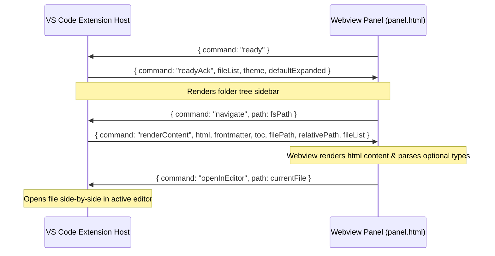

# Webview & Messaging Architecture

This document describes the webview layout and the messaging bridge between the VS Code Extension Host and the frontend panel.

---

## 🏛️ UI Shell Rendering
The webview UI is declared in [panel.html](file:///f:/Extensions/omg/media/panel.html).
When a panel is created or refreshed, `_buildShell` in [panel.ts](file:///f:/Extensions/omg/src/core/panel.ts) reads `panel.html` and injects variables by replacing `{{PLACEHOLDER}}` strings:

| Token | Replaced With |
| :--- | :--- |
| `{{THEME}}` | Current theme config (`auto`, `dark`, or `light`) |
| `{{WORKSPACE_NAME}}` | Name of the active workspace folder |
| `{{FILE_COUNT}}` | Total count of scanned markdown documents |
| `{{NAV_ITEMS}}` | Pre-rendered HTML sidebar navigation node elements |
| `{{PANEL_CSS_URI}}` | WebView-safe URI to `panel.css` |
| `{{ICON_MD_URI}}` | WebView-safe URI to the logo image asset (`logo-128.png`) |

---

## 🌉 Message Passing API

### 1. Webview $\rightarrow$ Extension Host (`panel.html` to `panel.ts`)
* **`ready`**: Sent once when DOM loading is complete.
* **`navigate`**: Sent when a user clicks on a file link or sidebar item. Contains the destination `path`.
* **`openInEditor`**: Sent when clicking the "Edit" button. Requests the extension to open `path` in a text document view.
* **`copyCode`**: Sent when clicking the copy button on code blocks. Requests the host write `text` to the clipboard.
* **`refresh`**: Sent when clicking the Refresh button in the top bar. Requests a full workspace scan and re-render.

### 2. Extension Host $\rightarrow$ Webview (`panel.ts` to `panel.html`)
* **`readyAck`**: Acknowledges webview readiness and sends initial `fileList`, `theme`, and expanded configurations.
* **`renderContent`**: Sends compiled HTML content, frontmatter variables, and Table of Contents (TOC) tree list.
* **`navNotFound`**: Sent if a file navigation request fails (e.g. invalid target path). Shows a "File not found" warning screen.

---

## 🗺️ Path Resolution & Security
* **Relative Image Rewriting**: Markdown images with relative paths are scanned in `_sendContent` via regular expressions and rewritten to webview-safe URIs using `this._panel.webview.asWebviewUri`.
* **Safe HTML & General Image Styling**: Raw HTML layout and rendering tags (like ``, `
`, `
`, ``, etc.) are passed through `SAFE_HTML_TAG_RE` in `inline.ts` unmodified. Images inside raw HTML automatically inherit responsive layout, border-radius, and pan/zoom handlers in the webview via general `.mdn-body img` selectors in `panel.css` and `panel.html`.
* **Robust Markdown Link Resolution**: Link navigation (`_navigateTo`) decodes URL encoded relative paths (e.g. spaces parsed as `%20`) using `decodeURIComponent` and performs a direct file system check via `fs.existsSync` relative to the current file's parent folder. This ensures newly added or unscanned workspace files can be opened and previewed immediately.
* **Unscanned Files Safety**: If the active editor is outside the workspace, it won't be scanned. To prevent infinite loading screen locks, the extension dynamically constructs a fallback file descriptor in `_sendContent` using `path.relative` and `path.basename`.
