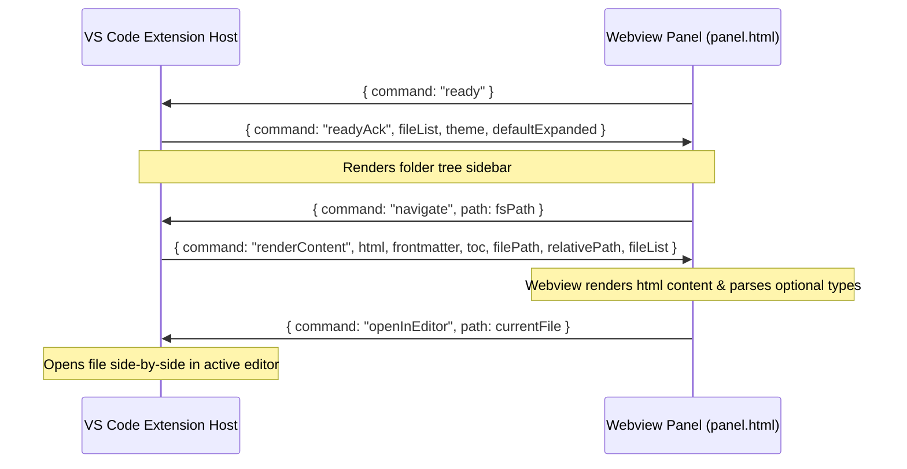

# Webview & Messaging Architecture

This document describes the webview layout and the messaging bridge between the VS Code Extension Host and the frontend panel.

---

## 🏛️ UI Directory Structure

The shared frontend UI lives in `ui/` at the project root — platform-agnostic and consumable by both the VS Code extension and a future desktop app.

```
ui/
├── panel.html              ← HTML shell template (~175 lines)
├── css/                    ← 18 CSS partials (design tokens → components)
│   ├── tokens.css          ← Root variables, themes, reset
│   ├── topbar.css          ├── buttons.css
│   ├── sidebar.css         ├── content.css
│   ├── markdown.css        ├── codeblock.css
│   ├── sections.css        ├── tables.css
│   ├── toc.css             ├── modal.css
│   ├── settings.css        ├── tooltips.css
│   ├── diff.css            ├── mermaid.css
│   ├── scroll-top.css      ├── misc.css
│   └── mdx-components.css
├── js/                     ← 12 JS modules (TDZ-ordered)
│   ├── boot.js             ← vscode API + shared state
│   ├── nav.js              ← Nav + DocHistory
│   ├── table.js            ← Table (MUST load before ui.js)
│   ├── sidebar.js          ├── toc.js
│   ├── search.js           ├── settings.js
│   ├── ui.js               ← UI controller (depends on Table, TOC, etc.)
│   ├── modal.js            ├── resize.js
│   ├── keyboard.js         └── mdx-components.js
└── assets/
    ├── icons/              ← SVG icons (shared)
    └── logos/              ← Logo assets (shared)
```

## 🏗️ UI Shell Rendering
The webview UI template is [panel.html](file:///f:/Extensions/markdown-explorer/ui/panel.html).
When a panel is created or refreshed, `_buildShell` in [panel.ts](file:///f:/Extensions/markdown-explorer/src/core/panel.ts) reads `panel.html` and injects variables by replacing `{{PLACEHOLDER}}` strings:

| Token | Replaced With |
| :--- | :--- |
| `{{THEME}}` | Current theme config (`auto`, `dark`, or `light`) |
| `{{WORKSPACE_NAME}}` | Name of the active workspace folder |
| `{{FILE_COUNT}}` | Total count of scanned markdown documents |
| `{{NAV_ITEMS}}` | Pre-rendered HTML sidebar navigation node elements |
| `{{CSP_SOURCE}}` | WebView CSP source from `webview.cspSource` |
| `{{CSS_LINKS}}` | Generated `<link>` tags for all 18 CSS partials |
| `{{JS_SCRIPTS}}` | Generated `<script>` tags for all 12 JS modules |
| `{{ICON_MD_URI}}` | WebView-safe URI to the logo image asset (`logo-128.png`) |
| `{{ICON_MOON_URI}}` | WebView-safe URI to moon icon (dark mode toggle) |
| `{{ICON_SUN_URI}}` | WebView-safe URI to sun icon (light mode toggle) |

---

## 🌉 Message Passing API



### 1. Webview $\rightarrow$ Extension Host (`panel.html` to `panel.ts`)
* **`ready`**: Sent once when DOM loading is complete.
* **`navigate`**: Sent when a user clicks on a file link or sidebar item. Contains the destination `path`.
* **`openInEditor`**: Sent when clicking the "Edit" button. Requests the extension to open `path` in a text document view.
* **`copyCode`**: Sent when clicking the copy button on code blocks. Requests the host write `text` to the clipboard.
* **`refresh`**: Sent when clicking the Refresh button in the top bar. Requests a full workspace scan and re-render.

### 2. Extension Host $\rightarrow$ Webview (`panel.ts` to `panel.html`)
* **`readyAck`**: Acknowledges webview readiness and sends initial `fileList`, `theme`, and expanded configurations.
* **`renderContent`**: Sends compiled HTML content, frontmatter variables, and Table of Contents (TOC) tree list.
* **`navNotFound`**: Sent if a file navigation request fails (e.g. invalid target path). Shows a "File not found" warning screen.

---

## ⚠️ JS Module Load Order (TDZ Rule)

Scripts in `panel.html` **must** load in this exact order:

1. `boot.js` → shared state (`vscode`, `currentFile`, `fileList`, etc.)
2. `nav.js` → `Nav`, `DocHistory`
3. `table.js` → `Table` (**must precede `ui.js`**)
4. `sidebar.js` → `Sidebar`
5. `toc.js` → `TOC`
6. `search.js` → `Search`
7. `settings.js` → `Settings`
8. `ui.js` → `UI` (depends on Table, TOC, Settings, Search)
9. `modal.js` → `ModalViewer`
10. `resize.js` → `Resize`
11. `keyboard.js` → `Keyboard` (depends on all above)
12. `mdx-components.js` → Custom web components (standalone)

A minimal inline `<script>` at the bottom of `panel.html` wires up the `load` and `message` event listeners.

---

## 🗺️ Path Resolution & Security
* **CSP Policy**: Uses `webview.cspSource` for `style-src`, `script-src`, `img-src`, and `frame-src` to allow loading local CSS/JS files.
* **Relative Image Rewriting**: Markdown images with relative paths are scanned in `_sendContent` via regular expressions and rewritten to webview-safe URIs using `this._panel.webview.asWebviewUri`.
* **Safe HTML & General Image Styling**: Raw HTML layout and rendering tags (like ``, `<p>`, `<div>`, `<span>`, etc.) are passed through `SAFE_HTML_TAG_RE` in `inline.ts` unmodified. Images inside raw HTML automatically inherit responsive layout, border-radius, and pan/zoom handlers in the webview via general `.mdn-body img` selectors.
* **Robust Markdown Link Resolution**: Link navigation (`_navigateTo`) decodes URL encoded relative paths (e.g. spaces parsed as `%20`) using `decodeURIComponent` and performs a direct file system check via `fs.existsSync` relative to the current file's parent folder. This ensures newly added or unscanned workspace files can be opened and previewed immediately.
* **Unscanned Files Safety**: If the active editor is outside the workspace, it won't be scanned. To prevent infinite loading screen locks, the extension dynamically constructs a fallback file descriptor in `_sendContent` using `path.relative` and `path.basename`.
