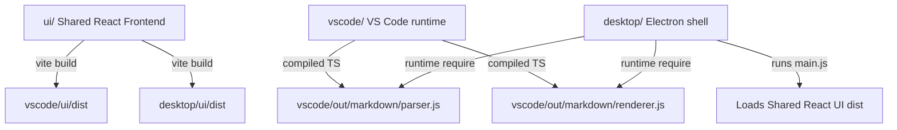

# Contributor & Development Guidelines

This document provides comprehensive instructions and architectural guidelines for developers and contributors working on the **Markdown Explorer** monorepo workspace.

---

## 🎯 Mission of this Document
The mission of `GUIDELINE.md` is to preserve codebase health, establish standardized patterns for shared asset usage, and ensure visual and execution consistency across all three deployment targets (**VS Code Extension**, **Shared React UI**, and the **Standalone Electron Desktop App**). Our core design tenets are:
*   **Offline-First & Security-Centered**: Operating 100% locally with zero cloud telemetry, tracking, or remote dependencies.
*   **Aesthetic & Premium Feel**: Smooth hover animations, glassmorphism designs, sticky components, and custom typography.
*   **Lightweight & Performant**: Keeping asset footprints small and bundle sizes optimized.

---

## 🛠️ Developer Environment Setup

### 1. Prerequisites
Ensure the following tools are installed on your machine:
*   **Node.js**: Version `18.x` or higher is recommended (supports ESModules and workspace configurations).
*   **npm**: Version `9.x` or higher.
*   **Visual Studio Code**: The recommended IDE for extension development.

### 2. Monorepo Setup (NPM Workspaces)
This project leverages **NPM Workspaces** to share code, models, and assets across different deployment runtimes. The workspace modules are defined in the root [package.json](file:///f:/Extensions/markdown-explorer/package.json):
*   `ui` (React Shared Frontend)
*   `vscode` (VS Code Extension runtime)
*   `desktop` (Electron Standalone Desktop container)

To configure your local developer environment:
1.  Clone the repository.
2.  Open the workspace folder in VS Code.
3.  Install all workspace dependencies concurrently by running the following command in the **root directory**:
    ```bash
    npm install
    ```
    *This runs a single install command that recursively resolves dependencies across `ui`, `vscode`, and `desktop` and creates symlinks for shared builds.*

---

## 🏗️ Project Architecture & Workspaces File Map



### 1. Component Repositories
*   **`ui/` (Shared Frontend Wrapper)**:
    *   Powered by React 19, TypeScript, and Vite.
    *   [ui/src/App.tsx](file:///f:/Extensions/markdown-explorer/ui/src/App.tsx): Root application shell directing page state, theme selectors, sidebar resizing, and global event handlers.
    *   [ui/src/components/Modal/TermsModal.tsx](file:///f:/Extensions/markdown-explorer/ui/src/components/Modal/TermsModal.tsx): First-run terms of service and MIT License validation view.
    *   [ui/src/components/Workspace/WorkspaceSelection.tsx](file:///f:/Extensions/markdown-explorer/ui/src/components/Workspace/WorkspaceSelection.tsx): Frameless landing window displaying a native workspace selector.
*   **`vscode/` (VS Code extension container)**:
    *   Coordinates VS Code workspace API integration.
    *   [vscode/src/extension.ts](file:///f:/Extensions/markdown-explorer/vscode/src/extension.ts): Entrypoint. Registers titlebar commands and sidebar panel instances.
    *   [vscode/src/markdown/parser.ts](file:///f:/Extensions/markdown-explorer/vscode/src/markdown/parser.ts): Tokenizes markdown headings, tables, code blocks, MDX tags, and callouts.
    *   [vscode/src/markdown/renderer.ts](file:///f:/Extensions/markdown-explorer/vscode/src/markdown/renderer.ts): Renders markdown tokens into rich, interactive HTML nodes.
    *   [vscode/scripts/copy-ui.js](file:///f:/Extensions/markdown-explorer/vscode/scripts/copy-ui.js): Compiles and copies React UI distribution assets into the extension folder before VSIX packaging.
*   **`desktop/` (Electron standalone shell)**:
    *   Coordinates operating system integrations.
    *   [desktop/main.js](file:///f:/Extensions/markdown-explorer/desktop/main.js): Main process managing the frameless window, system tray menu, IPC event handlers, and active paths.
    *   [desktop/preload.js](file:///f:/Extensions/markdown-explorer/desktop/preload.js): Context-isolated bridge exposing a secure platform communication interface (`electronAPI`).
    *   [desktop/scanner.js](file:///f:/Extensions/markdown-explorer/desktop/scanner.js): Scans local folders recursively to map out markdown files and automatically extract frontmatter/heading titles.

### 2. Dynamic Parser Binding Architecture
To avoid duplicating the core markdown parsing logic, the Standalone Electron App dynamically binds and imports the VS Code compiled TS tokenizer and renderer at runtime. 
Inside [desktop/main.js](file:///f:/Extensions/markdown-explorer/desktop/main.js):
*   On startup, Electron attempts to `require()` compiled TS files from `../vscode/out/markdown/parser.js` and `../vscode/out/markdown/renderer.js`.
*   If found, they are dynamically bound to the file renderer. If they aren't compiled yet, Electron falls back gracefully to rendering raw markdown as plain monospaced text.
*   **Developer Rule**: When editing markdown parsing logic, ensure both VS Code and shared React assets are rebuilt so the changes propagate to the Electron runtime.

---

## 🐞 Run & Debug Workflows

We provide unified commands inside the root [package.json](file:///f:/Extensions/markdown-explorer/package.json) to develop and debug both targets:

### 1. VS Code Extension (F5 Workflow)
1.  Open the workspace root in VS Code.
2.  Press **`F5`** (or go to *Run and Debug* and select **Debug Extension**).
3.  VS Code automatically runs a pre-launch compilation step:
    *   Rebuilds the shared React UI (`npm run build:ui`).
    *   Copies UI output assets into the `vscode/` workspace.
    *   Starts a watch compilation on extension TS files (`npm run watch`).
4.  A new **Extension Development Host** window will spawn.
5.  In the new host, open any folder containing `.md` or `.mdx` files, open a markdown file, and trigger the preview using `Ctrl+Alt+V` or `Ctrl+Shift+M`.

### 2. Standalone Electron App (Desktop Workflow)
1.  Build the shared UI assets:
    ```bash
    npm run build:ui
    ```
2.  Compile the VS Code markdown parser (which is dynamically loaded by the desktop app):
    ```bash
    npm run build:vscode
    ```
3.  Launch the standalone desktop application:
    ```bash
    npm run start:desktop
    ```
    *This executes `electron .` within the `desktop/` workspace folder, opening a frameless desktop window pointing to the compiled React UI.*

---

## 🖥️ Standalone Electron App Deep-Dive

Version **1.3.0** introduced a production-grade standalone desktop wrapper for Markdown Explorer. The following native integrations govern the application:

### 1. Frameless Window Custom Controls
To deliver a sleek, premium experience, the desktop app uses a frameless window configuration:
*   Inside [desktop/main.js](file:///f:/Extensions/markdown-explorer/desktop/main.js), the BrowserWindow is created with `frame: false`.
*   A custom Topbar inside [ui/src/App.tsx](file:///f:/Extensions/markdown-explorer/ui/src/App.tsx) handles window dragging using `-webkit-app-region: drag` and excludes buttons via `-webkit-app-region: no-drag`.
*   Titlebar control buttons (Minimize, Maximize/Restore, Close) are bound to IPC commands (`window-minimize`, `window-maximize`, and `window-close`), which safely invoke native Electron BrowserWindow state operations.
*   Developer Tools access (`F12` or `Ctrl+Shift+I`) is automatically blocked in production/packaged builds to secure client data.

### 2. System Tray Integration
*   The application launches a custom taskbar icon using the premium [ui/assets/logos/logo-128.png](file:///f:/Extensions/markdown-explorer/ui/assets/logos/logo-128.png) graphic.
*   Right-clicking the tray menu presents controls to **Open Markdown Explorer** or **Quit** the application completely.
*   Left-clicking the tray icon toggles window visibility, bringing the application back into immediate focus.

### 3. Recent Workspaces Persistence
*   Recent folders opened by the user are stored in flat JSON format inside `recent-workspaces.json` under the standard operating system's `userData` application directory.
*   This persistence ledger is loaded on startup and displayed on the centermost Workspace Selection Page, allowing users to collapse recent lists or launch workspaces with a single click.

### 4. High-Performance Workspace Scanner
The scanner inside [desktop/scanner.js](file:///f:/Extensions/markdown-explorer/desktop/scanner.js) builds a tree view of local workspace files using native node file-system APIs:
*   **Exclusions**: Folders like `.git`, `node_modules`, `.vscode`, `out`, and `dist` are strictly ignored to prevent scanning overhead.
*   **Search Limit**: The workspace scan is hard-capped at **1000 files** to maintain high UI rendering performance.
*   **Title Resolution**: The scanner parses titles intelligently. If the file is an `.mdx` document, it matches title fields from frontmatter blocks, exported variables (`export const title = '...'`), exported metadata blocks, and JSX components. For standard `.md` files, it extracts the first high-level heading (`# Heading`). If none exists, it defaults to the file name.

### 5. Path Breadcrumb Truncation
*   To conserve draggable frameless workspace window space, file breadcrumbs inside the header automatically fold folder chains exceeding 3 levels into an ellipsis (`root / ... / parent / file.md`).
*   Path folding uses strict `!important` overriding in [ui/src/styles/global.css](file:///f:/Extensions/markdown-explorer/ui/src/styles/global.css) to prevent element overflow bugs.
*   Hovering over the folded segment reveals the complete absolute filepath inside a beautifully styled tooltip bubble.

### 6. Offline Typography and Font Routing
To ensure the application looks premium offline without making external CDN calls, we package two embedded fonts:
*   **Be Vietnam Pro** (for clean, legible UI text) and **Cascadia Code** (for codeblocks and markdown markup).
*   **Dynamic Font Routing**: Custom fonts are packaged under the `ui/assets/fonts/` folder and applied conditionally using the `body.is-electron` CSS selector.
*   The VS Code extension inherits the user's active theme and system families without overriding them, whereas the Electron Desktop target automatically activates custom typography.
*   **Optimization rule**: The TTF source font files are excluded from VSIX packaging using `.vscodeignore` configurations, **halving the packaged extension binary size down to 173.34 KB**.

### 7. First-Run Terms & License Agreement Modal
*   On the very first launch of the desktop application, a frameless modal overlay asks the user to accept the MIT License and offline-first privacy statement.
*   This state is persisted in the client's LocalStorage under `markdown-explorer-terms-accepted`.
*   Until checked, the modal locks out workspace selectors and document renderers.

### 8. Relative Image Path URL Resolver
*   Because Electron webviews run under strict sandbox guidelines, standard relative image paths (e.g. `src="images/screenshot.png"`) will fail to render when running on local filesystems.
*   Inside `desktop/main.js`, a regex scanner intercepts compiled HTML output at render-time and replaces relative paths with absolute `file:///` URLs mapped to the workspace folder. This allows local visual media to render seamlessly in both extension and desktop modes.

---

## 📦 Packaging & Distribution

```bash
# Packaging Targets and Output Folders
├── vscode/
│   └── vscode-extension-markdown-explorer-1.3.0.vsix (Packaged Extension)
└── desktop/
    └── dist/
        └── Markdown Explorer Portable.exe            (Windows Desktop Target)
```

### 1. VS Code Extension packaging
To compile assets and package the extension into a single redistributable `.vsix` binary, run:
```bash
npm run package
```
*This command runs a clean React UI compilation, triggers the `copy-ui.js` copier script to copy compiled bundles into the `vscode/` extension folder, compiles TypeScript extension logic, and packages everything using VSCE.*

### 2. Standalone Electron Desktop App packaging
To compile assets and bundle the Electron application, run:
```bash
npm run build:desktop
```
*This compiles the shared UI, compiles the VS Code markdown parser, and executes `electron-builder` under the `desktop` workspace to bundle a portable Windows binary (or standard system installers) under `desktop/dist/`.*

### 3. CI/CD Release Pipeline
Our automated GitHub Actions release workflow packages deployment targets in parallel:
*   **Runner A (Ubuntu)**: Compiles and packages the VS Code `.vsix` file.
*   **Runner B (Windows)**: Compiles and packages the Electron `.exe` file.
*   Both binaries are uploaded and published concurrently under a unified tag-release on GitHub.

---

## 💅 Styling, Performance, and Design Conventions

### 1. Offline-First & Security Pledge
*   **No analytics**: Never embed third-party tracking scripts, cookies, or remote analytics hooks.
*   **Strict Isolation**: All rendering (MathJax, Mermaid diagrams, charts) must run fully offline. Do not pull libraries from external CDNs inside `index.html`.

### 2. Sticky Table Headers & Overflow Constraints
*   To enable sticky table headers (`thead tr th` staying frozen at the top of scroll viewports), avoid using `overflow: hidden` on containing accordion nodes, as it disrupts Chrome's sticky bounding boxes.
*   Instead, utilize `overflow: clip` on accordion components and layout boundaries. This preserves rounded corners and isolates layout clipping without disrupting the table header's sticky coordinates relative to the scrollPort.

### 3. Global Scope and TDZ (Temporal Dead Zone) Risks
*   Because the frontend styles and libraries (like `Chart.js` and `Mermaid`) execute in a unified global context, declare layout components and helpers above other referencing scripts inside HTML outputs to avoid Temporal Dead Zone (TDZ) reference errors.
*   Always ensure shared state controls (e.g., sort, search, folding toggles) are registered under the global `window.UI` and `window.Table` scopes.
