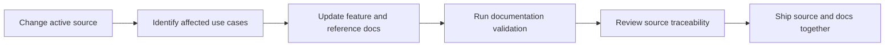

# Documentation Governance

## Objective

This folder is the source-derived application specification for humans and AI agents. It documents active behavior only.

## Required document properties

| Property | Rule |
|---|---|
| `timestamp` | ISO 8601 creation or revision time |
| `name` | Stable human-readable document name |
| `topic` | One narrow behavior domain |
| `document_type` | `specification`, `use-case`, `reference`, `runtime`, or `quality` |
| `status` | `active`; remove or revise when behavior changes |
| `parent_docs` | Navigation to the governing or index document |
| `related_docs` | Directly connected specifications only |
| `source_scope` | Existing active implementation paths |
| `test_scope` | Existing automated verification paths |
| `runtime_scope` | Affected hosts |

## Writing rules

- Describe observable behavior before implementation detail.
- Separate the success path, alternate paths, and failure recovery.
- Use exact command, message, setting, and enum names from source.
- Include acceptance criteria that can be tested.
- UI specifications include HTML, CSS, and JavaScript examples.
- Prefer tables, lists, and Mermaid diagrams over long prose.
- Do not describe removed code, plans without implementation, or assumed behavior.

## Change workflow

## Definition of complete

A behavior is documented only when its user flow, host contract, state effects, runtime differences, recovery, acceptance criteria, source paths, and tests are represented.

---

[← Markdown Explorer Application Specification](../README.md) · [Documentation index](../README.md) · [Product Scope →](02-product-scope.md)
