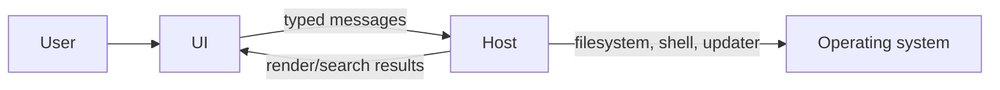

# Actors and Terminology

| Term | Definition |
|---|---|
| User | Person navigating and reading local documentation |
| UI | Shared React application rendered by a host |
| Host | Electron, Tauri, VS Code, Chromium, or website adapter |
| Workspace | Folder tree or single-file virtual root exposed to the UI |
| Workspace tab | Desktop-level container for a workspace; not a document tab |
| Content tab | Open document state inside a workspace |
| Operation ID | Correlation token that prevents stale workspace responses from mutating current state |
| Request ID | Correlation token for search and resource requests |
| Render content | Host message containing rendered HTML, TOC, frontmatter, paths, and source text |
| Scope focus | Folder paths included in navigation or search |
| Conversion preview | Markdown representation generated from a non-Markdown source document |
| Local-first HTML | Sandboxed HTML preview where local assets may be inlined and active remote access is blocked |
| Recent workspace | Persisted path or browser handle offered for reopening |

## Actor boundaries

## Source traceability

| Kind | Path | Purpose |
|---|---|---|
| Implementation | `ui/src/platform/bridge.ts` | Active behavior or contract |
| Implementation | `ui/src/types/webviewMessages.ts` | Active behavior or contract |
| Implementation | `ui/src/types/hostMessages.ts` | Active behavior or contract |

---

[← Product Scope](02-product-scope.md) · [Documentation index](../README.md) · [Source-of-Truth Rules →](04-source-of-truth.md)
