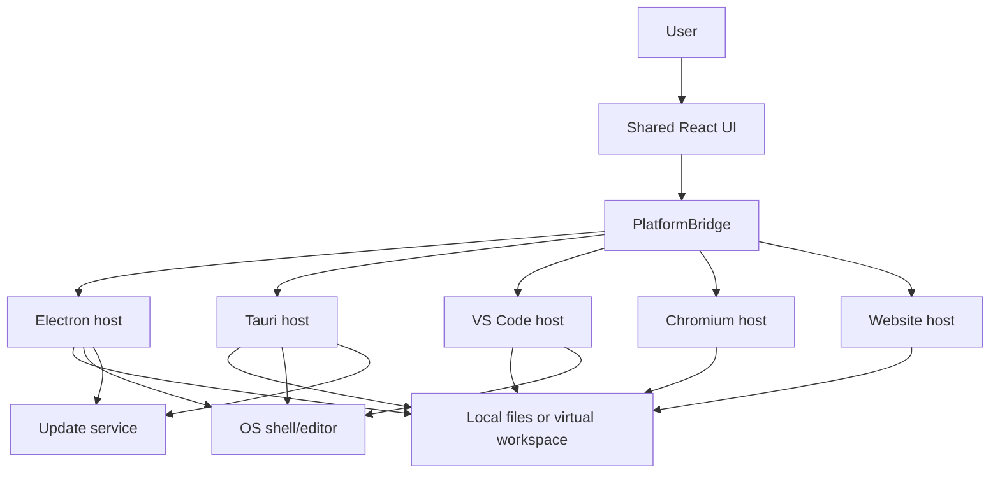

# System Context

## Boundary rules

| Boundary | Contract |
|---|---|
| User → UI | Keyboard, pointer, drag/drop, dialogs, context menus |
| UI → host | `WebviewMessage` discriminated union |
| Host → UI | `HostMessage` discriminated union |
| Host → filesystem | Runtime-specific scanning, watching, reading, conversion |
| HTML preview → host | Restricted workspace-text resource bridge |
| Host → shell | Validated external URL and filesystem location operations |

## Shared responsibility

The React UI owns presentation, navigation state, content enhancements, settings UI, and request correlation. Hosts own privileged operations and translate their results into common messages.

## Source traceability

| Kind | Path | Purpose |
|---|---|---|
| Implementation | `ui/src/main.tsx` | Active behavior or contract |
| Implementation | `ui/src/platform/bridge.ts` | Active behavior or contract |
| Implementation | `electron/core/main-runtime.js` | Active behavior or contract |
| Implementation | `tauri/src/core/bootstrap.rs` | Active behavior or contract |
| Implementation | `vscode/src/core/panel.ts` | Active behavior or contract |
| Implementation | `chromium-xtension/src/chrome-host.ts` | Active behavior or contract |
| Implementation | `website-app/src/web-host.ts` | Active behavior or contract |

---

[← Application Coverage Matrix](../00-foundation/06-coverage-matrix.md) · [Documentation index](../README.md) · [Runtime Architecture →](02-runtime-architecture.md)
