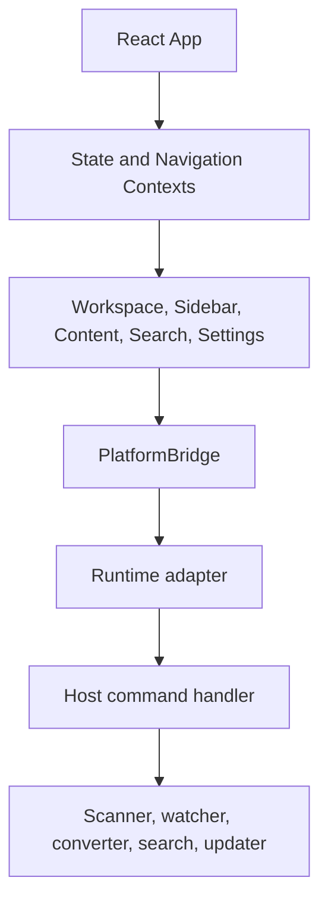

# Runtime Architecture

## Runtime detection

The UI detects one bridge during startup and exposes it as `window.PlatformBridge`:

| Detection | Bridge |
|---|---|
| `acquireVsCodeApi` exists | VS Code |
| `electronAPI` exists | Electron or Tauri-compatible preload API |
| `__chromeExtBus` exists | Chromium extension |
| `__webDemoBus` exists | Website demo/file mode |
| None | Startup error; no privileged behavior is guessed |

## Layering

## Parity model

- Common commands and messages use identical discriminants.
- Unsupported capabilities return safe behavior or remain hidden; they do not fake success.
- Runtime-specific features are documented in `04-runtimes`.
- Contract tests prevent silent command drift.

## Source traceability

| Kind | Path | Purpose |
|---|---|---|
| Implementation | `ui/src/main.tsx` | Active behavior or contract |
| Implementation | `ui/src/platform/electron.ts` | Active behavior or contract |
| Implementation | `ui/src/platform/vscode.ts` | Active behavior or contract |
| Implementation | `ui/src/platform/chrome.ts` | Active behavior or contract |
| Implementation | `ui/src/platform/web.ts` | Active behavior or contract |
| Verification | `tests/unit/ui/platform-bridges.test.ts` | Automated expectation |
| Verification | `tests/contracts/host-message-parity.test.ts` | Automated expectation |
| Verification | `tests/contracts/tauri-dispatcher-parity.test.ts` | Automated expectation |

---

[← System Context](01-system-context.md) · [Documentation index](../README.md) · [Bridge Protocol →](03-bridge-protocol.md)
