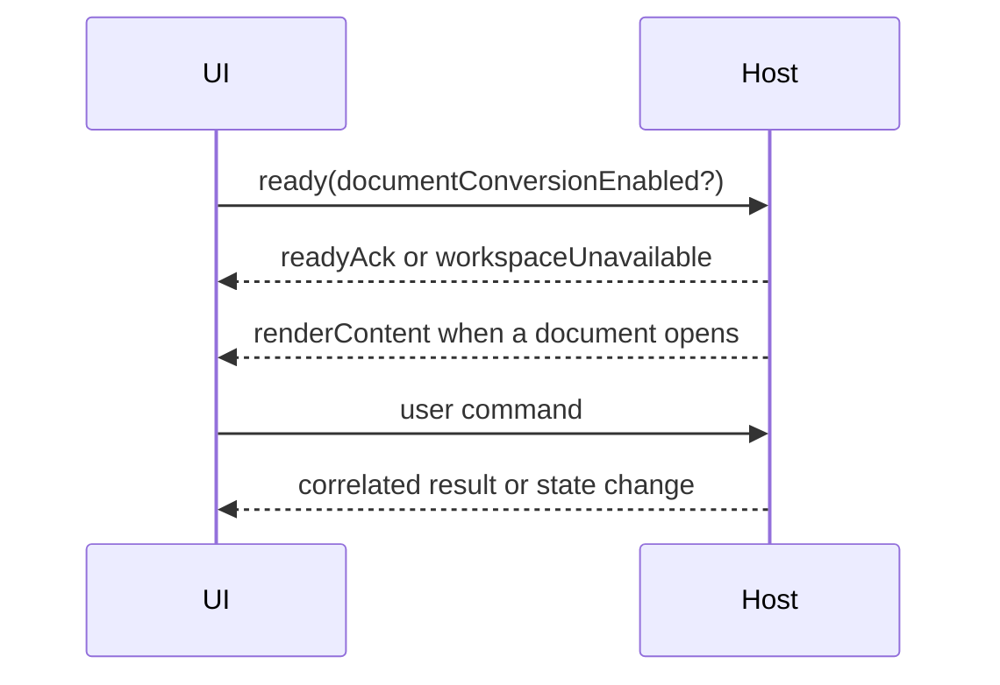

# Bridge Protocol

## Interface

```typescript
export interface PlatformBridge {
  postMessage(message: WebviewMessage): void;
  onMessage(handler: (message: HostMessage) => void): () => void;
  getState<T>(): T | undefined;
  setState<T>(state: T): void;
  copyToClipboard(text: string): Promise<void>;
}
```

## Protocol rules

- Every cross-boundary message has a literal `command` discriminant.
- Workspace messages may carry `workspaceOperationId` and `workspaceTabId`.
- Search/resource/export operations carry `requestId` and ignore mismatched responses.
- Structured external open launches arrive via `externalOpenRequest` carrying target file/folder details.
- UI state persistence is adapter-owned through `getState` and `setState`.
- Clipboard behavior prefers host APIs and must report failure where relevant.
- Unknown commands are ignored or rejected safely; they never execute arbitrary host operations.

## Lifecycle



See the command and host-message catalogs for all payloads.

## Source traceability

| Kind | Path | Purpose |
|---|---|---|
| Implementation | `ui/src/platform/bridge.ts` | Active behavior or contract |
| Implementation | `ui/src/types/webviewMessages.ts` | Active behavior or contract |
| Implementation | `ui/src/types/hostMessages.ts` | Active behavior or contract |
| Implementation | `ui/src/types/content.ts` | Active behavior or contract |
| Verification | `tests/contracts/host-message-parity.test.ts` | Automated expectation |
| Verification | `tests/contracts/tauri-host-message-parity.test.ts` | Automated expectation |

---

[← Runtime Architecture](02-runtime-architecture.md) · [Documentation index](../README.md) · [Request and Operation Correlation →](04-request-correlation.md)
