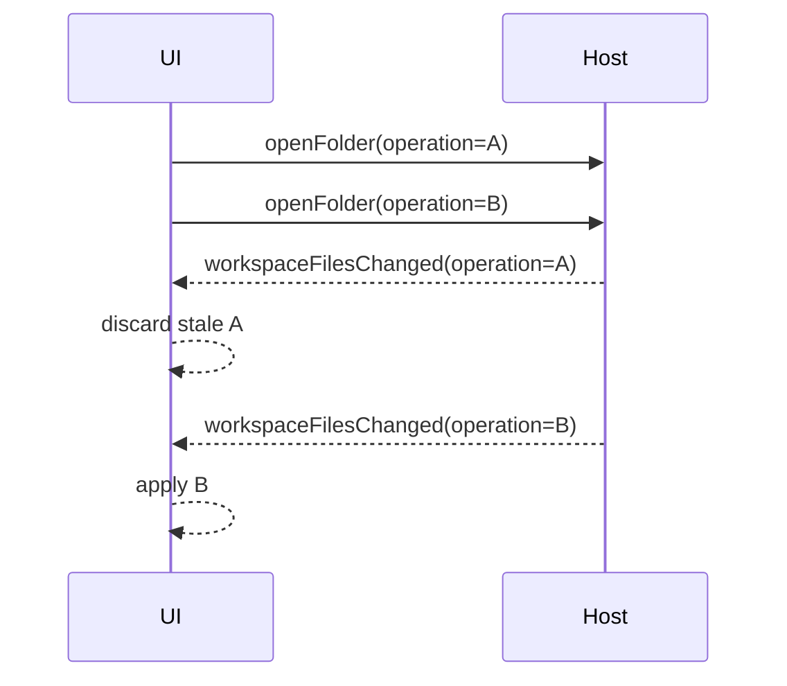

# Request and Operation Correlation

## Identifiers

| Identifier | Scope | Examples |
|---|---|---|
| `workspaceOperationId` | One open/activate/close/scan operation | Scan progress, cancellation, unavailable response |
| `workspaceTabId` | One desktop workspace tab | Activation and result routing |
| `requestId` | One search or resource request | Workspace search, cross-tab search, local CSS/JS reads |

## Required behavior

1. UI creates a fresh identifier before asynchronous work.
2. Host echoes the identifier on all correlated responses.
3. UI compares it with current active state.
4. Mismatched or cancelled results are discarded.
5. Cleanup invalidates pending work and removes timers/listeners.

## Source traceability

| Kind | Path | Purpose |
|---|---|---|
| Implementation | `ui/src/desktop/workspaceOperations.ts` | Active behavior or contract |
| Implementation | `ui/src/contexts/appStateReducer.ts` | Active behavior or contract |
| Implementation | `electron/core/runtime-workspace-handlers.js` | Active behavior or contract |
| Implementation | `tauri/src/dispatcher/incremental_scan.rs` | Active behavior or contract |
| Implementation | `vscode/src/core/incrementalScan.ts` | Active behavior or contract |
| Verification | `tests/node/workspace-operations.test.mjs` | Automated expectation |
| Verification | `tests/node/electron-scanner-cancellation.test.mjs` | Automated expectation |
| Verification | `tests/node/startup-workspace-cancellation.test.mjs` | Automated expectation |

---

[← Bridge Protocol](03-bridge-protocol.md) · [Documentation index](../README.md) · [Application State Model →](05-state-model.md)
