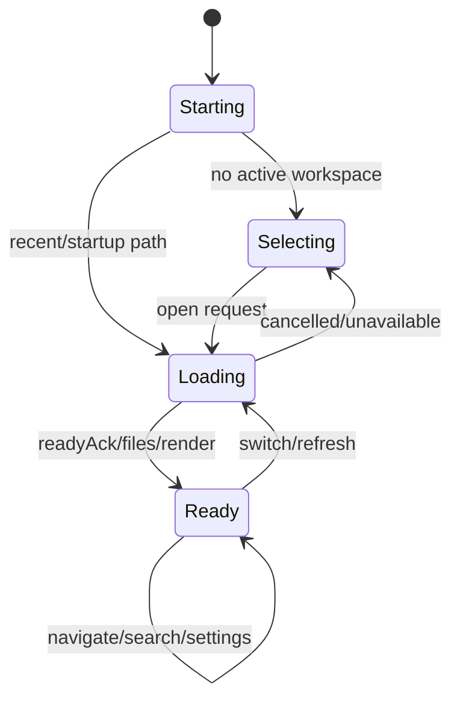

# Application State Model

## Major state domains

| Domain | Representative state | Lifetime |
|---|---|---|
| Host identity | runtime, platform, architecture, version | Session |
| Workspace | tree, file list, active path, loading, operation IDs | Workspace/session |
| Navigation | history, current content, TOC, scroll memory | Content tab/session |
| Desktop tabs | home/new/workspace tabs, active tab, aliases | Persisted desktop state |
| Search | query, results, request ID, status, pagination | Transient |
| Settings | preferences, scope maps, keybindings, language | Persisted bridge state |
| Theme | mode, style, custom themes, active custom ID | Persisted bridge state |
| Updates | capability and update state | Session |

## Reducer rules

- State transitions are explicit actions.
- Host messages are normalized before reducer updates.
- Workspace operations cannot overwrite another tab or newer operation.
- Content tabs preserve document scroll positions and preview overrides.
- Missing or locked workspaces transition to a recoverable selection state.

## Source traceability

| Kind | Path | Purpose |
|---|---|---|
| Implementation | `ui/src/contexts/AppStateContext.tsx` | Active behavior or contract |
| Implementation | `ui/src/contexts/appStateModel.ts` | Active behavior or contract |
| Implementation | `ui/src/contexts/appStateReducer.ts` | Active behavior or contract |
| Implementation | `ui/src/contexts/contentTabState.ts` | Active behavior or contract |
| Implementation | `ui/src/desktop/desktopTabs.ts` | Active behavior or contract |
| Verification | `tests/unit/ui/contexts/app-state.test.ts` | Automated expectation |
| Verification | `tests/unit/ui/contexts/app-state-integration.test.tsx` | Automated expectation |
| Verification | `tests/unit/ui/desktop-tabs.test.ts` | Automated expectation |

---

[← Request and Operation Correlation](04-request-correlation.md) · [Documentation index](../README.md) · [Security and Trust Boundaries →](06-security-trust-boundaries.md)
