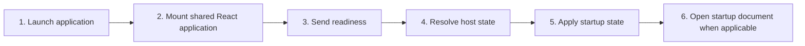

# Launch and Ready Handshake

## Purpose

Initialize the shared UI, select the correct platform bridge, obtain host identity and workspace state, and enter a usable screen without guessing unavailable capabilities.

| Property | Specification |
|---|---|
| Use-case ID | `UC-001` |
| Primary actor | User |
| Trigger | Application window, webview, extension panel, or website mounts. |
| Preconditions | A supported runtime adapter is available. |
| Success result | The UI receives `readyAck` or a recoverable `workspaceUnavailable`/selection state. |
| Scope exclusion | Dead code, unsupported runtime behavior, and speculative behavior |

## Real-world scenario

A user launches Markdown Explorer. The same UI must initialize correctly whether the host is desktop, VS Code, Chromium, or the website.



## Main success flow

| Step | User or event | System processing | Observable result |
|---:|---|---|---|
| 1 | Launch application | Detect the runtime bridge. | Bridge is assigned to `window.PlatformBridge`. |
| 2 | Mount shared React application | Register one host-message listener. | Loading or workspace-selection state appears. |
| 3 | Send readiness | `ready` with conversion preference. | Host begins startup workspace resolution. |
| 4 | Resolve host state | Load version, runtime, platform, recents, window state, and workspace. | `readyAck` or `workspaceUnavailable` is emitted. |
| 5 | Apply startup state | Reducer verifies operation metadata. | Workspace shell or selection screen appears. |
| 6 | Open startup document when applicable | Host emits `renderContent`. | Document, TOC, title, and file list render. |

## Alternate and failure flows

| Condition | Required behavior | Recovery |
|---|---|---|
| No bridge detected | Show startup failure; do not issue privileged commands. | Run in a supported host. |
| Startup workspace missing or locked | Emit `workspaceUnavailable` with reason. | User selects another workspace or removes the recent entry. |
| Ready response belongs to stale operation | Ignore it. | Continue waiting for the current operation. |

## Validation and business rules

- Register and dispose host listeners exactly once per mounted application.
- The host capability fields control visibility of updater and native controls.
- Do not open a default path that was not supplied by the host.


## Protocol effects

| Contract | Direction | Purpose |
|---|---|---|
| `ready` | UI → host | Announce UI readiness and conversion preference. |
| `readyAck` | Host → UI | Provide initial host/workspace state. |
| `workspaceUnavailable` | Host → UI | Enter recoverable unavailable state. |
| `renderContent` | Host → UI | Display startup document. |

## State and persistence

| State | Rule |
|---|---|
| `appRuntime` | Host capability classification. |
| `hostPlatform` | OS-specific labels and behavior. |
| `workspaceOperationId` | Reject stale startup results. |

## Runtime-specific behavior

| Runtime | Rule |
|---|---|
| Electron | Single-instance startup may include a queued external path. |
| Tauri | Preload-compatible bridge invokes Rust commands/events. |
| VS Code | Panel state and configured workspace initialize the view. |
| Chromium | Restore browser handles from IndexedDB when permission remains valid. |
| Website | Use virtual demo or browser file mode; native features remain absent. |

## Accessibility, security, and performance

- Keep keyboard focus on the active control or newly opened content.
- Announce asynchronous status through an `aria-live` region.
- Reject stale host responses whose operation or request ID no longer matches.


## Acceptance criteria

- [ ] A supported runtime reaches ready or a recoverable selection state.
- [ ] No duplicate message listener is left after unmount/remount.
- [ ] Host identity and capabilities match the active runtime.
- [ ] A stale startup response cannot replace newer state.
## UI reference implementation

The sample shows the interaction boundary, not a replacement for the React implementation.

```html
<section class="spec-launch-and-ready-handshake" aria-labelledby="launch-and-ready-handshake-title">
  <h2 id="launch-and-ready-handshake-title">Launch and Ready Handshake</h2>
  <p data-status role="status" aria-live="polite">Ready</p>
  <button type="button" data-action>Initialize application</button>
</section>
```

```css
.spec-launch-and-ready-handshake {
  display: grid;
  gap: 0.75rem;
  padding: 1rem;
  border: 1px solid var(--border);
  border-radius: var(--radius, 8px);
  background: var(--surface);
  color: var(--text);
}
.spec-launch-and-ready-handshake button:focus-visible {
  outline: 2px solid var(--accent);
  outline-offset: 2px;
}
```

```javascript
const root = document.querySelector('.spec-launch-and-ready-handshake');
const status = root.querySelector('[data-status]');
root.querySelector('[data-action]').addEventListener('click', () => {
  window.PlatformBridge.postMessage({ command: 'ready', documentConversionEnabled: true });
  status.textContent = 'Request sent';
});
```
## Source traceability

| Kind | Path | Purpose |
|---|---|---|
| Implementation | `ui/src/main.tsx` | Active behavior or contract |
| Implementation | `ui/src/platform/bridge.ts` | Active behavior or contract |
| Implementation | `ui/src/contexts/useAppStateEffects.ts` | Active behavior or contract |
| Implementation | `electron/core/main-runtime.js` | Active behavior or contract |
| Implementation | `tauri/src/dispatcher/ready.rs` | Active behavior or contract |
| Implementation | `vscode/src/core/panel.ts` | Active behavior or contract |
| Implementation | `chromium-xtension/src/chrome-host.ts` | Active behavior or contract |
| Implementation | `website-app/src/web-host.ts` | Active behavior or contract |
| Verification | `tests/unit/ui/platform-bridges.test.ts` | Automated expectation |
| Verification | `tests/unit/electron/main-runtime.test.ts` | Automated expectation |
| Verification | `tests/unit/vscode/panel.test.ts` | Automated expectation |
| Verification | `tests/unit/chromium/chrome-host.test.ts` | Automated expectation |

---

[← Persistence Architecture](../01-architecture/07-persistence-and-storage.md) · [Documentation index](../README.md) · [First-Run Terms and Theme Onboarding →](UC-002-first-run-terms-theme-onboarding.md)
