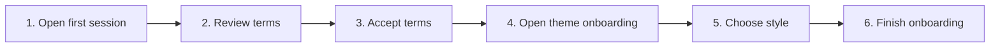

# First-Run Terms and Theme Onboarding

## Purpose

Require terms acknowledgement where configured and guide first-time users through an initial theme choice without blocking later settings changes.

| Property | Specification |
|---|---|
| Use-case ID | `UC-002` |
| Primary actor | User |
| Trigger | First UI session where acceptance or onboarding storage keys are absent. |
| Preconditions | Application state has initialized. |
| Success result | Terms are accepted and onboarding is marked complete; chosen theme is applied and persisted. |
| Scope exclusion | Dead code, unsupported runtime behavior, and speculative behavior |

## Real-world scenario

A new user opens the app and must understand local-file behavior before selecting a visual style.



## Main success flow

| Step | User or event | System processing | Observable result |
|---:|---|---|---|
| 1 | Open first session | Read local first-run flags. | Terms modal appears when acceptance is absent. |
| 2 | Review terms | Keep modal focus trapped and primary action visible. | User can read and accept. |
| 3 | Accept terms | Persist acceptance flag. | Theme onboarding becomes eligible. |
| 4 | Open theme onboarding | Present active built-in styles and mode choice. | User previews a theme. |
| 5 | Choose style | Update shared settings/theme state. | Preview updates immediately. |
| 6 | Finish onboarding | Persist completion and appearance. | Workspace or selection screen becomes primary UI. |

## Alternate and failure flows

| Condition | Required behavior | Recovery |
|---|---|---|
| Acceptance already stored | Skip terms modal. | Continue to onboarding or application. |
| Theme onboarding already complete | Skip onboarding. | Use persisted appearance. |
| Invalid persisted theme | Normalize to `default`. | User may choose another style later. |

## Validation and business rules

- Terms acceptance and onboarding completion use separate storage keys.
- The modal must not disappear from background clicks when acknowledgement is required.
- Theme style values must be valid `ThemeStyle` members.


## Protocol effects

| Contract | Direction | Purpose |
|---|---|---|
| `updateAppearance` | UI → host | Synchronize appearance to capable hosts. |

## State and persistence

| State | Rule |
|---|---|
| `markdown-explorer-terms-accepted` | First-run acknowledgement. |
| `markdown-explorer-theme-onboarding-complete` | One-time onboarding completion. |
| `theme/themeStyle` | Persisted appearance. |

## Runtime-specific behavior

| Runtime | Rule |
|---|---|
| All runtimes | Shared modal and theme behavior. |
| VS Code | Host theme may affect `auto` mode. |
| Desktop/Website | CSS token themes apply directly. |

## Accessibility, security, and performance

- Keep keyboard focus on the active control or newly opened content.
- Announce asynchronous status through an `aria-live` region.
- Reject stale host responses whose operation or request ID no longer matches.


## Acceptance criteria

- [ ] Required terms cannot be bypassed by accidental dismissal.
- [ ] A selected valid style applies immediately.
- [ ] Second launch does not repeat completed steps.
- [ ] Unknown legacy theme values normalize safely.
## UI reference implementation

The sample shows the interaction boundary, not a replacement for the React implementation.

```html
<section class="spec-first-run-terms-and-theme-onboarding" aria-labelledby="first-run-terms-and-theme-onboarding-title">
  <h2 id="first-run-terms-and-theme-onboarding-title">First-Run Terms and Theme Onboarding</h2>
  <p data-status role="status" aria-live="polite">Ready</p>
  <button type="button" data-action>Apply appearance</button>
</section>
```

```css
.spec-first-run-terms-and-theme-onboarding {
  display: grid;
  gap: 0.75rem;
  padding: 1rem;
  border: 1px solid var(--border);
  border-radius: var(--radius, 8px);
  background: var(--surface);
  color: var(--text);
}
.spec-first-run-terms-and-theme-onboarding button:focus-visible {
  outline: 2px solid var(--accent);
  outline-offset: 2px;
}
```

```javascript
const root = document.querySelector('.spec-first-run-terms-and-theme-onboarding');
const status = root.querySelector('[data-status]');
root.querySelector('[data-action]').addEventListener('click', () => {
  window.PlatformBridge.postMessage({ command: 'updateAppearance', theme: 'dark', themeStyle: 'tokyo-night' });
  status.textContent = 'Request sent';
});
```
## Source traceability

| Kind | Path | Purpose |
|---|---|---|
| Implementation | `ui/src/constants/storage.ts` | Shared product constants |
| Implementation | `ui/src/components/Modal/TermsModal.tsx` | Active behavior or contract |
| Implementation | `ui/src/components/Modal/ThemeOnboardingModal.tsx` | Active behavior or contract |
| Implementation | `ui/src/contexts/AppStateContext.tsx` | Active behavior or contract |
| Implementation | `ui/src/themeTypes.ts` | Active behavior or contract |
| Verification | `tests/node/product-constants.test.mjs` | Shared constant contracts |
| Verification | `tests/unit/ui/components/modal-render.test.tsx` | Automated expectation |
| Verification | `tests/node/theme-onboarding-dropdown-visibility.test.mjs` | Automated expectation |
| Verification | `tests/unit/ui/components/theme-modals-render.test.tsx` | Automated expectation |

---

[← Launch and Ready Handshake](UC-001-launch-ready-handshake.md) · [Documentation index](../README.md) · [Open a Folder Workspace →](UC-003-open-folder-workspace.md)
