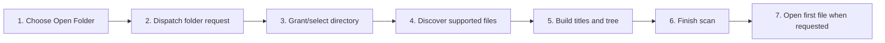

# Open a Folder Workspace

## Purpose

Let the user select a local directory, scan supported documents, expose partial progress, and establish it as the active workspace.

| Property | Specification |
|---|---|
| Use-case ID | `UC-003` |
| Primary actor | User |
| Trigger | Open Folder action, workspace selection, browser directory picker, or dropped directory. |
| Preconditions | The runtime supports directory access and the user grants permission when required. |
| Success result | The workspace tree and file list are visible, recents are updated, and an initial file may open. |
| Scope exclusion | Dead code, unsupported runtime behavior, and speculative behavior |

## Real-world scenario

A documentation author selects a project folder containing Markdown and related documents.



## Main success flow

| Step | User or event | System processing | Observable result |
|---:|---|---|---|
| 1 | Choose Open Folder | Create operation and target tab IDs. | Loading state starts. |
| 2 | Dispatch folder request | `openFolder` carries operation metadata. | Native/browser picker opens when no handle is supplied. |
| 3 | Grant/select directory | Host validates access and initializes scanner. | Scan progress begins. |
| 4 | Discover supported files | Apply ignored directories and root ignore file. | Partial file list may appear after threshold. |
| 5 | Build titles and tree | Use title-priority rules and normalized paths. | `workspaceFilesChanged` updates UI cumulatively. |
| 6 | Finish scan | Persist recents/handle and start watcher or poller. | `readyAck`/final files state becomes active. |
| 7 | Open first file when requested | Navigate using canonical path. | `renderContent` displays document. |

## Alternate and failure flows

| Condition | Required behavior | Recovery |
|---|---|---|
| Picker cancelled | Emit cancellation or clear loading without changing active workspace. | Return focus to Open Folder. |
| Permission denied | Keep current workspace and show actionable error. | Retry and grant access. |
| No supported files | Show empty workspace state. | Add files or choose another folder. |
| New open supersedes scan | Cancel old operation. | Apply only newer operation results. |

## Validation and business rules

- Ignore configured heavy/build directories and root `.markdown-explorer-ignore` exact-name entries.
- Never apply file batches from a stale operation.
- Recent workspace update occurs only after usable access is established.


## Protocol effects

| Contract | Direction | Purpose |
|---|---|---|
| `openFolder` | UI → host | Start directory selection/open and scanning. |
| `cancelWorkspaceScan` | UI → host | Cancel the current scan. |
| `setLoading` | Host → UI | Describe loading work. |
| `workspaceScanProgress` | Host → UI | Report scanned count and active state. |
| `workspaceFilesChanged` | Host → UI | Deliver cumulative tree/list. |
| `workspaceOpenCancelled` | Host → UI | End cancelled operation. |
| `renderContent` | Host → UI | Open first document. |

## State and persistence

| State | Rule |
|---|---|
| `workspaceOperationId` | Current open/scan generation. |
| `fileList/tree` | Cumulative workspace model. |
| `recentWorkspaces` | Persisted reopen targets. |

## Runtime-specific behavior

| Runtime | Rule |
|---|---|
| Electron | Native dialog, filesystem scanner, watcher, recents by path. |
| Tauri | Rust scanner/watcher and native file protocols. |
| VS Code | Folder selection within extension host and VS Code filesystem. |
| Chromium | File System Access directory handle persisted in IndexedDB. |
| Website | Browser directory/file mode where supported; demo mode remains virtual. |

## Accessibility, security, and performance

- Keep keyboard focus on the active control or newly opened content.
- Announce asynchronous status through an `aria-live` region.
- Reject stale host responses whose operation or request ID no longer matches.


## Acceptance criteria

- [ ] Cancelled selection leaves previous workspace intact.
- [ ] Partial results preserve ordering and do not duplicate files.
- [ ] Ignored directories are not scanned.
- [ ] Final state starts change detection on supported runtimes.
## UI reference implementation

The sample shows the interaction boundary, not a replacement for the React implementation.

```html
<section class="spec-open-a-folder-workspace" aria-labelledby="open-a-folder-workspace-title">
  <h2 id="open-a-folder-workspace-title">Open a Folder Workspace</h2>
  <p data-status role="status" aria-live="polite">Ready</p>
  <button type="button" data-action>Choose folder</button>
</section>
```

```css
.spec-open-a-folder-workspace {
  display: grid;
  gap: 0.75rem;
  padding: 1rem;
  border: 1px solid var(--border);
  border-radius: var(--radius, 8px);
  background: var(--surface);
  color: var(--text);
}
.spec-open-a-folder-workspace button:focus-visible {
  outline: 2px solid var(--accent);
  outline-offset: 2px;
}
```

```javascript
const root = document.querySelector('.spec-open-a-folder-workspace');
const status = root.querySelector('[data-status]');
root.querySelector('[data-action]').addEventListener('click', () => {
  window.PlatformBridge.postMessage({ command: 'openFolder', workspaceOperationId: crypto.randomUUID(), openFirstFile: true });
  status.textContent = 'Request sent';
});
```
## Source traceability

| Kind | Path | Purpose |
|---|---|---|
| Implementation | `ui/src/components/Workspace/WorkspaceSelection.tsx` | Active behavior or contract |
| Implementation | `ui/src/desktop/workspaceOperations.ts` | Active behavior or contract |
| Implementation | `electron/workspace/scanner.js` | Active behavior or contract |
| Implementation | `electron/core/runtime-workspace-handlers.js` | Active behavior or contract |
| Implementation | `tauri/src/workspace/scanner.rs` | Active behavior or contract |
| Implementation | `vscode/src/core/scanner.ts` | Active behavior or contract |
| Implementation | `chromium-xtension/src/scanner.ts` | Active behavior or contract |
| Implementation | `website-app/src/web-file-mode.ts` | Active behavior or contract |
| Verification | `tests/unit/electron/scanner.test.ts` | Automated expectation |
| Verification | `tests/unit/chromium/scanner.test.ts` | Automated expectation |
| Verification | `tests/unit/ui/components/workspace-render.test.tsx` | Automated expectation |
| Verification | `tests/node/workspace-operations.test.mjs` | Automated expectation |

---

[← First-Run Terms and Theme Onboarding](UC-002-first-run-terms-theme-onboarding.md) · [Documentation index](../README.md) · [Open a Single File →](UC-004-open-single-file.md)
