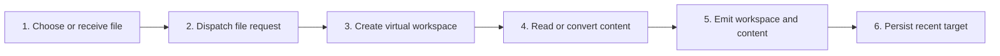

# Open a Single File

## Purpose

Open one supported document as a virtual workspace while retaining navigation and preview capabilities appropriate to the host.

| Property | Specification |
|---|---|
| Use-case ID | `UC-004` |
| Primary actor | User |
| Trigger | Open File, file association, extension command, dropped file, or external path. |
| Preconditions | The selected file is readable and has a supported base or convertible extension. |
| Success result | A single-file workspace is active and the document renders or shows a conversion result. |
| Scope exclusion | Dead code, unsupported runtime behavior, and speculative behavior |

## Real-world scenario

A user double-clicks an `.mdx` file or selects a document without opening its containing project.



## Main success flow

| Step | User or event | System processing | Observable result |
|---:|---|---|---|
| 1 | Choose or receive file | Create operation ID. | Loading state starts. |
| 2 | Dispatch file request | Use `openFile`, `openFileHandle`, or `openPath`. | Host validates type and access. |
| 3 | Create virtual workspace | Set file list/tree around selected file. | Workspace title and path appear. |
| 4 | Read or convert content | Parse Markdown/MDX/text or opt-in conversion. | Render payload is created. |
| 5 | Emit workspace and content | Send ready/files and `renderContent`. | Document appears with title and TOC. |
| 6 | Persist recent target | Store path or handle where supported. | File is available in recents. |

## Alternate and failure flows

| Condition | Required behavior | Recovery |
|---|---|---|
| Unsupported extension | Do not render arbitrary bytes. | Show unsupported-file feedback. |
| Conversion disabled | Explain that the source needs conversion enabled. | Enable setting or choose Markdown. |
| File missing after recent open | Emit unavailable state. | Remove recent or locate another file. |
| Browser permission lost | Request handle permission again. | Retry after grant. |

## Validation and business rules

- Single-file mode must not imply access to unrelated parent files.
- Path and display name remain distinct.
- Conversion errors produce explanatory Markdown and quality metadata rather than blank content.


## Protocol effects

| Contract | Direction | Purpose |
|---|---|---|
| `openFile` | UI → host | Open native file picker target. |
| `openFileHandle` | UI → host | Open browser file handle. |
| `openPath` | UI → host | Open a supplied path. |
| `readyAck` | Host → UI | Establish virtual workspace. |
| `renderContent` | Host → UI | Display document or preview. |
| `workspaceUnavailable` | Host → UI | Report missing/locked target. |

## State and persistence

| State | Rule |
|---|---|
| `workspacePath` | Single file or virtual root identity. |
| `previewInfo` | Text/converted source and quality. |
| `recentWorkspaces` | Reopen target. |

## Runtime-specific behavior

| Runtime | Rule |
|---|---|
| Electron/Tauri | File association and native dialog supported. |
| VS Code | Command or explorer context opens URI. |
| Chromium/Website | File picker handle; no document conversion in Chromium. |
| All | Supported Markdown/MDX renders through shared UI contract. |

## Accessibility, security, and performance

- Keep keyboard focus on the active control or newly opened content.
- Announce asynchronous status through an `aria-live` region.
- Reject stale host responses whose operation or request ID no longer matches.


## Acceptance criteria

- [ ] A supported Markdown file renders from each applicable entry route.
- [ ] Unsupported binary data is not interpreted as text.
- [ ] Missing files lead to recoverable state.
- [ ] Preview metadata identifies converted and text previews.
## UI reference implementation

The sample shows the interaction boundary, not a replacement for the React implementation.

```html
<section class="spec-open-a-single-file" aria-labelledby="open-a-single-file-title">
  <h2 id="open-a-single-file-title">Open a Single File</h2>
  <p data-status role="status" aria-live="polite">Ready</p>
  <button type="button" data-action>Choose file</button>
</section>
```

```css
.spec-open-a-single-file {
  display: grid;
  gap: 0.75rem;
  padding: 1rem;
  border: 1px solid var(--border);
  border-radius: var(--radius, 8px);
  background: var(--surface);
  color: var(--text);
}
.spec-open-a-single-file button:focus-visible {
  outline: 2px solid var(--accent);
  outline-offset: 2px;
}
```

```javascript
const root = document.querySelector('.spec-open-a-single-file');
const status = root.querySelector('[data-status]');
root.querySelector('[data-action]').addEventListener('click', () => {
  window.PlatformBridge.postMessage({ command: 'openFile', workspaceOperationId: crypto.randomUUID() });
  status.textContent = 'Request sent';
});
```
## Source traceability

| Kind | Path | Purpose |
|---|---|---|
| Implementation | `ui/src/desktop/workspaceOperations.ts` | Active behavior or contract |
| Implementation | `ui/src/hooks/useFileDropOpen.ts` | Active behavior or contract |
| Implementation | `electron/core/external-open.js` | Active behavior or contract |
| Implementation | `tauri/src/runtime/external_open.rs` | Active behavior or contract |
| Implementation | `vscode/src/extension.ts` | Active behavior or contract |
| Implementation | `chromium-xtension/src/file-access.ts` | Active behavior or contract |
| Implementation | `website-app/src/web-file-mode.ts` | Active behavior or contract |
| Verification | `tests/unit/ui/file-drop-open.test.tsx` | Automated expectation |
| Verification | `tests/unit/electron/external-open.test.ts` | Automated expectation |
| Verification | `tests/unit/vscode/extension.test.ts` | Automated expectation |
| Verification | `tests/unit/chromium/web-file-mode.test.ts` | Automated expectation |

---

[← Open a Folder Workspace](UC-003-open-folder-workspace.md) · [Documentation index](../README.md) · [Manage Recent Workspaces →](UC-005-recent-workspaces.md)
