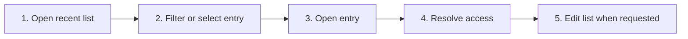

# Manage Recent Workspaces

## Purpose

Reopen, search, rename, delete, replace, and recover recent workspace entries without corrupting active workspace state.

| Property | Specification |
|---|---|
| Use-case ID | `UC-005` |
| Primary actor | User |
| Trigger | Recent-workspace list, More dialog, startup restore, or settings import. |
| Preconditions | At least one recent entry exists for the runtime. |
| Success result | The chosen workspace opens, or the recent list is updated consistently after edit/removal. |
| Scope exclusion | Dead code, unsupported runtime behavior, and speculative behavior |

## Real-world scenario

A user returns to a project, searches a long recent list, adds a display alias, or removes a stale path.



## Main success flow

| Step | User or event | System processing | Observable result |
|---:|---|---|---|
| 1 | Open recent list | Show top entries and More/search affordance. | Recent targets are visible. |
| 2 | Filter or select entry | Match name, alias, or path. | Candidate is highlighted. |
| 3 | Open entry | Dispatch `openRecentWorkspace` with operation metadata. | Workspace scan/open starts. |
| 4 | Resolve access | Host validates path/handle. | Workspace opens or unavailable reason appears. |
| 5 | Edit list when requested | Delete, alias locally, or replace imported ordering. | UI and host persistence synchronize. |

## Alternate and failure flows

| Condition | Required behavior | Recovery |
|---|---|---|
| Entry missing | Show missing workspace state. | Delete recent or choose another target. |
| Entry locked | Show locked state without deleting automatically. | Fix permissions and retry. |
| Browser handle permission expired | Prompt for access. | Grant and reopen. |
| Delete active recent | Remove only recent record, not files. | Current workspace remains open. |

## Validation and business rules

- Deleting a recent never deletes filesystem content.
- Aliases are display-only and cannot replace canonical paths.
- Imported recents are capped and validated.


## Protocol effects

| Contract | Direction | Purpose |
|---|---|---|
| `openRecentWorkspace` | UI → host | Open selected recent target. |
| `deleteRecentWorkspace` | UI → host | Remove one host recent. |
| `replaceRecentWorkspaces` | UI → host | Replace validated recent list. |
| `recentWorkspacesChanged` | Host → UI | Synchronize list after host mutation. |
| `workspaceUnavailable` | Host → UI | Describe missing/locked target. |
| `readyAck` | Host → UI | Open valid target. |

## State and persistence

| State | Rule |
|---|---|
| `recentWorkspaces` | Canonical recent entries. |
| `markdown-explorer-workspace-aliases-v1` | Display aliases. |
| `workspaceOperationId` | Open correlation. |

### Localized last-opened time

Recent entries format short relative ages with `Intl.RelativeTimeFormat` and older timestamps with `Intl.DateTimeFormat`, using the selected Markdown Explorer locale. Presentation code does not append English-only `ago` text.

## Runtime-specific behavior

| Runtime | Rule |
|---|---|
| Electron/Tauri/VS Code | Recent paths stored by host. |
| Chromium | Handles stored in IndexedDB. |
| Website | Browser file mode recents are capability-dependent; demo remains virtual. |

## Accessibility, security, and performance

- Keep keyboard focus on the active control or newly opened content.
- Announce asynchronous status through an `aria-live` region.
- Reject stale host responses whose operation or request ID no longer matches.


## Acceptance criteria

- [ ] Reopening a valid recent follows normal workspace open flow.
- [ ] Deleting an entry cannot delete user files.
- [ ] Aliases survive restart and preserve canonical path.
- [ ] Unavailable entries present reason and recovery action.
## UI reference implementation

The sample shows the interaction boundary, not a replacement for the React implementation.

```html
<section class="spec-manage-recent-workspaces" aria-labelledby="manage-recent-workspaces-title">
  <h2 id="manage-recent-workspaces-title">Manage Recent Workspaces</h2>
  <p data-status role="status" aria-live="polite">Ready</p>
  <button type="button" data-action>Open recent workspace</button>
</section>
```

```css
.spec-manage-recent-workspaces {
  display: grid;
  gap: 0.75rem;
  padding: 1rem;
  border: 1px solid var(--border);
  border-radius: var(--radius, 8px);
  background: var(--surface);
  color: var(--text);
}
.spec-manage-recent-workspaces button:focus-visible {
  outline: 2px solid var(--accent);
  outline-offset: 2px;
}
```

```javascript
const root = document.querySelector('.spec-manage-recent-workspaces');
const status = root.querySelector('[data-status]');
root.querySelector('[data-action]').addEventListener('click', () => {
  window.PlatformBridge.postMessage({ command: 'openRecentWorkspace', path: '/project/docs', openFirstFile: true, workspaceOperationId: crypto.randomUUID() });
  status.textContent = 'Request sent';
});
```
## Source traceability

| Kind | Path | Purpose |
|---|---|---|
| Implementation | `ui/src/components/Workspace/RecentWorkspaceItem.tsx` | Active behavior or contract |
| Implementation | `ui/src/components/Workspace/workspaceSelectionUtils.ts` | Locale-aware last-opened formatting |
| Implementation | `ui/src/components/Workspace/RecentWorkspacesModal.tsx` | Active behavior or contract |
| Implementation | `electron/workspace/recents.js` | Active behavior or contract |
| Implementation | `tauri/src/workspace/recents.rs` | Active behavior or contract |
| Implementation | `chromium-xtension/src/recent-workspaces.ts` | Active behavior or contract |
| Verification | `tests/unit/electron/recents.test.ts` | Automated expectation |
| Verification | `tests/unit/chromium/recent-workspaces.test.ts` | Automated expectation |
| Verification | `tests/unit/ui/components/workspace-items-render.test.tsx` | Automated expectation |

---

[← Open a Single File](UC-004-open-single-file.md) · [Documentation index](../README.md) · [Workspace Scan Progress and Cancellation →](UC-006-workspace-scan-progress-cancellation.md)
