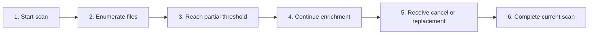

# Workspace Scan Progress and Cancellation

## Purpose

Reveal useful files during long scans, report progress, and cancel safely without stale batches mutating a newer workspace.

| Property | Specification |
|---|---|
| Use-case ID | `UC-006` |
| Primary actor | User |
| Trigger | Folder open, recent open, activation, refresh, or startup scan. |
| Preconditions | A workspace scan is active. |
| Success result | Cumulative results arrive, final active state is correct, or cancellation restores a safe state. |
| Scope exclusion | Dead code, unsupported runtime behavior, and speculative behavior |

## Real-world scenario

A large monorepo takes several seconds to scan; the user sees documents early and can switch projects immediately.



## Main success flow

| Step | User or event | System processing | Observable result |
|---:|---|---|---|
| 1 | Start scan | Assign operation ID and set loading. | Progress UI appears. |
| 2 | Enumerate files | Apply exclusions and supported types. | Scanned count increases. |
| 3 | Reach partial threshold | After about 3 seconds or cumulative 32-item batch, emit files. | User can browse early results. |
| 4 | Continue enrichment | Read bounded title prefixes with controlled concurrency. | Titles improve without blocking scan. |
| 5 | Receive cancel or replacement | Abort old scanner/watch setup. | Cancellation event clears loading. |
| 6 | Complete current scan | Emit final tree/list and inactive progress. | Workspace is stable. |

## Alternate and failure flows

| Condition | Required behavior | Recovery |
|---|---|---|
| User cancels | Stop work and emit cancellation. | Return to previous/selection state. |
| New operation begins | Invalidate old operation. | Old batches are ignored. |
| Individual file unreadable | Skip or use filename fallback. | Continue scan. |
| Title enrichment deadline reached | Use available title/filename. | Complete scan promptly. |

## Validation and business rules

- Partial file batches are cumulative, not deltas.
- Operation IDs must be included on correlated progress and files messages.
- Cancellation must dispose scanner resources and not clear a newer workspace.


## Protocol effects

| Contract | Direction | Purpose |
|---|---|---|
| `cancelWorkspaceScan` | UI → host | Cancel one operation. |
| `cancelAllWorkspaceScans` | UI → host | Cancel every active scan. |
| `setLoading` | Host → UI | Loading label/detail. |
| `workspaceScanProgress` | Host → UI | Scanned count and active flag. |
| `workspaceFilesChanged` | Host → UI | Cumulative partial/final result. |
| `workspaceOpenCancelled` | Host → UI | Operation ended by cancellation. |

## State and persistence

| State | Rule |
|---|---|
| `workspaceOperationId` | Current scan identity. |
| `scannedFiles` | Progress count. |
| `loading` | User-visible operation state. |

## Runtime-specific behavior

| Runtime | Rule |
|---|---|
| Electron | 32 concurrent title reads, 250 ms read timeout, 1.5 s enrichment deadline, 8 KiB prefix. |
| Tauri | Rust incremental scan and cancellation. |
| VS Code | Incremental extension-host scanning. |
| Chromium | Incremental browser handle traversal. |
| Website | Browser file mode or immediate virtual dataset. |

## Accessibility, security, and performance

- Keep keyboard focus on the active control or newly opened content.
- Announce asynchronous status through an `aria-live` region.
- Reject stale host responses whose operation or request ID no longer matches.


## Acceptance criteria

- [ ] Partial results appear for long scans.
- [ ] Results never duplicate or regress cumulative file count.
- [ ] Cancel ends loading and does not alter a newer operation.
- [ ] Unreadable title metadata cannot fail the whole scan.
## UI reference implementation

The sample shows the interaction boundary, not a replacement for the React implementation.

```html
<section class="spec-workspace-scan-progress-and-cancellation" aria-labelledby="workspace-scan-progress-and-cancellation-title">
  <h2 id="workspace-scan-progress-and-cancellation-title">Workspace Scan Progress and Cancellation</h2>
  <p data-status role="status" aria-live="polite">Ready</p>
  <button type="button" data-action>Cancel scan</button>
</section>
```

```css
.spec-workspace-scan-progress-and-cancellation {
  display: grid;
  gap: 0.75rem;
  padding: 1rem;
  border: 1px solid var(--border);
  border-radius: var(--radius, 8px);
  background: var(--surface);
  color: var(--text);
}
.spec-workspace-scan-progress-and-cancellation button:focus-visible {
  outline: 2px solid var(--accent);
  outline-offset: 2px;
}
```

```javascript
const root = document.querySelector('.spec-workspace-scan-progress-and-cancellation');
const status = root.querySelector('[data-status]');
root.querySelector('[data-action]').addEventListener('click', () => {
  window.PlatformBridge.postMessage({ command: 'cancelWorkspaceScan', workspaceOperationId: 'workspace-op-123' });
  status.textContent = 'Request sent';
});
```
## Source traceability

| Kind | Path | Purpose |
|---|---|---|
| Implementation | `electron/workspace/scanner.js` | Active behavior or contract |
| Implementation | `electron/core/runtime-workspace-handlers.js` | Active behavior or contract |
| Implementation | `tauri/src/dispatcher/incremental_scan.rs` | Active behavior or contract |
| Implementation | `vscode/src/core/incrementalScan.ts` | Active behavior or contract |
| Implementation | `chromium-xtension/src/incremental-workspace-scan.ts` | Active behavior or contract |
| Implementation | `ui/src/contexts/appStateReducer.ts` | Active behavior or contract |
| Verification | `tests/node/electron-scanner-cancellation.test.mjs` | Automated expectation |
| Verification | `tests/unit/chromium/incremental-workspace-scan.test.ts` | Automated expectation |
| Verification | `tests/node/startup-workspace-cancellation.test.mjs` | Automated expectation |

---

[← Manage Recent Workspaces](UC-005-recent-workspaces.md) · [Documentation index](../README.md) · [Live Refresh and Stale Content →](UC-007-live-refresh-stale-content.md)
