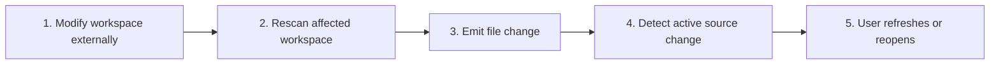

# Live Refresh and Stale Content

## Purpose

Detect workspace changes, refresh the file tree, and mark an open document stale when its source changes without silently replacing the user’s reading position.

| Property | Specification |
|---|---|
| Use-case ID | `UC-007` |
| Primary actor | User |
| Trigger | Filesystem watcher, browser poll, manual refresh, or current-file change event. |
| Preconditions | A workspace is open. |
| Success result | Tree/list reflect current files and changed active content is refreshed or visibly marked stale. |
| Scope exclusion | Dead code, unsupported runtime behavior, and speculative behavior |

## Real-world scenario

A writer edits Markdown in another editor while reading it in Markdown Explorer.



## Main success flow

| Step | User or event | System processing | Observable result |
|---:|---|---|---|
| 1 | Modify workspace externally | Watcher/poller detects relevant change. | Host schedules debounced refresh. |
| 2 | Rescan affected workspace | Preserve operation/tab identity. | Updated tree/list is produced. |
| 3 | Emit file change | `workspaceFilesChanged` updates navigation. | Added/removed/renamed files appear. |
| 4 | Detect active source change | Emit `currentFileChanged`. | UI marks content stale or refreshes per flow. |
| 5 | User refreshes or reopens | Dispatch `refresh`/navigate. | New `renderContent` replaces content and keeps appropriate state. |

## Alternate and failure flows

| Condition | Required behavior | Recovery |
|---|---|---|
| Temporary file churn | Debounce/coalesce events. | One stable refresh. |
| Active file deleted | Remove from list and show recoverable missing state. | Choose another file. |
| Watcher unavailable | Manual refresh remains available. | User triggers refresh. |
| Stale response from old tab | Ignore by operation/tab metadata. | Current tab remains unchanged. |

## Validation and business rules

- Do not reset scroll before replacement content is committed.
- Watching begins only after a workspace is usable.
- Changes to ignored paths do not trigger workspace content updates.


## Protocol effects

| Contract | Direction | Purpose |
|---|---|---|
| `refresh` | UI → host | Request current workspace/content refresh. |
| `workspaceFilesChanged` | Host → UI | Update tree and file list. |
| `currentFileChanged` | Host → UI | Signal source changed externally. |
| `renderContent` | Host → UI | Provide refreshed document. |

## State and persistence

| State | Rule |
|---|---|
| `content tab stale flag` | Indicates source differs from rendered content. |
| `scroll memory` | Restored after valid rerender. |
| `workspace operation/tab IDs` | Route changes correctly. |

## Runtime-specific behavior

| Runtime | Rule |
|---|---|
| Electron | Native watcher and workspace-refresh service. |
| Tauri | Rust watcher. |
| VS Code | Workspace watcher and panel refresh. |
| Chromium | Polling around 3 seconds where handle access permits. |
| Website | Virtual demo is static; browser mode depends on file handle behavior. |

## Accessibility, security, and performance

- Keep keyboard focus on the active control or newly opened content.
- Announce asynchronous status through an `aria-live` region.
- Reject stale host responses whose operation or request ID no longer matches.


## Acceptance criteria

- [ ] External edits are detected on watcher-enabled hosts.
- [ ] A current file change is distinguishable from tree-only changes.
- [ ] Manual refresh works when automatic detection is unavailable.
- [ ] Stale events cannot jump the user to another file.
## UI reference implementation

The sample shows the interaction boundary, not a replacement for the React implementation.

```html
<section class="spec-live-refresh-and-stale-content" aria-labelledby="live-refresh-and-stale-content-title">
  <h2 id="live-refresh-and-stale-content-title">Live Refresh and Stale Content</h2>
  <p data-status role="status" aria-live="polite">Ready</p>
  <button type="button" data-action>Refresh content</button>
</section>
```

```css
.spec-live-refresh-and-stale-content {
  display: grid;
  gap: 0.75rem;
  padding: 1rem;
  border: 1px solid var(--border);
  border-radius: var(--radius, 8px);
  background: var(--surface);
  color: var(--text);
}
.spec-live-refresh-and-stale-content button:focus-visible {
  outline: 2px solid var(--accent);
  outline-offset: 2px;
}
```

```javascript
const root = document.querySelector('.spec-live-refresh-and-stale-content');
const status = root.querySelector('[data-status]');
root.querySelector('[data-action]').addEventListener('click', () => {
  window.PlatformBridge.postMessage({ command: 'refresh' });
  status.textContent = 'Request sent';
});
```
## Source traceability

| Kind | Path | Purpose |
|---|---|---|
| Implementation | `electron/workspace/workspace-watch.js` | Active behavior or contract |
| Implementation | `electron/workspace/workspace-refresh.js` | Active behavior or contract |
| Implementation | `tauri/src/workspace/watch.rs` | Active behavior or contract |
| Implementation | `vscode/src/core/panelWatch.ts` | Active behavior or contract |
| Implementation | `chromium-xtension/src/current-file-watcher.ts` | Active behavior or contract |
| Implementation | `ui/src/contexts/useAppStateEffects.ts` | Active behavior or contract |
| Verification | `tests/unit/electron/workspace-watch.test.ts` | Automated expectation |
| Verification | `tests/unit/electron/workspace-refresh.test.ts` | Automated expectation |
| Verification | `tests/unit/chromium/current-file-watcher.test.ts` | Automated expectation |
| Verification | `tests/node/electron-stale-content.test.mjs` | Automated expectation |

---

[← Workspace Scan Progress and Cancellation](UC-006-workspace-scan-progress-cancellation.md) · [Documentation index](../README.md) · [Desktop Workspace Tabs, Focus Mode, and Aliases →](UC-008-desktop-workspace-tabs-focus-aliases.md)
