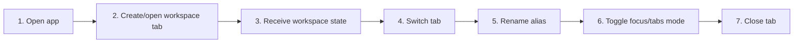

# Desktop Workspace Tabs, Focus Mode, and Aliases

## Purpose

Manage multiple workspaces in desktop tabs, preserve per-tab snapshots, switch between tab and focus views, and display user-defined aliases.

| Property | Specification |
|---|---|
| Use-case ID | `UC-008` |
| Primary actor | User |
| Trigger | Open new workspace, switch workspace tab, context-menu action, or desktop view-mode shortcut. |
| Preconditions | Desktop runtime and shared desktop-tab feature are active. |
| Success result | Each workspace has isolated state and switching restores its content without cross-tab contamination. |
| Scope exclusion | Dead code, unsupported runtime behavior, and speculative behavior |

## Real-world scenario

A user compares documentation across several repositories and temporarily enters a distraction-free focus view.



## Main success flow

| Step | User or event | System processing | Observable result |
|---:|---|---|---|
| 1 | Open app | Restore home/new/workspace tab snapshot. | Valid tabs and active tab appear. |
| 2 | Create/open workspace tab | Assign stable tab ID and operation ID. | Loading appears inside target tab. |
| 3 | Receive workspace state | Route messages by tab/operation. | Target tab becomes usable. |
| 4 | Switch tab | Snapshot outgoing state and activate incoming workspace. | Tree/content/scroll restore. |
| 5 | Rename alias | Persist display alias by canonical workspace identity. | Tab label changes only. |
| 6 | Toggle focus/tabs mode | Persist `desktopViewMode`. | Tab strip visibility/layout changes. |
| 7 | Close tab | Cancel its work and choose deterministic next tab. | Other tabs remain intact. |

## Alternate and failure flows

| Condition | Required behavior | Recovery |
|---|---|---|
| Restored workspace missing | Keep tab recoverable/unavailable. | Close or reopen another path. |
| Close home tab requested | Reject; home remains fixed. | No state change. |
| Scan result targets closed tab | Ignore result. | No tab resurrection. |
| Corrupt persisted snapshot | Normalize to home/new safe state. | User reopens workspaces. |

## Validation and business rules

- Home is fixed and cannot be removed.
- Aliases never alter paths or search identity.
- Close cancels tab-specific work before removing state.
- Each tab owns independent content tabs, history, and scroll memory.


## Protocol effects

| Contract | Direction | Purpose |
|---|---|---|
| `activateWorkspace` | UI → host | Activate/open workspace within a tab. |
| `closeWorkspace` | UI → host | Dispose workspace state. |
| `cancelWorkspaceScan` | UI → host | Cancel tab scan. |
| `readyAck` | Host → UI | Populate target tab. |
| `workspaceFilesChanged` | Host → UI | Update target tab. |
| `workspaceUnavailable` | Host → UI | Mark target tab unavailable. |

## State and persistence

| State | Rule |
|---|---|
| `markdown-explorer-desktop-tabs-v1` | Persisted desktop snapshot. |
| `markdown-explorer-workspace-aliases-v1` | Workspace display aliases. |
| `desktopViewMode` | `focus` or `tabs`. |

## Runtime-specific behavior

| Runtime | Rule |
|---|---|
| Electron/Tauri | Full desktop-tab shell. |
| VS Code/Chromium/Website | Shared content tabs may exist, but desktop workspace-tab shell is not the primary model. |

## Accessibility, security, and performance

- Keep keyboard focus on the active control or newly opened content.
- Announce asynchronous status through an `aria-live` region.
- Reject stale host responses whose operation or request ID no longer matches.


## Acceptance criteria

- [ ] Switching tabs restores the correct tree and active document.
- [ ] Closing a scanning tab prevents later messages from restoring it.
- [ ] Home remains available.
- [ ] Alias and view mode survive restart.
## UI reference implementation

The sample shows the interaction boundary, not a replacement for the React implementation.

```html
<section class="spec-desktop-workspace-tabs-focus-mode-and-aliases" aria-labelledby="desktop-workspace-tabs-focus-mode-and-aliases-title">
  <h2 id="desktop-workspace-tabs-focus-mode-and-aliases-title">Desktop Workspace Tabs, Focus Mode, and Aliases</h2>
  <p data-status role="status" aria-live="polite">Ready</p>
  <button type="button" data-action>Activate workspace</button>
</section>
```

```css
.spec-desktop-workspace-tabs-focus-mode-and-aliases {
  display: grid;
  gap: 0.75rem;
  padding: 1rem;
  border: 1px solid var(--border);
  border-radius: var(--radius, 8px);
  background: var(--surface);
  color: var(--text);
}
.spec-desktop-workspace-tabs-focus-mode-and-aliases button:focus-visible {
  outline: 2px solid var(--accent);
  outline-offset: 2px;
}
```

```javascript
const root = document.querySelector('.spec-desktop-workspace-tabs-focus-mode-and-aliases');
const status = root.querySelector('[data-status]');
root.querySelector('[data-action]').addEventListener('click', () => {
  window.PlatformBridge.postMessage({ command: 'activateWorkspace', workspacePath: '/project/docs', filePath: '/project/docs/readme.md', openFirstFile: true, workspaceOperationId: crypto.randomUUID() });
  status.textContent = 'Request sent';
});
```
## Source traceability

| Kind | Path | Purpose |
|---|---|---|
| Implementation | `ui/src/components/Desktop/DesktopTabBar.tsx` | Active behavior or contract |
| Implementation | `ui/src/components/Desktop/DesktopTabContextMenu.tsx` | Active behavior or contract |
| Implementation | `ui/src/hooks/useDesktopTabs.ts` | Active behavior or contract |
| Implementation | `ui/src/desktop/desktopTabs.ts` | Active behavior or contract |
| Implementation | `ui/src/desktop/desktopTabSnapshot.ts` | Active behavior or contract |
| Verification | `tests/unit/ui/desktop-tabs.test.ts` | Automated expectation |
| Verification | `tests/unit/ui/components/desktop-tabbar-deep.test.tsx` | Automated expectation |
| Verification | `tests/unit/ui/hooks/useDesktopTabs.test.ts` | Automated expectation |

---

[← Live Refresh and Stale Content](UC-007-live-refresh-stale-content.md) · [Documentation index](../README.md) · [Browse, Filter, and Scope the Sidebar →](UC-009-sidebar-browse-filter-scope.md)
