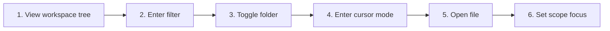

# Browse, Filter, and Scope the Sidebar

## Purpose

Navigate a hierarchical workspace, filter visible nodes, use keyboard cursor mode, and focus navigation/search on selected folders.

| Property | Specification |
|---|---|
| Use-case ID | `UC-009` |
| Primary actor | User |
| Trigger | Workspace opens; user types sidebar filter, expands a folder, changes scope, or uses keyboard navigation. |
| Preconditions | Workspace tree contains one or more files. |
| Success result | The user can locate and open a file while scoped/filtered presentation remains understandable. |
| Scope exclusion | Dead code, unsupported runtime behavior, and speculative behavior |

## Real-world scenario

A large monorepo contains many documentation folders; the user focuses on two product areas and filters for “setup”.



## Main success flow

| Step | User or event | System processing | Observable result |
|---:|---|---|---|
| 1 | View workspace tree | Render folders/files with expanded state. | Sidebar shows hierarchy. |
| 2 | Enter filter | Normalize query and recursively retain matching ancestors. | Only relevant branches remain. |
| 3 | Toggle folder | Update expanded state. | Children show or hide. |
| 4 | Enter cursor mode | Move active tree item by keyboard. | Visible item receives focus/selection. |
| 5 | Open file | Dispatch navigation. | Document opens and active node updates. |
| 6 | Set scope focus | Persist selected folder paths for workspace. | Navigation/search limit to scope where applicable. |

## Alternate and failure flows

| Condition | Required behavior | Recovery |
|---|---|---|
| No filter matches | Show empty filtered state. | Clear or edit query. |
| Active file hidden by scope | Keep document readable; indicate tree mismatch. | Change scope or locate file. |
| Scoped path removed | Reconcile persisted scope. | Drop invalid scope entry. |
| Context menu outside viewport | Clamp position. | Menu remains reachable. |

## Validation and business rules

- Filtering preserves ancestor context.
- Scope paths are workspace-specific and validated against current tree.
- Tree actions remain keyboard operable.
- Sidebar context menu exposes only valid file/folder actions.


## Protocol effects

| Contract | Direction | Purpose |
|---|---|---|
| `navigate` | UI → host | Open selected file. |
| `openShellLocation` | UI → host | Reveal/open selected location where supported. |
| `renderContent` | Host → UI | Set active file after navigation. |
| `navNotFound` | Host → UI | Report target not found. |

## State and persistence

| State | Rule |
|---|---|
| `scopeFocus` | Navigation folder scopes by workspace. |
| `searchScopeFocus` | Search scopes by workspace. |
| `sidebar width` | Persisted layout width. |

## Runtime-specific behavior

| Runtime | Rule |
|---|---|
| All | Shared tree/filter/keyboard behavior. |
| Desktop/VS Code | Native shell or editor actions available. |
| Chromium/Website | Shell actions hidden or adapted. |

## Accessibility, security, and performance

- Keep keyboard focus on the active control or newly opened content.
- Announce asynchronous status through an `aria-live` region.
- Reject stale host responses whose operation or request ID no longer matches.


## Acceptance criteria

- [ ] Filter results include ancestors needed to understand location.
- [ ] Keyboard can reach, expand, and open visible tree items.
- [ ] Removed scope paths are reconciled.
- [ ] Opening a file selects the matching tree node when visible.
## UI reference implementation

The sample shows the interaction boundary, not a replacement for the React implementation.

```html
<section class="spec-browse-filter-and-scope-the-sidebar" aria-labelledby="browse-filter-and-scope-the-sidebar-title">
  <h2 id="browse-filter-and-scope-the-sidebar-title">Browse, Filter, and Scope the Sidebar</h2>
  <p data-status role="status" aria-live="polite">Ready</p>
  <button type="button" data-action>Open document</button>
</section>
```

```css
.spec-browse-filter-and-scope-the-sidebar {
  display: grid;
  gap: 0.75rem;
  padding: 1rem;
  border: 1px solid var(--border);
  border-radius: var(--radius, 8px);
  background: var(--surface);
  color: var(--text);
}
.spec-browse-filter-and-scope-the-sidebar button:focus-visible {
  outline: 2px solid var(--accent);
  outline-offset: 2px;
}
```

```javascript
const root = document.querySelector('.spec-browse-filter-and-scope-the-sidebar');
const status = root.querySelector('[data-status]');
root.querySelector('[data-action]').addEventListener('click', () => {
  window.PlatformBridge.postMessage({ command: 'navigate', path: '/project/docs/guide.md' });
  status.textContent = 'Request sent';
});
```
## Source traceability

| Kind | Path | Purpose |
|---|---|---|
| Implementation | `ui/src/components/Sidebar/Sidebar.tsx` | Active behavior or contract |
| Implementation | `ui/src/components/Sidebar/SidebarSearch.tsx` | Active behavior or contract |
| Implementation | `ui/src/components/Sidebar/TreeNode.tsx` | Active behavior or contract |
| Implementation | `ui/src/components/Sidebar/sidebarTreeFiltering.ts` | Active behavior or contract |
| Implementation | `ui/src/components/Sidebar/useSidebarCursorNavigation.ts` | Active behavior or contract |
| Verification | `tests/unit/ui/components/sidebar-search-render.test.tsx` | Automated expectation |
| Verification | `tests/unit/ui/components/sidebar-search-pure.test.ts` | Automated expectation |
| Verification | `tests/unit/ui/components/sidebar-render.test.tsx` | Automated expectation |
| Verification | `tests/unit/ui/components/sidebar-item-menu.test.tsx` | Automated expectation |

---

[← Desktop Workspace Tabs, Focus Mode, and Aliases](UC-008-desktop-workspace-tabs-focus-aliases.md) · [Documentation index](../README.md) · [Content Tabs and Scroll Memory →](UC-010-content-tabs-scroll-memory.md)
