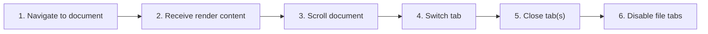

# Content Tabs and Scroll Memory

## Purpose

Open multiple documents within a workspace, switch/close tabs, preserve per-document rendered state and scroll position, and apply configured file-tab behavior.

| Property | Specification |
|---|---|
| Use-case ID | `UC-010` |
| Primary actor | User |
| Trigger | Navigate to a document while file tabs are enabled, select a content tab, or close tabs via button/context menu/shortcut. |
| Preconditions | Workspace is ready and at least one document can render. |
| Success result | Active content matches the selected tab and prior scroll positions restore without leaking between documents. |
| Scope exclusion | Dead code, unsupported runtime behavior, and speculative behavior |

## Real-world scenario

A reader opens an API guide and several referenced files, switches repeatedly, then closes tabs to the right.



## Main success flow

| Step | User or event | System processing | Observable result |
|---:|---|---|---|
| 1 | Navigate to document | Create or reuse content tab by canonical file path. | Loading/current tab state updates. |
| 2 | Receive render content | Store HTML, source, TOC, frontmatter, preview metadata. | Tab displays document. |
| 3 | Scroll document | Record position for active content tab. | Position is retained. |
| 4 | Switch tab | Save outgoing scroll and activate stored content. | Incoming tab restores its position. |
| 5 | Close tab(s) | Apply close-current/all/right/other rule. | Deterministic neighbor becomes active. |
| 6 | Disable file tabs | Normalize to single active document behavior. | Extra tab UI disappears safely. |

## Alternate and failure flows

| Condition | Required behavior | Recovery |
|---|---|---|
| Navigate to already-open file | Activate existing tab instead of duplicating. | Stored state restores. |
| Close active last tab | Return to workspace empty/welcome content. | User opens another file. |
| External source becomes stale | Mark corresponding tab. | Refresh that tab. |
| Workspace closes | Dispose all content tabs and scroll state for it. | No residual content remains. |

## Validation and business rules

- Canonical file path is the content-tab identity.
- Scroll restoration occurs after content layout is ready.
- Close actions must not emit duplicate close events.
- Tab state is isolated by workspace tab.


## Protocol effects

| Contract | Direction | Purpose |
|---|---|---|
| `navigate` | UI → host | Open or activate document. |
| `refresh` | UI → host | Reload stale active document. |
| `renderContent` | Host → UI | Populate content tab. |
| `currentFileChanged` | Host → UI | Mark matching tab stale. |

## State and persistence

| State | Rule |
|---|---|
| `fileTabs` | Preference controlling tab UX. |
| `ContentTab` | Document HTML/source/TOC/frontmatter/preview. |
| `scroll memory` | Position keyed by document/tab. |

## Runtime-specific behavior

| Runtime | Rule |
|---|---|
| All | Shared content-tab implementation. |
| Electron | Dedicated close shortcuts and context menu actions. |
| Other hosts | Controls remain available where file tabs are enabled. |

## Accessibility, security, and performance

- Keep keyboard focus on the active control or newly opened content.
- Announce asynchronous status through an `aria-live` region.
- Reject stale host responses whose operation or request ID no longer matches.


## Acceptance criteria

- [ ] The same file is not duplicated in one workspace.
- [ ] Each tab restores its own scroll position.
- [ ] Close-to-right and close-others choose correct survivors.
- [ ] Workspace switch cannot show another workspace’s content tabs.
## UI reference implementation

The sample shows the interaction boundary, not a replacement for the React implementation.

```html
<section class="spec-content-tabs-and-scroll-memory" aria-labelledby="content-tabs-and-scroll-memory-title">
  <h2 id="content-tabs-and-scroll-memory-title">Content Tabs and Scroll Memory</h2>
  <p data-status role="status" aria-live="polite">Ready</p>
  <button type="button" data-action>Open document</button>
</section>
```

```css
.spec-content-tabs-and-scroll-memory {
  display: grid;
  gap: 0.75rem;
  padding: 1rem;
  border: 1px solid var(--border);
  border-radius: var(--radius, 8px);
  background: var(--surface);
  color: var(--text);
}
.spec-content-tabs-and-scroll-memory button:focus-visible {
  outline: 2px solid var(--accent);
  outline-offset: 2px;
}
```

```javascript
const root = document.querySelector('.spec-content-tabs-and-scroll-memory');
const status = root.querySelector('[data-status]');
root.querySelector('[data-action]').addEventListener('click', () => {
  window.PlatformBridge.postMessage({ command: 'navigate', path: '/project/docs/guide.md' });
  status.textContent = 'Request sent';
});
```
## Source traceability

| Kind | Path | Purpose |
|---|---|---|
| Implementation | `ui/src/components/Content/ContentTabs.tsx` | Active behavior or contract |
| Implementation | `ui/src/contexts/contentTabState.ts` | Active behavior or contract |
| Implementation | `ui/src/components/Content/useContentScrollMemory.ts` | Active behavior or contract |
| Implementation | `ui/src/components/shared/TabContextMenu.tsx` | Active behavior or contract |
| Verification | `tests/unit/ui/components/content-tabs-deep.test.tsx` | Automated expectation |
| Verification | `tests/unit/ui/components/content-tabs-render.test.tsx` | Automated expectation |
| Verification | `tests/node/content-tab-close-events.test.mjs` | Automated expectation |

---

[← Browse, Filter, and Scope the Sidebar](UC-009-sidebar-browse-filter-scope.md) · [Documentation index](../README.md) · [Navigate Links, History, TOC, and Collapsible Headings →](UC-011-links-history-toc-headings.md)
