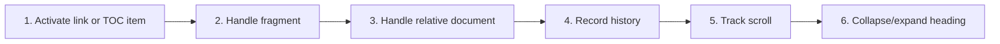

# Navigate Links, History, TOC, and Collapsible Headings

## Purpose

Provide predictable in-document and cross-document navigation while preserving back/forward history, active TOC state, and collapsed section state.

| Property | Specification |
|---|---|
| Use-case ID | `UC-011` |
| Primary actor | User |
| Trigger | Click a Markdown link, TOC item, heading control, or back/forward action. |
| Preconditions | A rendered document contains navigable targets. |
| Success result | The intended document/fragment is visible and navigation state remains reversible. |
| Scope exclusion | Dead code, unsupported runtime behavior, and speculative behavior |

## Real-world scenario

A reader follows a relative link to another guide, jumps to a section, returns with Back, and collapses completed sections.



## Main success flow

| Step | User or event | System processing | Observable result |
|---:|---|---|---|
| 1 | Activate link or TOC item | Classify fragment, workspace-relative, external, or dangerous target. | Valid target is chosen. |
| 2 | Handle fragment | Locate heading ID and expand ancestors. | Target scrolls into view. |
| 3 | Handle relative document | Resolve against current document/workspace. | `navigate` opens file and optional fragment. |
| 4 | Record history | Push current and target locations without duplicate noise. | Back/Forward becomes enabled. |
| 5 | Track scroll | Update active TOC heading. | TOC highlights current section. |
| 6 | Collapse/expand heading | Toggle section visibility and persist document state as applicable. | Section body hides/shows. |

## Alternate and failure flows

| Condition | Required behavior | Recovery |
|---|---|---|
| Target not found | Emit/display `navNotFound`. | Remain on current content. |
| Dangerous URL scheme | Block action. | No navigation. |
| External HTTPS URL | Route through validated external open. | Default browser opens on capable host. |
| Collapsed target section | Expand it before scrolling. | Target becomes visible. |

## Scope View modal navigation

Users can right-click any Markdown link and select **Open as scope** to inspect the linked document in an isolated modal overlay (`ScopeViewModal`) without disrupting the main document viewer or content tabs:
- The modal maintains an isolated 10-step history stack (`MAX_SCOPE_DEPTH=10`) with animated depth segment indicators.
- Users can navigate backward and forward within the scope history using modal header buttons, keyboard shortcuts (`Alt+Left`/`Alt+Right`, `BrowserBack`/`BrowserForward`), or hardware mouse back/forward buttons (buttons 3 and 4).
- The header includes an **Open file** button (`OpenFileIcon`) that navigates the main workspace to the previewed document and closes the modal.

## Hardware mouse history navigation

Hardware mouse back and forward buttons (Mouse Buttons 3 and 4) trigger history navigation in both the main document viewer and the Scope View modal through `attachMouseHistoryNavigation`. Early `mousedown`/`pointerdown` capture prevents native browser navigation, and rapid duplicate events are debounced within a 40 ms window.

## Validation and business rules

- Relative links resolve from current document path, not process working directory.
- History stores logical locations, not arbitrary DOM nodes.
- Heading IDs are stable within one rendered document.
- Dangerous schemes never reach the OS shell.


## Protocol effects

| Contract | Direction | Purpose |
|---|---|---|
| `navigate` | UI → host | Open internal document path. |
| `openExternal` | UI → host | Open validated external URL. |
| `renderContent` | Host → UI | Display internal navigation target. |
| `navNotFound` | Host → UI | Report unresolved target. |

## State and persistence

| State | Rule |
|---|---|
| `navigation history` | Back/forward locations. |
| `active TOC entry` | Scroll-derived heading. |
| `heading section state` | Collapsed/expanded IDs. |

## Runtime-specific behavior

| Runtime | Rule |
|---|---|
| All | Shared fragment, TOC, history, and heading behavior. |
| Desktop/VS Code | External URL delegated to host shell. |
| Browser | External navigation follows extension/website policy. |

## Accessibility, security, and performance

- Keep keyboard focus on the active control or newly opened content.
- Announce asynchronous status through an `aria-live` region.
- Reject stale host responses whose operation or request ID no longer matches.


## Acceptance criteria

- [ ] Fragment links reveal and focus the correct heading.
- [ ] Back/Forward restores prior document and fragment.
- [ ] Blocked schemes produce no host shell action.
- [ ] Collapsed sections do not prevent target navigation.
## UI reference implementation

The sample shows the interaction boundary, not a replacement for the React implementation.

```html
<section class="spec-navigate-links-history-toc-and-collapsible-headings" aria-labelledby="navigate-links-history-toc-and-collapsible-headings-title">
  <h2 id="navigate-links-history-toc-and-collapsible-headings-title">Navigate Links, History, TOC, and Collapsible Headings</h2>
  <p data-status role="status" aria-live="polite">Ready</p>
  <button type="button" data-action>Open document</button>
</section>
```

```css
.spec-navigate-links-history-toc-and-collapsible-headings {
  display: grid;
  gap: 0.75rem;
  padding: 1rem;
  border: 1px solid var(--border);
  border-radius: var(--radius, 8px);
  background: var(--surface);
  color: var(--text);
}
.spec-navigate-links-history-toc-and-collapsible-headings button:focus-visible {
  outline: 2px solid var(--accent);
  outline-offset: 2px;
}
```

```javascript
const root = document.querySelector('.spec-navigate-links-history-toc-and-collapsible-headings');
const status = root.querySelector('[data-status]');
root.querySelector('[data-action]').addEventListener('click', () => {
  window.PlatformBridge.postMessage({ command: 'navigate', path: '/project/docs/guide.md' });
  status.textContent = 'Request sent';
});
```
## Source traceability

| Kind | Path | Purpose |
|---|---|---|
| Implementation | `ui/src/contexts/NavigationContext.tsx` | Active behavior or contract |
| Implementation | `ui/src/components/TOC/TableOfContents.tsx` | Active behavior or contract |
| Implementation | `ui/src/components/Content/headingSectionInteractions.ts` | Active behavior or contract |
| Implementation | `ui/src/components/Content/useContentNavigationEffects.ts` | Active behavior or contract |
| Implementation | `ui/src/dom/linkContextMenu.ts` | Active behavior or contract |
| Verification | `tests/unit/ui/contexts/navigation.test.tsx` | Automated expectation |
| Verification | `tests/unit/ui/components/toc-render.test.tsx` | Automated expectation |
| Verification | `tests/unit/ui/dom/linkContextMenu.test.ts` | Automated expectation |

---

[← Content Tabs and Scroll Memory](UC-010-content-tabs-scroll-memory.md) · [Documentation index](../README.md) · [Find in the Current Document →](UC-012-find-current-document.md)
