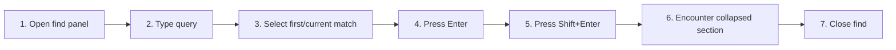

# Find in the Current Document

## Purpose

Search visible rendered text with Unicode-aware matching, keyboard traversal, wrapping, and automatic expansion of hidden sections.

| Property | Specification |
|---|---|
| Use-case ID | `UC-012` |
| Primary actor | User |
| Trigger | Find shortcut or toolbar action. |
| Preconditions | A document is rendered. |
| Success result | Matches are highlighted and the selected match is scrolled into view with accurate count/navigation. |
| Scope exclusion | Dead code, unsupported runtime behavior, and speculative behavior |

## Real-world scenario

A reader searches a long guide for a Vietnamese or Japanese term and steps through every occurrence.



## Main success flow

| Step | User or event | System processing | Observable result |
|---:|---|---|---|
| 1 | Open find panel | Focus query field without losing document state. | Find controls appear. |
| 2 | Type query | Walk eligible rendered text nodes and normalize Unicode matching. | Match count updates. |
| 3 | Select first/current match | Create highlights and selected marker. | Match scrolls into view. |
| 4 | Press Enter | Advance; wrap after last match. | Next match selected. |
| 5 | Press Shift+Enter | Move backward; wrap before first. | Previous match selected. |
| 6 | Encounter collapsed section | Expand containing section. | Hidden match becomes visible. |
| 7 | Close find | Remove highlights and restore focus appropriately. | Document remains at selected location. |

## Alternate and failure flows

| Condition | Required behavior | Recovery |
|---|---|---|
| Empty query | Clear highlights/count. | Panel remains ready. |
| No match | Show zero-result state. | Edit query. |
| DOM changes after enhancement | Recompute eligible nodes safely. | Counts remain valid. |
| Match inside excluded control | Do not count it. | Search only document content. |

## Validation and business rules

- Exclude controls, scripts, styles, iframe, SVG, canvas, line numbers, and table toolbars.
- Use Unicode-aware comparison.
- Enter and Shift+Enter wrap.
- Find is local UI behavior and does not search source files.


## Protocol effects

| Contract | Direction | Purpose |
|---|---|---|
| None | Local UI | No host protocol required |

## State and persistence

| State | Rule |
|---|---|
| `find query` | Current text. |
| `match list/index` | Eligible matches and selection. |
| `panel open` | Focus/visibility state. |

## Runtime-specific behavior

| Runtime | Rule |
|---|---|
| All | Identical shared DOM search. |
| Electron | Default shortcut is `Ctrl+F`. |
| Other shared defaults | Action may use configured shortcut. |

## Accessibility, security, and performance

- Keep keyboard focus on the active control or newly opened content.
- Announce asynchronous status through an `aria-live` region.
- Reject stale host responses whose operation or request ID no longer matches.


## Acceptance criteria

- [ ] Unicode text is matched consistently.
- [ ] Excluded UI labels do not inflate counts.
- [ ] Traversal wraps in both directions.
- [ ] A match in a collapsed section becomes visible.
## UI reference implementation

The sample shows the interaction boundary, not a replacement for the React implementation.

```html
<section class="spec-find-in-the-current-document" aria-labelledby="find-in-the-current-document-title">
  <h2 id="find-in-the-current-document-title">Find in the Current Document</h2>
  <p data-status role="status" aria-live="polite">Ready</p>
  <button type="button" data-action>Open document</button>
</section>
```

```css
.spec-find-in-the-current-document {
  display: grid;
  gap: 0.75rem;
  padding: 1rem;
  border: 1px solid var(--border);
  border-radius: var(--radius, 8px);
  background: var(--surface);
  color: var(--text);
}
.spec-find-in-the-current-document button:focus-visible {
  outline: 2px solid var(--accent);
  outline-offset: 2px;
}
```

```javascript
const root = document.querySelector('.spec-find-in-the-current-document');
const status = root.querySelector('[data-status]');
root.querySelector('[data-action]').addEventListener('click', () => {
  window.PlatformBridge.postMessage({ command: 'navigate', path: '/project/docs/guide.md' });
  status.textContent = 'Request sent';
});
```
## Source traceability

| Kind | Path | Purpose |
|---|---|---|
| Implementation | `ui/src/components/Search/FindInFilePanel.tsx` | Active behavior or contract |
| Implementation | `ui/src/utils/searchJump.ts` | Active behavior or contract |
| Implementation | `ui/src/utils/unicodeSearch.ts` | Active behavior or contract |
| Implementation | `ui/src/components/Content/headingSectionInteractions.ts` | Active behavior or contract |
| Verification | `tests/unit/ui/components/find-in-file-render.test.tsx` | Automated expectation |
| Verification | `tests/unit/ui/searchJump-dom.test.ts` | Automated expectation |
| Verification | `tests/unit/ui/searchJump.test.ts` | Automated expectation |

---

[← Navigate Links, History, TOC, and Collapsible Headings](UC-011-links-history-toc-headings.md) · [Documentation index](../README.md) · [Search the Current Workspace →](UC-013-search-current-workspace.md)
