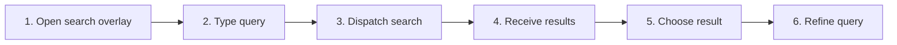

# Search the Current Workspace

## Purpose

Search indexed document metadata and eligible contents inside the active workspace, show excerpts and match positions, and navigate to results.

| Property | Specification |
|---|---|
| Use-case ID | `UC-013` |
| Primary actor | User |
| Trigger | Workspace-search action or configured shortcut. |
| Preconditions | Active workspace has a file list; host search is supported. |
| Success result | Correlated results appear in a modal; selecting previews a result and its arrow opens the correct file/match. |
| Scope exclusion | Dead code, unsupported runtime behavior, and speculative behavior |

## Real-world scenario

A user searches the current repository for “authentication” across file names, titles, paths, and Markdown text.



## Main success flow

| Step | User or event | System processing | Observable result |
|---:|---|---|---|
| 1 | Open search modal | Show bounded workspace, results, and preview columns. | Query input receives focus without replacing the document view. |
| 2 | Type query | Debounce and create request ID. | Search status begins. |
| 3 | Dispatch search | `searchWorkspace` includes candidate items, query, and `matchCase`. | Host searches metadata/content with the selected casing rule. |
| 4 | Receive results | Match response request ID. | Result list with excerpts/lines appears. |
| 5 | Select result row | Keep the modal open, request the full source, render it, and scroll to the selected match. | The target file appears in the preview column at the matching position. |
| 6 | Toggle **Preview** | Default on; hide/show the preview column. | When on, only the preview-header arrow opens. When off, each result row shows its own arrow. |
| 7 | Drag either separator | Resize workspace, results, or preview width within modal limits. | All three sections remain usable without becoming full-screen. |
| 8 | Click an open arrow | Navigate with query, case mode, match ordinal, and index. | Document opens and the same target is highlighted/scrolled. |
| 9 | Refine query or toggle case | Cancel/ignore previous request. | Only newest results for the active casing rule remain. |

## Alternate and failure flows

| Condition | Required behavior | Recovery |
|---|---|---|
| One-character query unsupported/empty | Return no results without failure. | Enter more characters. |
| File exceeds content limit | Search metadata only. | Result may still match title/path. |
| Result file changed | Navigation may fail or target shift. | Open file and report unavailable exact match. |
| Stale response | Discard by request ID. | Wait for latest request. |

## Validation and business rules

- Search index covers supported Markdown/text content, not arbitrary converted binaries.
- Maximum indexed items and file-size limits are enforced.
- Multiple hits in one file carry match ordinals.
- Search is case-insensitive by default; **Match case** applies to title, file name, path, and content.
- **Preview** is on by default. It renders the complete selected Markdown/text file and scrolls to the chosen match.
- While preview is on, row arrows are hidden and the preview-header arrow performs navigation; while off, each row exposes a translated tooltip arrow.
- Workspace inclusion checkboxes default on, and the workspace/result/preview separators are horizontally resizable.
- Results never cross active workspace unless all-tabs mode is selected.


## Protocol effects

| Contract | Direction | Purpose |
|---|---|---|
| `searchWorkspace` | UI → host | Run current-workspace query with optional `matchCase`. |
| `workspaceSearchResults` | Host → UI | Return correlated results. |
| `loadSearchPreview` | UI → host | Read the selected indexed file for preview. |
| `searchPreviewResult` | Host → UI | Return full Markdown/text source or a bounded failure reason. |

## State and persistence

| State | Rule |
|---|---|
| `requestId` | Latest workspace search request. |
| `searchScopeFocus` | Workspace-specific search folders. |
| `result selection` | Keyboard/pointer navigation state. |

## Runtime-specific behavior

| Runtime | Rule |
|---|---|
| Electron/Tauri/VS Code/Chromium | Host or worker-backed workspace search. |
| Website demo/file mode | Search virtual/browser file set. |
| All | Shared result overlay and navigation. |

## Accessibility, security, and performance

- Keep keyboard focus on the active control or newly opened content.
- Give modal, case toggle, preview, and open controls translated accessible names.
- Reject stale host responses whose operation or request ID no longer matches.


## Acceptance criteria

- [ ] Only latest request results render.
- [ ] Results show enough path/title/excerpt context.
- [ ] Selecting a row renders the full target file and scrolls to the selected match without navigation.
- [ ] Preview defaults on; preview-on shows only the header open arrow and preview-off shows row arrows.
- [ ] Workspace/result/preview widths are resizable.
- [ ] Clicking the visible arrow opens the correct workspace file and match.
- [ ] Match-case mode is preserved through document highlighting.
- [ ] Oversized content does not block metadata search.
## UI reference implementation

The sample shows the interaction boundary, not a replacement for the React implementation.

```html
<section class="spec-search-the-current-workspace" aria-labelledby="search-the-current-workspace-title">
  <h2 id="search-the-current-workspace-title">Search the Current Workspace</h2>
  <p data-status role="status" aria-live="polite">Ready</p>
  <button type="button" data-action>Search workspace</button>
</section>
```

```css
.spec-search-the-current-workspace {
  display: grid;
  gap: 0.75rem;
  padding: 1rem;
  border: 1px solid var(--border);
  border-radius: var(--radius, 8px);
  background: var(--surface);
  color: var(--text);
}
.spec-search-the-current-workspace button:focus-visible {
  outline: 2px solid var(--accent);
  outline-offset: 2px;
}
```

```javascript
const root = document.querySelector('.spec-search-the-current-workspace');
const status = root.querySelector('[data-status]');
root.querySelector('[data-action]').addEventListener('click', () => {
  window.PlatformBridge.postMessage({ command: 'searchWorkspace', requestId: crypto.randomUUID(), query: 'Architecture', matchCase: true, items: [] });
  status.textContent = 'Request sent';
});
```
## Source traceability

| Kind | Path | Purpose |
|---|---|---|
| Implementation | `ui/src/components/Search/SearchOverlay.tsx` | Modal state, query dispatch, preview toggle, and navigation |
| Implementation | `ui/src/components/Search/SearchOverlayWorkspaceList.tsx` | Workspace selection and themed inclusion checkboxes |
| Implementation | `ui/src/components/Search/SearchOverlayResults.tsx` | Result selection and tooltip open arrows |
| Implementation | `ui/src/components/Search/SearchDocumentPreview.tsx` | Full-file rendering and match-position scrolling |
| Implementation | `ui/src/components/Search/useSearchOverlayResize.ts` | Bounded three-column resizing |
| Implementation | `ui/src/useAppSearchEffects.ts` | Active behavior or contract |
| Implementation | `electron/core/runtime-command-search-handlers.js` | Workspace search and validated preview loading |
| Implementation | `tauri/src/dispatcher/search.rs` | Active behavior or contract |
| Implementation | `vscode/src/core/panelSearch.ts` | Case-aware workspace matching |
| Implementation | `vscode/src/core/panelSearchPreview.ts` | Indexed full-file preview loading |
| Implementation | `chromium-xtension/src/search-index.ts` | Active behavior or contract |
| Implementation | `website-app/src/web-file-utility-router.ts` | Browser-file preview loading |
| Implementation | `website-app/src/web-test-search.ts` | Website test-mode search |
| Verification | `tests/node/search-ui-contracts.test.mjs` | Modal, resize, tooltip, checkbox, and styling contracts |
| Verification | `tests/unit/ui/components/search-overlay-interaction.test.tsx` | Preview/open/workspace interaction behavior |
| Verification | `tests/node/search-preview-runtime.test.mjs` | Validated Electron preview behavior |
| Verification | `tests/node/search-preview-host-contracts.test.mjs` | Preview routing across supported hosts |
| Verification | `tests/unit/vscode/panel-search-preview.test.ts` | VS Code preview allowlist and source loading |
| Verification | `tests/unit/electron/search-index.test.ts` | Automated expectation |
| Verification | `tests/unit/chromium/search-index.test.ts` | Automated expectation |
| Verification | `tests/unit/vscode/panel.test.ts` | Automated expectation |

---

[← Find in the Current Document](UC-012-find-current-document.md) · [Documentation index](../README.md) · [Search Across Workspace Tabs →](UC-014-search-all-workspace-tabs.md)
