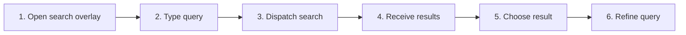

# Search the Current Workspace

## Purpose

Search indexed document metadata and eligible contents inside the active workspace, show excerpts and match positions, and navigate to results.

| Property | Specification |
|---|---|
| Use-case ID | `UC-013` |
| Primary actor | User |
| Trigger | Workspace-search action or configured shortcut. |
| Preconditions | Active workspace has a file list; host search is supported. |
| Success result | Correlated results appear and selecting one opens the correct file/match. |
| Scope exclusion | Dead code, unsupported runtime behavior, and speculative behavior |

## Real-world scenario

A user searches the current repository for “authentication” across file names, titles, paths, and Markdown text.



## Main success flow

| Step | User or event | System processing | Observable result |
|---:|---|---|---|
| 1 | Open search overlay | Default to current-workspace scope. | Query input receives focus. |
| 2 | Type query | Debounce and create request ID. | Search status begins. |
| 3 | Dispatch search | `searchWorkspace` includes candidate items and query. | Host searches metadata/content. |
| 4 | Receive results | Match response request ID. | Result list with excerpts/lines appears. |
| 5 | Choose result | Navigate to file and match ordinal/index. | Document opens and target is highlighted/scrolled. |
| 6 | Refine query | Cancel/ignore previous request. | Only newest results remain. |

## Alternate and failure flows

| Condition | Required behavior | Recovery |
|---|---|---|
| One-character query unsupported/empty | Return no results without failure. | Enter more characters. |
| File exceeds content limit | Search metadata only. | Result may still match title/path. |
| Result file changed | Navigation may fail or target shift. | Open file and report unavailable exact match. |
| Stale response | Discard by request ID. | Wait for latest request. |

## Validation and business rules

- Search index covers supported Markdown/text content, not arbitrary converted binaries.
- Maximum indexed items and file-size limits are enforced.
- Multiple hits in one file carry match ordinals.
- Results never cross active workspace unless all-tabs mode is selected.


## Protocol effects

| Contract | Direction | Purpose |
|---|---|---|
| `searchWorkspace` | UI → host | Run current-workspace query. |
| `workspaceSearchResults` | Host → UI | Return correlated results. |

## State and persistence

| State | Rule |
|---|---|
| `requestId` | Latest workspace search request. |
| `searchScopeFocus` | Workspace-specific search folders. |
| `result selection` | Keyboard/pointer navigation state. |

## Runtime-specific behavior

| Runtime | Rule |
|---|---|
| Electron/Tauri/VS Code/Chromium | Host or worker-backed workspace search. |
| Website demo/file mode | Search virtual/browser file set. |
| All | Shared result overlay and navigation. |

## Accessibility, security, and performance

- Keep keyboard focus on the active control or newly opened content.
- Announce asynchronous status through an `aria-live` region.
- Reject stale host responses whose operation or request ID no longer matches.


## Acceptance criteria

- [ ] Only latest request results render.
- [ ] Results show enough path/title/excerpt context.
- [ ] Selecting a result opens the correct workspace file.
- [ ] Oversized content does not block metadata search.
## UI reference implementation

The sample shows the interaction boundary, not a replacement for the React implementation.

```html
<section class="spec-search-the-current-workspace" aria-labelledby="search-the-current-workspace-title">
  <h2 id="search-the-current-workspace-title">Search the Current Workspace</h2>
  <p data-status role="status" aria-live="polite">Ready</p>
  <button type="button" data-action>Search workspace</button>
</section>
```

```css
.spec-search-the-current-workspace {
  display: grid;
  gap: 0.75rem;
  padding: 1rem;
  border: 1px solid var(--border);
  border-radius: var(--radius, 8px);
  background: var(--surface);
  color: var(--text);
}
.spec-search-the-current-workspace button:focus-visible {
  outline: 2px solid var(--accent);
  outline-offset: 2px;
}
```

```javascript
const root = document.querySelector('.spec-search-the-current-workspace');
const status = root.querySelector('[data-status]');
root.querySelector('[data-action]').addEventListener('click', () => {
  window.PlatformBridge.postMessage({ command: 'searchWorkspace', requestId: crypto.randomUUID(), query: 'architecture', items: [] });
  status.textContent = 'Request sent';
});
```
## Source traceability

| Kind | Path | Purpose |
|---|---|---|
| Implementation | `ui/src/components/Search/SearchOverlay.tsx` | Active behavior or contract |
| Implementation | `ui/src/useAppSearchEffects.ts` | Active behavior or contract |
| Implementation | `electron/core/runtime-workspace-search.js` | Active behavior or contract |
| Implementation | `tauri/src/dispatcher/search.rs` | Active behavior or contract |
| Implementation | `vscode/src/core/panelSearch.ts` | Active behavior or contract |
| Implementation | `chromium-xtension/src/search-index.ts` | Active behavior or contract |
| Implementation | `website-app/src/web-test-search.ts` | Active behavior or contract |
| Verification | `tests/unit/ui/components/search-overlay-render.test.tsx` | Automated expectation |
| Verification | `tests/unit/electron/search-index.test.ts` | Automated expectation |
| Verification | `tests/unit/chromium/search-index.test.ts` | Automated expectation |
| Verification | `tests/unit/vscode/panel.test.ts` | Automated expectation |

---

[← Find in the Current Document](UC-012-find-current-document.md) · [Documentation index](../README.md) · [Search Across Workspace Tabs →](UC-014-search-all-workspace-tabs.md)
