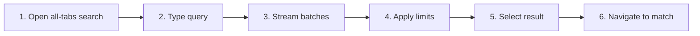

# Search Across Workspace Tabs

## Purpose

Search all open desktop workspaces without loading every document into the UI, stream bounded results, and navigate to the owning tab/file.

| Property | Specification |
|---|---|
| Use-case ID | `UC-014` |
| Primary actor | User |
| Trigger | All-tabs search action or shortcut. |
| Preconditions | Desktop workspace tabs exist; at least one has indexable files. |
| Success result | Results identify tab and file, and selection activates the correct workspace before navigation. |
| Scope exclusion | Dead code, unsupported runtime behavior, and speculative behavior |

## Real-world scenario

A user remembers a phrase but not which of five repositories contains it.



## Main success flow

| Step | User or event | System processing | Observable result |
|---:|---|---|---|
| 1 | Open all-tabs search | Load/prime workspace indexes for open tabs. | Search mode identifies all workspaces. |
| 2 | Type query | Create request ID and dispatch cross-tab search. | Worker search starts. |
| 3 | Stream batches | Host returns result batches/status. | UI appends results without blocking. |
| 4 | Apply limits | Stop at configured cap and mark truncation. | User sees bounded complete status. |
| 5 | Select result | Activate result tab/workspace. | Owning workspace becomes active. |
| 6 | Navigate to match | Open file and locate match. | Correct document/match appears. |

## Alternate and failure flows

| Condition | Required behavior | Recovery |
|---|---|---|
| Index not loaded | Request `loadWorkspaceSearchIndexes`. | Search resumes after loaded message. |
| Query changes | Cancel or obsolete worker request. | Old batches ignored. |
| Result tab closed | Do not reactivate deleted tab. | Show unavailable result. |
| Limit reached | Set `truncated`. | Refine query. |

## Validation and business rules

- Each result includes tab ID/label and canonical file identity.
- Worker search default maximum is bounded; UI pagination is bounded.
- Index priming is incremental to avoid blocking startup.
- Closed tabs invalidate associated indexes/results.


## Protocol effects

| Contract | Direction | Purpose |
|---|---|---|
| `loadWorkspaceSearchIndexes` | UI → host | Load file lists/trees for tabs. |
| `indexWorkspaceSearchItems` | UI → host | Prime searchable items. |
| `searchAcrossWorkspaces` | UI → host | Run all-tabs search. |
| `workspaceSearchIndexLoaded` | Host → UI | Return loaded tab indexes. |
| `crossTabSearchResults` | Host → UI | Stream results/status/cancel/truncation. |

## State and persistence

| State | Rule |
|---|---|
| `cross-tab request ID` | Latest worker query. |
| `tab search indexes` | Per-workspace searchable metadata/content. |
| `page size` | UI shows bounded pages. |

## Runtime-specific behavior

| Runtime | Rule |
|---|---|
| Electron | Search worker; default max 2000 results, prime batch 5, UI page 100. |
| Tauri | Parity search implementation where available. |
| Other hosts | Feature hidden or adapted when desktop workspace tabs are absent. |

## Accessibility, security, and performance

- Keep keyboard focus on the active control or newly opened content.
- Announce asynchronous status through an `aria-live` region.
- Reject stale host responses whose operation or request ID no longer matches.


## Acceptance criteria

- [ ] Results identify their workspace tab.
- [ ] Changing query prevents old batches from appending.
- [ ] Selecting result activates the right tab before file navigation.
- [ ] Truncation/cancellation status is visible.
## UI reference implementation

The sample shows the interaction boundary, not a replacement for the React implementation.

```html
<section class="spec-search-across-workspace-tabs" aria-labelledby="search-across-workspace-tabs-title">
  <h2 id="search-across-workspace-tabs-title">Search Across Workspace Tabs</h2>
  <p data-status role="status" aria-live="polite">Ready</p>
  <button type="button" data-action>Load workspace indexes</button>
</section>
```

```css
.spec-search-across-workspace-tabs {
  display: grid;
  gap: 0.75rem;
  padding: 1rem;
  border: 1px solid var(--border);
  border-radius: var(--radius, 8px);
  background: var(--surface);
  color: var(--text);
}
.spec-search-across-workspace-tabs button:focus-visible {
  outline: 2px solid var(--accent);
  outline-offset: 2px;
}
```

```javascript
const root = document.querySelector('.spec-search-across-workspace-tabs');
const status = root.querySelector('[data-status]');
root.querySelector('[data-action]').addEventListener('click', () => {
  window.PlatformBridge.postMessage({ command: 'loadWorkspaceSearchIndexes', tabs: [{ tabId: 'workspace-tab-1', workspacePath: '/project/docs' }] });
  status.textContent = 'Request sent';
});
```
## Source traceability

| Kind | Path | Purpose |
|---|---|---|
| Implementation | `ui/src/hooks/useDesktopTabSearchSync.ts` | Active behavior or contract |
| Implementation | `ui/src/useAppSearchEffects.ts` | Active behavior or contract |
| Implementation | `electron/search/search-worker-controller.js` | Active behavior or contract |
| Implementation | `electron/search/search-worker.js` | Active behavior or contract |
| Implementation | `electron/search/search-index.js` | Active behavior or contract |
| Implementation | `tauri/src/search/worker.rs` | Active behavior or contract |
| Verification | `tests/unit/electron/search-worker-controller.test.ts` | Automated expectation |
| Verification | `tests/unit/electron/search-worker.test.ts` | Automated expectation |
| Verification | `tests/unit/ui/components/search-overlay-render.test.tsx` | Automated expectation |

---

[← Search the Current Workspace](UC-013-search-current-workspace.md) · [Documentation index](../README.md) · [Open Dropped and External Paths →](UC-015-drag-drop-external-open.md)
