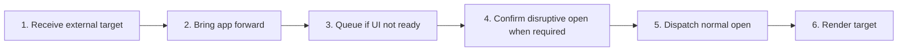

# Open Dropped and External Paths

## Purpose

Accept supported files/folders from drag-and-drop, OS file association, second-instance launch, or extension command and route them through normal safe open operations.

| Property | Specification |
|---|---|
| Use-case ID | `UC-015` |
| Primary actor | User |
| Trigger | Drop event, process arguments, single-instance event, OS file association, or host command. |
| Preconditions | The host receives a resolvable target. |
| Success result | The target opens in the intended workspace/tab or produces recoverable feedback. |
| Scope exclusion | Dead code, unsupported runtime behavior, and speculative behavior |

## Real-world scenario

A user drags a Markdown file into the window, then later double-clicks another file while the app is already running.



## Main success flow

| Step | User or event | System processing | Observable result |
|---:|---|---|---|
| 1 | Receive external target | Normalize file/handle/path and classify folder/file. | Unsupported targets are rejected. |
| 2 | Bring app forward | Restore/show/focus existing window when applicable. | User sees active app. |
| 3 | Queue if UI not ready | Hold external path until ready handshake completes. | No target is lost. |
| 4 | Confirm disruptive open when required | Show confirmation for replacing/switching context. | User chooses continue/cancel. |
| 5 | Dispatch normal open | Use `openPath`, `openFileHandle`, or `openFolder`. | Standard operation/cancellation rules apply. |
| 6 | Render target | Host emits workspace state/content. | Path is visible. |

## Alternate and failure flows

| Condition | Required behavior | Recovery |
|---|---|---|
| Multiple dropped items | Apply supported selection policy; avoid ambiguous silent opens. | User may open individually. |
| Unsupported item | Show ignored/unsupported feedback. | Choose supported file/folder. |
| Second instance while first starting | Queue path. | Open after `ready`. |
| User rejects confirmation | Do not change workspace. | Remain in current context. |

## Validation and business rules

- External input never bypasses extension/type/path validation.
- Queued targets preserve order and are consumed once.
- A drop must not trigger browser navigation.
- The same workspace operation correlation rules apply.


## Protocol effects

| Contract | Direction | Purpose |
|---|---|---|
| `confirmOpenPath` | UI → host | Confirm host-supplied path before disruptive open. |
| `openPath` | UI → host | Open confirmed native path. |
| `openFileHandle` | UI → host | Open dropped/browser file handle. |
| `externalOpenPath` | Host → UI | Deliver queued host path to UI. |
| `readyAck` | Host → UI | Signal UI/host readiness. |
| `renderContent` | Host → UI | Display target. |

## State and persistence

| State | Rule |
|---|---|
| `external open queue` | Targets received before ready. |
| `workspace operation ID` | Correlate open. |
| `drop hover state` | Visual affordance only. |

## Runtime-specific behavior

| Runtime | Rule |
|---|---|
| Electron | Single-instance lock, argv/file association, queued external paths. Unpackaged dev launches (`electron .`) ignore the entry argument `.` and only route explicit external CLI paths. |
| Tauri | Single-instance and file-drop events. |
| VS Code | Explorer/editor commands supply URI. |
| Chromium/Website | File System Access handles from drop/picker where browser permits. |

## Accessibility, security, and performance

- Keep keyboard focus on the active control or newly opened content.
- Announce asynchronous status through an `aria-live` region.
- Reject stale host responses whose operation or request ID no longer matches.


## Acceptance criteria

- [ ] Dropping a supported file prevents default browser behavior and opens once.
- [ ] An external path received before ready is not lost.
- [ ] Unsupported inputs do not reach filesystem conversion/render paths.
- [ ] Cancelling confirmation preserves current workspace.
## UI reference implementation

The sample shows the interaction boundary, not a replacement for the React implementation.

```html
<section class="spec-open-dropped-and-external-paths" aria-labelledby="open-dropped-and-external-paths-title">
  <h2 id="open-dropped-and-external-paths-title">Open Dropped and External Paths</h2>
  <p data-status role="status" aria-live="polite">Ready</p>
  <button type="button" data-action>Confirm open path</button>
</section>
```

```css
.spec-open-dropped-and-external-paths {
  display: grid;
  gap: 0.75rem;
  padding: 1rem;
  border: 1px solid var(--border);
  border-radius: var(--radius, 8px);
  background: var(--surface);
  color: var(--text);
}
.spec-open-dropped-and-external-paths button:focus-visible {
  outline: 2px solid var(--accent);
  outline-offset: 2px;
}
```

```javascript
const root = document.querySelector('.spec-open-dropped-and-external-paths');
const status = root.querySelector('[data-status]');
root.querySelector('[data-action]').addEventListener('click', () => {
  window.PlatformBridge.postMessage({ command: 'confirmOpenPath', path: '/project/docs/readme.md' });
  status.textContent = 'Request sent';
});
```
## Source traceability

| Kind | Path | Purpose |
|---|---|---|
| Implementation | `ui/src/hooks/useFileDropOpen.ts` | Active behavior or contract |
| Implementation | `electron/core/external-open.js` | Active behavior or contract |
| Implementation | `electron/core/startup-workspace.js` | Active behavior or contract |
| Implementation | `tauri/src/runtime/external_open.rs` | Active behavior or contract |
| Implementation | `vscode/src/extension.ts` | Active behavior or contract |
| Implementation | `website-app/src/web-file-mode.ts` | Active behavior or contract |
| Verification | `tests/unit/ui/hooks/useFileDropOpen.test.ts` | Automated expectation |
| Verification | `tests/unit/electron/external-open.test.ts` | Automated expectation |
| Verification | `tests/unit/electron/startup-workspace.test.ts` | Automated expectation |
| Verification | `tests/node/startup-workspace-cancellation.test.mjs` | Automated expectation |

---

[← Search Across Workspace Tabs](UC-014-search-all-workspace-tabs.md) · [Documentation index](../README.md) · [Use Context Menus and Shell Actions →](UC-016-context-menus-shell-actions.md)
