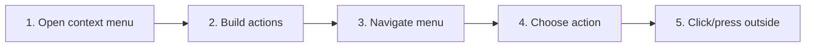

# Use Context Menus and Shell Actions

## Purpose

Expose context-sensitive actions for sidebar items, content tabs, workspace tabs, links, and toolbar controls while routing privileged filesystem/browser work through typed commands.

| Property | Specification |
|---|---|
| Use-case ID | `UC-016` |
| Primary actor | User |
| Trigger | Right-click/context-menu key or toolbar overflow action. |
| Preconditions | A contextual target exists. |
| Success result | Only valid actions appear; chosen action executes once and menu closes predictably. |
| Scope exclusion | Dead code, unsupported runtime behavior, and speculative behavior |

## Real-world scenario

A user reveals the current file in File Explorer, copies a link, opens a folder, or closes other tabs.



## Main success flow

| Step | User or event | System processing | Observable result |
|---:|---|---|---|
| 1 | Open context menu | Identify target kind and viewport coordinates. | Menu appears within viewport. |
| 2 | Build actions | Apply runtime capabilities and target state. | Only valid commands are enabled. |
| 3 | Navigate menu | Use pointer or keyboard. | Focused item is visible. |
| 4 | Choose action | Close menu then execute local or host action. | Requested behavior occurs once. |
| 5 | Click/press outside | Dismiss menu. | Focus returns appropriately. |

## Alternate and failure flows

| Condition | Required behavior | Recovery |
|---|---|---|
| Target disappears | Disable/abort action. | Close menu safely. |
| Shell feature unsupported | Hide native action. | Use copy path/link alternative. |
| Path is a directory | Use `open-directory`. | OS file manager opens directory. |
| Path is a file | Use `reveal-file` or `open-parent-directory`. | OS-specific location appears. |

## Validation and business rules

- Exact shell modes are `open-directory`, `reveal-file`, and `open-parent-directory`.
- OS labels use Finder, File Explorer, or File Manager.
- Menus are clamped to viewport.
- External URLs must pass scheme validation.


## Protocol effects

| Contract | Direction | Purpose |
|---|---|---|
| `openShellLocation` | UI → host | Open/reveal validated path. |
| `openExternal` | UI → host | Open validated URL. |
| `openInEditor` | UI → host | Open file in editor host. |
| `copyCode` | UI → host | Copy content where host clipboard is used. |

## State and persistence

| State | Rule |
|---|---|
| `menu target` | Typed contextual target. |
| `menu position` | Viewport-clamped coordinates. |
| `host platform` | OS-specific labels. |

## Runtime-specific behavior

| Runtime | Rule |
|---|---|
| Electron/Tauri | Native shell locations and browser. |
| VS Code | Editor/reveal actions through extension APIs. |
| Chromium/Website | Native path actions hidden; browser-safe link/copy actions remain. |

## Accessibility, security, and performance

- Keep keyboard focus on the active control or newly opened content.
- Announce asynchronous status through an `aria-live` region.
- Reject stale host responses whose operation or request ID no longer matches.


## Acceptance criteria

- [ ] Menu never renders off-screen.
- [ ] Unsupported privileged actions are absent or disabled.
- [ ] One selection performs one action.
- [ ] Shell command uses correct mode for file/folder target.
## UI reference implementation

The sample shows the interaction boundary, not a replacement for the React implementation.

```html
<section class="spec-use-context-menus-and-shell-actions" aria-labelledby="use-context-menus-and-shell-actions-title">
  <h2 id="use-context-menus-and-shell-actions-title">Use Context Menus and Shell Actions</h2>
  <p data-status role="status" aria-live="polite">Ready</p>
  <button type="button" data-action>Reveal in file manager</button>
</section>
```

```css
.spec-use-context-menus-and-shell-actions {
  display: grid;
  gap: 0.75rem;
  padding: 1rem;
  border: 1px solid var(--border);
  border-radius: var(--radius, 8px);
  background: var(--surface);
  color: var(--text);
}
.spec-use-context-menus-and-shell-actions button:focus-visible {
  outline: 2px solid var(--accent);
  outline-offset: 2px;
}
```

```javascript
const root = document.querySelector('.spec-use-context-menus-and-shell-actions');
const status = root.querySelector('[data-status]');
root.querySelector('[data-action]').addEventListener('click', () => {
  window.PlatformBridge.postMessage({ command: 'openShellLocation', path: '/project/docs/guide.md', mode: 'reveal-file' });
  status.textContent = 'Request sent';
});
```
## Source traceability

| Kind | Path | Purpose |
|---|---|---|
| Implementation | `ui/src/components/Sidebar/SidebarItemMenu.tsx` | Active behavior or contract |
| Implementation | `ui/src/components/shared/TabContextMenu.tsx` | Active behavior or contract |
| Implementation | `ui/src/components/Desktop/DesktopTabContextMenu.tsx` | Active behavior or contract |
| Implementation | `ui/src/components/shared/LinkContextMenu.tsx` | Active behavior or contract |
| Implementation | `ui/src/components/shared/ToolbarActionMenu.tsx` | Active behavior or contract |
| Implementation | `ui/src/desktop/shellLocation.ts` | Active behavior or contract |
| Verification | `tests/unit/ui/components/sidebar-item-menu.test.tsx` | Automated expectation |
| Verification | `tests/unit/ui/dom/linkContextMenu.test.ts` | Automated expectation |
| Verification | `tests/node/shell-location.test.mjs` | Automated expectation |

---

[← Open Dropped and External Paths](UC-015-drag-drop-external-open.md) · [Documentation index](../README.md) · [Configure Application Preferences →](UC-017-preferences.md)
