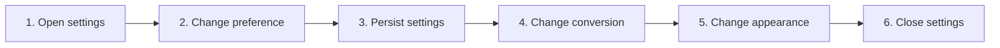

# Configure Application Preferences

## Purpose

Edit supported behavioral preferences, apply changes immediately, and persist normalized settings across sessions.

| Property | Specification |
|---|---|
| Use-case ID | `UC-017` |
| Primary actor | User |
| Trigger | Settings action, shortcut, or onboarding-related preference link. |
| Preconditions | Shared UI is initialized. |
| Success result | Valid changes update the UI/host and persist; invalid values cannot corrupt state. |
| Scope exclusion | Dead code, unsupported runtime behavior, and speculative behavior |

## Real-world scenario

A user enables file tabs, title display, CSV preview, and document conversion while limiting navigation scope.



## Main success flow

| Step | User or event | System processing | Observable result |
|---:|---|---|---|
| 1 | Open settings | Render preference panel from current state. | Controls reflect effective values. |
| 2 | Change preference | Validate and dispatch reducer update. | Affected UI changes immediately. |
| 3 | Persist settings | Call bridge `setState` with normalized state. | Value survives restart. |
| 4 | Change conversion | Send `setDocumentConversion`. | Host updates scan/render eligibility. |
| 5 | Change appearance | Send `updateAppearance`. | Host/UI appearance synchronizes. |
| 6 | Close settings | Return focus to invoking control. | Application remains in updated state. |

## Alternate and failure flows

| Condition | Required behavior | Recovery |
|---|---|---|
| Runtime lacks capability | Hide/disable setting with explanation. | No unsupported command sent. |
| Persisted value wrong type | Use default/normalization. | Settings screen remains usable. |
| Conversion change during workspace | Rescan/refresh according to host. | Convertible files appear/disappear correctly. |
| Scope contains deleted folders | Reconcile invalid paths. | Only valid scopes remain. |

## Validation and business rules

- Settings keys match `AppSettings` exactly.
- Optional maps/lists are size-limited and normalized.
- Preference descriptions explain user-visible effect.
- Changing one preference must not reset unrelated fields.


## Protocol effects

| Contract | Direction | Purpose |
|---|---|---|
| `setDocumentConversion` | UI → host | Enable/disable host conversion. |
| `updateAppearance` | UI → host | Apply mode/style. |
| `workspaceFilesChanged` | Host → UI | Reflect file eligibility changes. |
| `readyAck` | Host → UI | Report effective conversion capability/state. |

## State and persistence

| State | Rule |
|---|---|
| `AppSettings` | Persisted preference object. |
| `settings UI reducer` | Modal panels/dialog state. |
| `scope maps` | Per-workspace path arrays. |

## Runtime-specific behavior

| Runtime | Rule |
|---|---|
| All | Shared settings UI and persisted state. |
| Chromium | Document conversion unavailable/disabled. |
| Desktop | View mode and native shortcut additions apply. |
| VS Code | Extension configuration also influences host behavior. |

## Accessibility, security, and performance

- Keep keyboard focus on the active control or newly opened content.
- Announce asynchronous status through an `aria-live` region.
- Reject stale host responses whose operation or request ID no longer matches.


## Acceptance criteria

- [ ] Every active `AppSettings` key has an editable or intentionally hidden behavior.
- [ ] Invalid persisted values fall back without crash.
- [ ] Conversion toggle reaches capable host once.
- [ ] Unrelated settings survive each change.
## UI reference implementation

The sample shows the interaction boundary, not a replacement for the React implementation.

```html
<section class="spec-configure-application-preferences" aria-labelledby="configure-application-preferences-title">
  <h2 id="configure-application-preferences-title">Configure Application Preferences</h2>
  <p data-status role="status" aria-live="polite">Ready</p>
  <button type="button" data-action>Enable conversion</button>
</section>
```

```css
.spec-configure-application-preferences {
  display: grid;
  gap: 0.75rem;
  padding: 1rem;
  border: 1px solid var(--border);
  border-radius: var(--radius, 8px);
  background: var(--surface);
  color: var(--text);
}
.spec-configure-application-preferences button:focus-visible {
  outline: 2px solid var(--accent);
  outline-offset: 2px;
}
```

```javascript
const root = document.querySelector('.spec-configure-application-preferences');
const status = root.querySelector('[data-status]');
root.querySelector('[data-action]').addEventListener('click', () => {
  window.PlatformBridge.postMessage({ command: 'setDocumentConversion', enabled: true });
  status.textContent = 'Request sent';
});
```
## Source traceability

| Kind | Path | Purpose |
|---|---|---|
| Implementation | `ui/src/components/Settings/SettingsModal.tsx` | Active behavior or contract |
| Implementation | `ui/src/components/Settings/SettingsPreferencesPanel.tsx` | Active behavior or contract |
| Implementation | `ui/src/contexts/reducers/settingsUiReducer.ts` | Active behavior or contract |
| Implementation | `ui/src/themeTypes.ts` | Active behavior or contract |
| Implementation | `ui/src/contexts/AppStateContext.tsx` | Active behavior or contract |
| Verification | `tests/unit/ui/components/settings-modal-deep.test.tsx` | Automated expectation |
| Verification | `tests/unit/ui/components/settings-render.test.tsx` | Automated expectation |
| Verification | `tests/unit/ui/contexts/state-utils.test.ts` | Automated expectation |

---

[← Use Context Menus and Shell Actions](UC-016-context-menus-shell-actions.md) · [Documentation index](../README.md) · [Import and Export Settings →](UC-018-settings-import-export.md)
