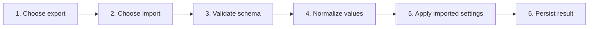

# Import and Export Settings

## Purpose

Move validated settings between installations using a versioned file without importing executable content, unbounded data, or malformed state.

| Property | Specification |
|---|---|
| Use-case ID | `UC-018` |
| Primary actor | User |
| Trigger | Export Settings or Import Settings action. |
| Preconditions | Settings modal is available; browser/host permits file download or selection. |
| Success result | Exported file contains supported normalized fields, or valid imported data replaces/merges state according to contract. |
| Scope exclusion | Dead code, unsupported runtime behavior, and speculative behavior |

## Real-world scenario

A user transfers supported preferences, custom shortcut values, themes, browsing scope, recents, and local layout fragments to another machine.



## Main success flow

| Step | User or event | System processing | Observable result |
|---:|---|---|---|
| 1 | Choose export | Collect current supported settings and metadata. | Versioned JSON file downloads. |
| 2 | Choose import | Select and read JSON file within size limits. | Parser validates envelope. |
| 3 | Validate schema | Check kind, schema version, data shape, limits, and themes. | Errors map to explicit reason. |
| 4 | Normalize values | Clamp arrays/maps/strings and drop unsupported values. | Safe import result is produced. |
| 5 | Apply imported settings | Update shared state and host recents when included. | UI reflects imported configuration. |
| 6 | Persist result | Write through bridge/local stores. | Configuration survives restart. |

## Alternate and failure flows

| Condition | Required behavior | Recovery |
|---|---|---|
| Invalid JSON | Return `invalidJson`. | Choose corrected file. |
| Missing data | Return `missingData`. | Use proper export. |
| Wrong kind | Return `wrongFile`. | Select Markdown Explorer settings file. |
| Unknown schema | Return `unknownSchema`. | Use supported export version. |
| Oversized maps/theme image | Reject or clamp per validation. | Reduce data. |

## Validation and business rules

- Envelope kind is `markdown-explorer-settings`; schema is versioned.
- Do not evaluate imported strings or HTML.
- Recent entries and browsing-scope arrays are capped.
- The active importer currently preserves existing `searchScopeFocus` and `disabledKeybindings` because those two fields are not returned by `normalizeSettings`.
- Custom theme IDs/names/colors/layout/background obey theme limits.


## Protocol effects

| Contract | Direction | Purpose |
|---|---|---|
| `replaceRecentWorkspaces` | UI → host | Synchronize validated imported recents. |
| `recentWorkspacesChanged` | Host → UI | Confirm effective host recent list. |

## State and persistence

| State | Rule |
|---|---|
| `import result` | Validated settings fragment and optional recents. |
| `customThemes` | Capped, normalized theme records. |
| `scopeFocus` | Imported browsing scope; capped per-workspace arrays. |
| `searchScopeFocus/disabledKeybindings` | Existing values are preserved by the current importer. |

## Runtime-specific behavior

| Runtime | Rule |
|---|---|
| All | Shared JSON schema and validation. |
| Browser | Uses browser download/file input. |
| Desktop/VS Code | Uses webview-compatible file selection/download plus host recent sync. |

## Accessibility, security, and performance

- Keep keyboard focus on the active control or newly opened content.
- Announce asynchronous status through an `aria-live` region.
- Reject stale host responses whose operation or request ID no longer matches.


## Acceptance criteria

- [ ] A fresh export imports all fields supported by the active importer.
- [ ] Each declared error reason is distinguishable.
- [ ] Malformed input cannot partially corrupt existing state.
- [ ] Existing search-scope and disabled-shortcut maps remain unchanged during import.
- [ ] Limits prevent unbounded local storage growth.
## UI reference implementation

The sample shows the interaction boundary, not a replacement for the React implementation.

```html
<section class="spec-import-and-export-settings" aria-labelledby="import-and-export-settings-title">
  <h2 id="import-and-export-settings-title">Import and Export Settings</h2>
  <p data-status role="status" aria-live="polite">Ready</p>
  <button type="button" data-action>Apply imported recents</button>
</section>
```

```css
.spec-import-and-export-settings {
  display: grid;
  gap: 0.75rem;
  padding: 1rem;
  border: 1px solid var(--border);
  border-radius: var(--radius, 8px);
  background: var(--surface);
  color: var(--text);
}
.spec-import-and-export-settings button:focus-visible {
  outline: 2px solid var(--accent);
  outline-offset: 2px;
}
```

```javascript
const root = document.querySelector('.spec-import-and-export-settings');
const status = root.querySelector('[data-status]');
root.querySelector('[data-action]').addEventListener('click', () => {
  window.PlatformBridge.postMessage({ command: 'replaceRecentWorkspaces', recentWorkspaces: [{ name: 'Docs', path: '/project/docs', lastOpened: Date.now() }] });
  status.textContent = 'Request sent';
});
```
## Source traceability

| Kind | Path | Purpose |
|---|---|---|
| Implementation | `ui/src/settings/settingsImportExport.ts` | Active behavior or contract |
| Implementation | `ui/src/components/Settings/settingsActions.ts` | Active behavior or contract |
| Implementation | `ui/src/components/Settings/SettingsModalDialogs.tsx` | Active behavior or contract |
| Implementation | `ui/src/theme/customThemes.ts` | Active behavior or contract |
| Verification | `tests/unit/ui/settings-import-export.test.ts` | Automated expectation |
| Verification | `tests/unit/ui/custom-themes.test.ts` | Automated expectation |
| Verification | `tests/unit/ui/components/settings-modal-deep.test.tsx` | Automated expectation |

---

[← Configure Application Preferences](UC-017-preferences.md) · [Documentation index](../README.md) · [Use and Customize Keyboard Shortcuts →](UC-019-keyboard-shortcuts.md)
