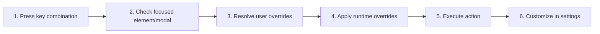

# Use and Customize Keyboard Shortcuts

## Purpose

Resolve default and user-defined shortcuts consistently, avoid browser/IME conflicts, expose searchable shortcut settings, and execute one matching action.

| Property | Specification |
|---|---|
| Use-case ID | `UC-019` |
| Primary actor | User |
| Trigger | Keydown event or shortcut customization. |
| Preconditions | UI focus is not in a context that owns the keystroke, unless action explicitly applies. |
| Success result | Exactly one allowed action runs, or the keystroke remains available to the focused control/system. |
| Scope exclusion | Dead code, unsupported runtime behavior, and speculative behavior |

## Real-world scenario

A user changes search shortcuts, disables one action, uses F11 fullscreen, and types with an IME without interference.



## Main success flow

| Step | User or event | System processing | Observable result |
|---:|---|---|---|
| 1 | Press key combination | Normalize platform modifiers and key token. | Candidate shortcut string is created. |
| 2 | Check focused element/modal | Apply input/editor/dialog guards. | Inapplicable actions are skipped. |
| 3 | Resolve user overrides | Check disabled map and custom binding before defaults. | Effective action is selected. |
| 4 | Apply runtime overrides | Use Electron-specific defaults where defined. | Host-appropriate action remains. |
| 5 | Execute action | Prevent default only when consumed. | One application action occurs. |
| 6 | Customize in settings | Validate conflict/banned binding and persist. | Effective map updates. |

## Alternate and failure flows

| Condition | Required behavior | Recovery |
|---|---|---|
| Binding disabled | Do nothing. | Keystroke remains native where possible. |
| Conflict with another action | Show validation/conflict feedback. | Choose another binding. |
| Banned IME binding `Ctrl+Space` | Reject assignment. | Use safe combination. |
| Desktop fullscreen/reset shortcuts | F11 toggles fullscreen; desktop `Ctrl+Alt+Z` resets Markdown Explorer zoom. VS Code/Chromium/Web retain native zoom behavior. | Rebind configurable desktop actions in Settings; host-native zoom is not intercepted. |

## Validation and business rules

- Shortcut matching is case/ordering normalized.
- Do not consume typing inside editable controls unless action is intended.
- Host/browser safety keys remain protected; non-desktop runtimes retain native zoom shortcuts.
- Search in shortcut settings matches action labels and bindings.
- All shortcuts rendered in tooltips, Settings Modal, and Welcome Page (Tips & Practices) display as styled 3D keycaps (`<ShortcutKeycaps size="sm">`) with lowered view angle perspective.
- Keycaps dynamically inherit active theme tokens (`--bg-e`, `--bg-s`, `--accent`, `--bd-x`, `--bd-s`) and border radius (`border-radius: clamp(0px, var(--r, 6px), 10px)`).
- Shortcut labels in Settings Modal render with high-contrast font weight (`font-weight: 600`) for clear legibility.
- Tips & Practices tab automatically syncs shortcut descriptions with the user's active keybindings configuration.


## Protocol effects

| Contract | Direction | Purpose |
|---|---|---|
| `toggle-fullscreen` | UI → host | Fixed fullscreen action. |
| `zoom-in` | UI → host | Zoom in. |
| `zoom-out` | UI → host | Zoom out. |
| `fullscreenChanged` | Host → UI | Synchronize fullscreen UI state. |

## State and persistence

| State | Rule |
|---|---|
| `keybindings` | Action-to-binding overrides. |
| `disabledKeybindings` | Action disable flags. |
| `effective bindings` | Defaults + runtime overrides + user changes. |

## Runtime-specific behavior

| Runtime | Rule |
|---|---|
| Electron | Uses desktop-specific defaults and close-tab actions. |
| macOS | Command modifier normalization where applicable. |
| Other hosts | Shared defaults plus host/browser reserved-key constraints. |

## Accessibility, security, and performance

- Keep keyboard focus on the active control or newly opened content.
- Announce asynchronous status through an `aria-live` region.
- Reject stale host responses whose operation or request ID no longer matches.


## Acceptance criteria

- [ ] A valid custom binding survives restart.
- [ ] Disabled bindings do not execute.
- [ ] Editable text fields keep normal typing.
- [ ] A key event never triggers two application actions.
## UI reference implementation

The sample shows the interaction boundary, not a replacement for the React implementation.

```html
<section class="spec-use-and-customize-keyboard-shortcuts" aria-labelledby="use-and-customize-keyboard-shortcuts-title">
  <h2 id="use-and-customize-keyboard-shortcuts-title">Use and Customize Keyboard Shortcuts</h2>
  <p data-status role="status" aria-live="polite">Ready</p>
  <button type="button" data-action>Toggle fullscreen</button>
</section>
```

```css
.spec-use-and-customize-keyboard-shortcuts {
  display: grid;
  gap: 0.75rem;
  padding: 1rem;
  border: 1px solid var(--border);
  border-radius: var(--radius, 8px);
  background: var(--surface);
  color: var(--text);
}
.spec-use-and-customize-keyboard-shortcuts button:focus-visible {
  outline: 2px solid var(--accent);
  outline-offset: 2px;
}
```

```javascript
const root = document.querySelector('.spec-use-and-customize-keyboard-shortcuts');
const status = root.querySelector('[data-status]');
root.querySelector('[data-action]').addEventListener('click', () => {
  window.PlatformBridge.postMessage({ command: 'toggle-fullscreen' });
  status.textContent = 'Request sent';
});
```
## Source traceability

| Kind | Path | Purpose |
|---|---|---|
| Implementation | `ui/src/hooks/useKeyboard.ts` | Active behavior or contract |
| Implementation | `ui/src/hooks/keyboardUtils.ts` | Active behavior or contract |
| Implementation | `ui/src/utils/shortcuts.ts` | Active behavior or contract |
| Implementation | `ui/src/components/Settings/SettingsShortcutsPanel.tsx` | Active behavior or contract |
| Implementation | `ui/src/components/Settings/keyboardShortcutSearch.ts` | Active behavior or contract |
| Verification | `tests/unit/ui/hooks/useKeyboard.test.ts` | Automated expectation |
| Verification | `tests/unit/ui/hooks/resolveKeyboardAction.test.ts` | Automated expectation |
| Verification | `tests/unit/ui/utils/shortcuts.test.ts` | Automated expectation |
| Verification | `tests/unit/ui/components/keyboard-shortcut-search.test.ts` | Automated expectation |

---

[← Import and Export Settings](UC-018-settings-import-export.md) · [Documentation index](../README.md) · [Select Theme Mode, Style, and Remix →](UC-020-theme-mode-style-remix.md)
