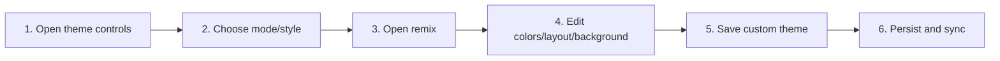

# Select Theme Mode, Style, and Remix

## Purpose

Apply built-in or custom appearance safely, support auto/light/dark modes, create bounded theme remixes, and migrate retired styles.

| Property | Specification |
|---|---|
| Use-case ID | `UC-020` |
| Primary actor | User |
| Trigger | Theme toggle, style picker, onboarding, or Theme Remix controls. |
| Preconditions | Shared UI is initialized. |
| Success result | Valid CSS tokens/layout/background apply immediately and persist without invalid theme state. |
| Scope exclusion | Dead code, unsupported runtime behavior, and speculative behavior |

## Real-world scenario

A user chooses Tokyo Night in dark mode, then creates a custom remix with different spacing and a local background image.



## Main success flow

| Step | User or event | System processing | Observable result |
|---:|---|---|---|
| 1 | Open theme controls | Load effective mode/style/custom theme. | Current selection is visible. |
| 2 | Choose mode/style | Validate `ThemeMode` and `ThemeStyle`. | Built-in tokens apply. |
| 3 | Open remix | Clone normalized base into editable model. | Preview reflects changes. |
| 4 | Edit colors/layout/background | Validate color values, ranges, data URL MIME/size. | Only valid values apply. |
| 5 | Save custom theme | Create/update bounded record with timestamps. | Theme appears in list and may become active. |
| 6 | Persist and sync | Update state and send `updateAppearance`. | Appearance survives restart. |

## Alternate and failure flows

| Condition | Required behavior | Recovery |
|---|---|---|
| Unknown persisted style | Normalize to `default`. | Application remains readable. |
| Legacy `pet-shiba` | Migrate to `pet-white-shiba`. | Current supported pet theme applies. |
| Too many themes/large image | Reject with status feedback. | Delete/reduce content. |
| Delete active custom theme | Clear active ID and fall back to base/default. | UI remains themed. |

## Validation and business rules

- Theme styles are exactly the active union; `glass` CSS is not an accepted style value.
- Custom themes are capped at 24.
- Background accepts png/jpeg/webp/gif data URLs within configured size.
- Layout numeric values are clamped to documented ranges.


## Protocol effects

| Contract | Direction | Purpose |
|---|---|---|
| `updateAppearance` | UI → host | Synchronize mode/style to host. |

## State and persistence

| State | Rule |
|---|---|
| `theme` | `auto`, `light`, or `dark`. |
| `themeStyle` | Active built-in style. |
| `customThemes/activeCustomThemeId` | Persisted remixes and selection. |

## Runtime-specific behavior

| Runtime | Rule |
|---|---|
| All | Shared CSS token/theme implementation. |
| VS Code | Auto mode follows host color context where bridged. |
| Desktop/Website | System preference controls auto mode. |

## Accessibility, security, and performance

- Keep keyboard focus on the active control or newly opened content.
- Announce asynchronous status through an `aria-live` region.
- Reject stale host responses whose operation or request ID no longer matches.


## Acceptance criteria

- [ ] Every active built-in style can be selected.
- [ ] Unknown/legacy values normalize deterministically.
- [ ] Invalid remix input cannot produce unsafe CSS or unbounded storage.
- [ ] Deleting active custom theme yields readable fallback.
## UI reference implementation

The sample shows the interaction boundary, not a replacement for the React implementation.

```html
<section class="spec-select-theme-mode-style-and-remix" aria-labelledby="select-theme-mode-style-and-remix-title">
  <h2 id="select-theme-mode-style-and-remix-title">Select Theme Mode, Style, and Remix</h2>
  <p data-status role="status" aria-live="polite">Ready</p>
  <button type="button" data-action>Apply appearance</button>
</section>
```

```css
.spec-select-theme-mode-style-and-remix {
  display: grid;
  gap: 0.75rem;
  padding: 1rem;
  border: 1px solid var(--border);
  border-radius: var(--radius, 8px);
  background: var(--surface);
  color: var(--text);
}
.spec-select-theme-mode-style-and-remix button:focus-visible {
  outline: 2px solid var(--accent);
  outline-offset: 2px;
}
```

```javascript
const root = document.querySelector('.spec-select-theme-mode-style-and-remix');
const status = root.querySelector('[data-status]');
root.querySelector('[data-action]').addEventListener('click', () => {
  window.PlatformBridge.postMessage({ command: 'updateAppearance', theme: 'dark', themeStyle: 'tokyo-night' });
  status.textContent = 'Request sent';
});
```
## Source traceability

| Kind | Path | Purpose |
|---|---|---|
| Implementation | `ui/src/components/Settings/ThemeStylePicker.tsx` | Active behavior or contract |
| Implementation | `ui/src/components/Settings/ThemeRemixModal.tsx` | Active behavior or contract |
| Implementation | `ui/src/components/Settings/themeRemixModel.ts` | Active behavior or contract |
| Implementation | `ui/src/theme/customThemes.ts` | Active behavior or contract |
| Implementation | `ui/src/themeTypes.ts` | Active behavior or contract |
| Verification | `tests/node/theme-grouping-and-styles.test.mjs` | Automated expectation |
| Verification | `tests/unit/ui/custom-themes.test.ts` | Automated expectation |
| Verification | `tests/unit/ui/components/theme-remix-interactions.test.tsx` | Automated expectation |

---

[← Use and Customize Keyboard Shortcuts](UC-019-keyboard-shortcuts.md) · [Documentation index](../README.md) · [Render Markdown, MDX, and Text Documents →](UC-021-render-markdown-mdx-text.md)
