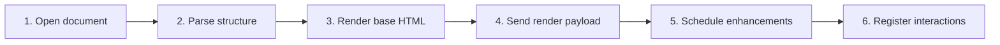

# Render Markdown, MDX, and Text Documents

## Purpose

Parse supported source into safe semantic HTML, frontmatter, TOC, title, and enhancement markers while preserving source text for copy/search/preview features.

| Property | Specification |
|---|---|
| Use-case ID | `UC-021` |
| Primary actor | User |
| Trigger | A supported document opens or refreshes. |
| Preconditions | Host can read the source or has generated a text/converted preview. |
| Success result | Base document renders once, then optional enhancements complete independently. |
| Scope exclusion | Dead code, unsupported runtime behavior, and speculative behavior |

## Real-world scenario

A documentation file contains YAML frontmatter, headings, tasks, callouts, code, math, tables, media, and selected MDX syntax.



## Main success flow

| Step | User or event | System processing | Observable result |
|---:|---|---|---|
| 1 | Open document | Host reads source and determines source kind. | Source text is available. |
| 2 | Parse structure | Handle frontmatter, blocks, inline syntax, tables, and safe MDX stripping. | AST/render model and TOC form. |
| 3 | Render base HTML | Escape unsafe text and emit semantic classes/data attributes. | Readable document appears immediately. |
| 4 | Send render payload | `renderContent` includes HTML/source/frontmatter/TOC/path/title. | UI commits active content/tab. |
| 5 | Schedule enhancements | Run syntax, math, Mermaid, tables, media with bounded concurrency/retries. | Rich features appear progressively. |
| 6 | Register interactions | Attach idempotent copy, heading, table, code-line, and link handlers. | Document becomes interactive. |

## Alternate and failure flows

| Condition | Required behavior | Recovery |
|---|---|---|
| Malformed frontmatter | Treat safely and continue with content/fallback metadata. | Document still renders. |
| Unsupported MDX execution | Strip imports/exports and handle only selected JSX patterns. | No arbitrary component execution. |
| Enhancement fails | Mark failure locally. | Base document remains readable. |
| Empty converted output | Render explanatory failure Markdown. | User sees reason/quality. |

## Validation and business rules

- Render base content exactly once per valid payload.
- Never execute arbitrary MDX imports/exports.
- Title priority follows metadata/heading/filename rules.
- Enhancement handlers are idempotent across rerenders.


## Protocol effects

| Contract | Direction | Purpose |
|---|---|---|
| `navigate` | UI → host | Request document navigation. |
| `renderContent` | Host → UI | Deliver rendered HTML and document metadata. |

## State and persistence

| State | Rule |
|---|---|
| `RenderedDocument` | Current HTML/source/frontmatter/TOC. |
| `ContentTab` | Per-document stored render state. |
| `enhancement task state` | Pending/running/done/failed per element. |

## Runtime-specific behavior

| Runtime | Rule |
|---|---|
| Shared UI | Canonical parser/renderer presentation. |
| VS Code | Maintains corresponding parser/renderer parity. |
| Electron/Tauri/Chromium/Website | Hosts provide source/render payload according to adapter path. |

## Accessibility, security, and performance

- Keep keyboard focus on the active control or newly opened content.
- Announce asynchronous status through an `aria-live` region.
- Reject stale host responses whose operation or request ID no longer matches.


## Acceptance criteria

- [ ] All supported block types produce readable base HTML.
- [ ] Unsafe MDX code is not executed.
- [ ] One enhancement failure does not blank the document.
- [ ] Render payload preserves paths, title, TOC, and source metadata.
## UI reference implementation

The sample shows the interaction boundary, not a replacement for the React implementation.

```html
<section class="spec-render-markdown-mdx-and-text-documents" aria-labelledby="render-markdown-mdx-and-text-documents-title">
  <h2 id="render-markdown-mdx-and-text-documents-title">Render Markdown, MDX, and Text Documents</h2>
  <p data-status role="status" aria-live="polite">Ready</p>
  <button type="button" data-action>Open document</button>
</section>
```

```css
.spec-render-markdown-mdx-and-text-documents {
  display: grid;
  gap: 0.75rem;
  padding: 1rem;
  border: 1px solid var(--border);
  border-radius: var(--radius, 8px);
  background: var(--surface);
  color: var(--text);
}
.spec-render-markdown-mdx-and-text-documents button:focus-visible {
  outline: 2px solid var(--accent);
  outline-offset: 2px;
}
```

```javascript
const root = document.querySelector('.spec-render-markdown-mdx-and-text-documents');
const status = root.querySelector('[data-status]');
root.querySelector('[data-action]').addEventListener('click', () => {
  window.PlatformBridge.postMessage({ command: 'navigate', path: '/project/docs/guide.md' });
  status.textContent = 'Request sent';
});
```
## Source traceability

| Kind | Path | Purpose |
|---|---|---|
| Implementation | `ui/src/markdown/parser.ts` | Active behavior or contract |
| Implementation | `ui/src/markdown/renderer.ts` | Active behavior or contract |
| Implementation | `ui/src/markdown/inline.ts` | Active behavior or contract |
| Implementation | `ui/src/contexts/renderedDocument.ts` | Active behavior or contract |
| Implementation | `ui/src/components/Content/runContentEnhancements.ts` | Active behavior or contract |
| Implementation | `vscode/src/markdown/parser.ts` | Active behavior or contract |
| Implementation | `vscode/src/markdown/renderer.ts` | Active behavior or contract |
| Verification | `tests/unit/ui/markdown/parser.test.ts` | Automated expectation |
| Verification | `tests/unit/ui/markdown/renderer.test.ts` | Automated expectation |
| Verification | `tests/contracts/markdown-parity.test.ts` | Automated expectation |
| Verification | `tests/node/render-once-contract.test.mjs` | Automated expectation |

---

[← Select Theme Mode, Style, and Remix](UC-020-theme-mode-style-remix.md) · [Documentation index](../README.md) · [Preview HTML Safely →](UC-022-html-preview-browser.md)
