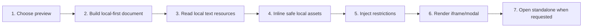

# Preview HTML Safely

## Purpose

Switch eligible HTML content between source and sandboxed preview, inline validated local assets, block active remote access, and optionally open a bounded standalone preview.

| Property | Specification |
|---|---|
| Use-case ID | `UC-022` |
| Primary actor | User |
| Trigger | Open `.html`, render an HTML code block, toggle preview, or choose Open in Browser/Preview. |
| Preconditions | HTML preview is enabled for the relevant content type. |
| Success result | HTML is visible in an isolated sandbox without escaping workspace or enabling active remote network behavior. |
| Scope exclusion | Dead code, unsupported runtime behavior, and speculative behavior |

## Real-world scenario

A developer previews an HTML prototype that references local CSS and JavaScript inside the workspace.



## Main success flow

| Step | User or event | System processing | Observable result |
|---:|---|---|---|
| 1 | Choose preview | Resolve document/code-block preview preference and override. | Preview control state is visible. |
| 2 | Build local-first document | Parse HTML and discover local script/style references. | Resource requests are identified. |
| 3 | Read local text resources | Send correlated `readWorkspaceTextResource`. | Validated CSS/JS content returns. |
| 4 | Inline safe local assets | Resolve recursive CSS imports within workspace. | Self-contained sandbox document forms. |
| 5 | Inject restrictions | Add CSP and disable active networking APIs. | Preview cannot establish active remote connections. |
| 6 | Render iframe/modal | Use sandbox without same-origin and no-referrer. | Interactive local preview appears. |
| 7 | Open standalone when requested | Send bounded HTML to supported host preview server/window. | Separate preview opens and expires safely. |

## Alternate and failure flows

| Condition | Required behavior | Recovery |
|---|---|---|
| Resource outside workspace | Return `outside-workspace`; omit asset and show warning. | Move asset into workspace. |
| Missing/unreadable/unsupported resource | Continue without it. | Correct reference/file. |
| Resource request timeout | Treat as `timeout`. | Retry/reopen preview. |
| Standalone preview unavailable | Keep modal/iframe preview. | Use built-in preview. |

## Validation and business rules

- Sandbox flags are `allow-scripts allow-forms`; never add `allow-same-origin`.
- CSP denies connections, frames, workers, objects, base, and form targets.
- Block fetch/XHR/WebSocket/EventSource/sendBeacon.
- Standalone document size and lifetime are bounded.


## Protocol effects

| Contract | Direction | Purpose |
|---|---|---|
| `readWorkspaceTextResource` | UI → host | Read validated local CSS/JS text. |
| `openHtmlPreview` | UI → host | Open standalone preview where supported. |
| `workspaceTextResourceResult` | Host → UI | Return correlated local asset content/reason. |

## State and persistence

| State | Rule |
|---|---|
| `defaultHtmlPreview` | Default `.html` view. |
| `defaultHtmlCodeBlockPreview` | Default HTML code-block view. |
| `htmlPreviewOverride` | Per-content-tab override. |

## Runtime-specific behavior

| Runtime | Rule |
|---|---|
| Electron | Local preview server/window; max document about 8 MiB; heartbeat/lifetime cleanup. |
| Tauri | Native preview runtime and local protocols. |
| VS Code | Extension-host preview server/webview path. |
| Chromium/Website | Sandboxed in-page preview; no native standalone server. |

## Accessibility, security, and performance

- Keep keyboard focus on the active control or newly opened content.
- Announce asynchronous status through an `aria-live` region.
- Reject stale host responses whose operation or request ID no longer matches.


## Acceptance criteria

- [ ] Preview iframe has no same-origin permission.
- [ ] Workspace escape resource requests fail.
- [ ] Active remote network APIs are unavailable.
- [ ] Missing assets do not prevent source view or base preview.
## UI reference implementation

The sample shows the interaction boundary, not a replacement for the React implementation.

```html
<section class="spec-preview-html-safely" aria-labelledby="preview-html-safely-title">
  <h2 id="preview-html-safely-title">Preview HTML Safely</h2>
  <p data-status role="status" aria-live="polite">Ready</p>
  <button type="button" data-action>Load local resource</button>
</section>
```

```css
.spec-preview-html-safely {
  display: grid;
  gap: 0.75rem;
  padding: 1rem;
  border: 1px solid var(--border);
  border-radius: var(--radius, 8px);
  background: var(--surface);
  color: var(--text);
}
.spec-preview-html-safely button:focus-visible {
  outline: 2px solid var(--accent);
  outline-offset: 2px;
}
```

```javascript
const root = document.querySelector('.spec-preview-html-safely');
const status = root.querySelector('[data-status]');
root.querySelector('[data-action]').addEventListener('click', () => {
  window.PlatformBridge.postMessage({ command: 'readWorkspaceTextResource', requestId: crypto.randomUUID(), documentPath: '/project/docs/guide.md', resourcePath: './styles/site.css' });
  status.textContent = 'Request sent';
});
```
## Source traceability

| Kind | Path | Purpose |
|---|---|---|
| Implementation | `ui/src/markdown/htmlLocalFirstPreview.ts` | Active behavior or contract |
| Implementation | `ui/src/markdown/htmlPreviewDocument.ts` | Active behavior or contract |
| Implementation | `ui/src/components/Modal/HtmlPreviewModal.tsx` | Active behavior or contract |
| Implementation | `ui/src/dom/htmlPreviewActions.ts` | Active behavior or contract |
| Implementation | `electron/core/html-preview-server.js` | Active behavior or contract |
| Implementation | `tauri/src/runtime/html_preview.rs` | Active behavior or contract |
| Implementation | `vscode/src/core/htmlPreviewServer.ts` | Active behavior or contract |
| Verification | `tests/node/html-local-first-followup.test.mjs` | Automated expectation |
| Verification | `tests/node/html-preview-settings-security-followup.test.mjs` | Automated expectation |
| Verification | `tests/unit/electron/html-preview-server.test.ts` | Automated expectation |
| Verification | `tests/node/html-preview-content.test.mjs` | Automated expectation |

---

[← Render Markdown, MDX, and Text Documents](UC-021-render-markdown-mdx-text.md) · [Documentation index](../README.md) · [Convert Supported Documents to Markdown Preview →](UC-023-document-conversion.md)
