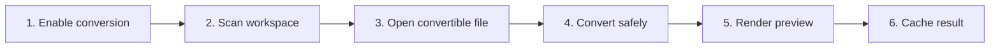

# Convert Supported Documents to Markdown Preview

## Purpose

Opt in to discovery and preview of office, PDF, HTML, spreadsheet, presentation, ODF, and RTF files using bounded runtime-specific converters.

| Property | Specification |
|---|---|
| Use-case ID | `UC-023` |
| Primary actor | User |
| Trigger | Enable conversion or open a supported convertible source. |
| Preconditions | Runtime supports conversion and `documentConversion` is enabled. |
| Success result | The source produces Markdown preview with quality metadata, or explanatory failure content. |
| Scope exclusion | Dead code, unsupported runtime behavior, and speculative behavior |

## Real-world scenario

A user browses a docs folder containing `.docx`, `.pdf`, `.xlsx`, and `.pptx` beside Markdown files.



## Main success flow

| Step | User or event | System processing | Observable result |
|---:|---|---|---|
| 1 | Enable conversion | Send `setDocumentConversion`. | Host updates eligibility. |
| 2 | Scan workspace | Include configured convertible extensions. | Files appear in tree. |
| 3 | Open convertible file | Host checks cache by modification time and size. | Cached or new conversion begins. |
| 4 | Convert safely | Use runtime converter with format/size bounds. | Markdown preview text is produced. |
| 5 | Render preview | Create `previewInfo` with source extension, timing/cache/quality. | Converted document is readable. |
| 6 | Cache result | Store only when source identity is current. | Subsequent open may be faster. |

## Alternate and failure flows

| Condition | Required behavior | Recovery |
|---|---|---|
| Conversion disabled | Do not expose/open convertible source as normal text. | Enable preference. |
| Unsupported runtime | Keep feature hidden/disabled. | Use desktop/VS Code host. |
| Converter fails/empty | Return explanatory Markdown and `conversion-failed`. | Open source externally or fix file. |
| Legacy best effort | Set warning/`legacy-best-effort`. | User treats fidelity cautiously. |
| Source changed | Invalidate mtime+size cache. | Reconvert. |

## Validation and business rules

- Convertible extensions are explicit; do not sniff arbitrary binary files.
- Chromium conversion is disabled.
- Tauri archive/XML members are bounded.
- Preview quality is communicated, not implied to match original layout exactly.


## Protocol effects

| Contract | Direction | Purpose |
|---|---|---|
| `setDocumentConversion` | UI → host | Change host conversion eligibility. |
| `navigate` | UI → host | Open convertible path. |
| `readyAck` | Host → UI | Report effective conversion setting/capability. |
| `workspaceFilesChanged` | Host → UI | Reflect eligible files. |
| `renderContent` | Host → UI | Deliver converted preview and `previewInfo`. |

## State and persistence

| State | Rule |
|---|---|
| `documentConversion` | Persisted opt-in. |
| `previewInfo` | Kind/source/duration/cache/quality/warning. |
| `conversion cache` | Keyed by source mtime and size. |

## Runtime-specific behavior

| Runtime | Rule |
|---|---|
| Electron | Uses `@the-long-ride/markdown-them` conversion wrapper. |
| VS Code | Uses corresponding document conversion module. |
| Tauri | Native Rust converters for HTML/Markdown/ODF/Office/PDF/PPTX/RTF/spreadsheets. |
| Chromium | Disabled. |
| Website | No native office conversion. |

## Accessibility, security, and performance

- Keep keyboard focus on the active control or newly opened content.
- Announce asynchronous status through an `aria-live` region.
- Reject stale host responses whose operation or request ID no longer matches.


## Acceptance criteria

- [ ] Disabled conversion excludes convertible files from normal scan/open behavior.
- [ ] Changed source invalidates cache.
- [ ] Failure yields readable explanation and quality code.
- [ ] Converted content never executes embedded document code.
## UI reference implementation

The sample shows the interaction boundary, not a replacement for the React implementation.

```html
<section class="spec-convert-supported-documents-to-markdown-preview" aria-labelledby="convert-supported-documents-to-markdown-preview-title">
  <h2 id="convert-supported-documents-to-markdown-preview-title">Convert Supported Documents to Markdown Preview</h2>
  <p data-status role="status" aria-live="polite">Ready</p>
  <button type="button" data-action>Enable conversion</button>
</section>
```

```css
.spec-convert-supported-documents-to-markdown-preview {
  display: grid;
  gap: 0.75rem;
  padding: 1rem;
  border: 1px solid var(--border);
  border-radius: var(--radius, 8px);
  background: var(--surface);
  color: var(--text);
}
.spec-convert-supported-documents-to-markdown-preview button:focus-visible {
  outline: 2px solid var(--accent);
  outline-offset: 2px;
}
```

```javascript
const root = document.querySelector('.spec-convert-supported-documents-to-markdown-preview');
const status = root.querySelector('[data-status]');
root.querySelector('[data-action]').addEventListener('click', () => {
  window.PlatformBridge.postMessage({ command: 'setDocumentConversion', enabled: true });
  status.textContent = 'Request sent';
});
```
## Source traceability

| Kind | Path | Purpose |
|---|---|---|
| Implementation | `electron/render/document-converter.js` | Active behavior or contract |
| Implementation | `vscode/src/core/documentConversion.ts` | Active behavior or contract |
| Implementation | `tauri/src/render/native_document_converter/mod.rs` | Active behavior or contract |
| Implementation | `tauri/src/render/document_converter.rs` | Active behavior or contract |
| Implementation | `ui/src/types/content.ts` | Active behavior or contract |
| Verification | `tests/unit/electron/document-converter.test.ts` | Automated expectation |
| Verification | `tests/unit/vscode/documentConversion.test.ts` | Automated expectation |
| Verification | `tests/node/tauri-native-document-converter.test.mjs` | Automated expectation |
| Verification | `tests/node/document-conversion-variants.test.mjs` | Automated expectation |

---

[← Preview HTML Safely](UC-022-html-preview-browser.md) · [Documentation index](../README.md) · [Interact with Tables and Charts →](UC-024-tables-charts.md)
