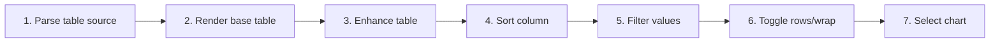

# Interact with Tables and Charts

## Purpose

Render GFM and delimited data, report malformed input, and provide sorting, filtering, wrapping, collapse, and chart views without blocking base content.

| Property | Specification |
|---|---|
| Use-case ID | `UC-024` |
| Primary actor | User |
| Trigger | Document contains a pipe table, TSV/delimited block, or CSV preview. |
| Preconditions | Table data parses into rows/columns or can report a specific warning. |
| Success result | User can inspect and transform the table view; chart loading remains optional and isolated. |
| Scope exclusion | Dead code, unsupported runtime behavior, and speculative behavior |

## Real-world scenario

A report contains 500 rows of metrics; the user filters environments, sorts latency, wraps a text column, and switches to a line chart.



## Main success flow

| Step | User or event | System processing | Observable result |
|---:|---|---|---|
| 1 | Parse table source | Detect delimiter/header mode and normalize rows. | Table model or warning forms. |
| 2 | Render base table | Emit semantic table and enhancement metadata. | First rows are readable. |
| 3 | Enhance table | Attach toolbar, sort, filter, wrap, collapse controls. | Controls become available. |
| 4 | Sort column | Apply stable direction/type-aware ordering. | Rows reorder. |
| 5 | Filter values | Apply global/column multi-select filters. | Visible rows/count update. |
| 6 | Toggle rows/wrap | Expand initial collapse and adjust column width classes. | Dense data becomes manageable. |
| 7 | Select chart | Lazy-load Chart.js and map suitable columns. | Bar/line/pie/doughnut visualization appears. |

## Alternate and failure flows

| Condition | Required behavior | Recovery |
|---|---|---|
| Malformed row widths | Show parse warning and safe fallback. | Fix source. |
| No chartable numeric data | Disable chart modes. | Use table. |
| Chart library fails | Keep table functional and mark chart error. | Retry/reopen. |
| Very large table | Use initial collapse and bounded interactions. | Expand intentionally. |

## Validation and business rules

- Delimited modes support comma, tab, semicolon, and pipe with header/noheader/auto.
- Initial table collapse applies after 15 rows.
- Line chart hides points beyond 200 rows.
- Pie mode renders doughnut-style where specified.


## Protocol effects

| Contract | Direction | Purpose |
|---|---|---|
| None | Local UI | No host protocol required |

## State and persistence

| State | Rule |
|---|---|
| `table sort/filter state` | Scoped to rendered table. |
| `row expansion` | Collapsed/expanded presentation. |
| `chart instance` | Disposed before rerender/unmount. |

## Runtime-specific behavior

| Runtime | Rule |
|---|---|
| All | Shared table rendering and DOM handlers. |
| Converted spreadsheets | Feed Markdown/delimited preview into same table behavior. |

## Accessibility, security, and performance

- Keep keyboard focus on the active control or newly opened content.
- Announce asynchronous status through an `aria-live` region.
- Reject stale host responses whose operation or request ID no longer matches.


## Acceptance criteria

- [ ] Sorting/filtering changes visible rows deterministically.
- [ ] Malformed data reports warning without crashing document.
- [ ] Chart failure leaves table usable.
- [ ] Handlers do not duplicate after enhancement retries.
## UI reference implementation

The sample shows the interaction boundary, not a replacement for the React implementation.

```html
<section class="spec-interact-with-tables-and-charts" aria-labelledby="interact-with-tables-and-charts-title">
  <h2 id="interact-with-tables-and-charts-title">Interact with Tables and Charts</h2>
  <p data-status role="status" aria-live="polite">Ready</p>
  <button type="button" data-action>Open document</button>
</section>
```

```css
.spec-interact-with-tables-and-charts {
  display: grid;
  gap: 0.75rem;
  padding: 1rem;
  border: 1px solid var(--border);
  border-radius: var(--radius, 8px);
  background: var(--surface);
  color: var(--text);
}
.spec-interact-with-tables-and-charts button:focus-visible {
  outline: 2px solid var(--accent);
  outline-offset: 2px;
}
```

```javascript
const root = document.querySelector('.spec-interact-with-tables-and-charts');
const status = root.querySelector('[data-status]');
root.querySelector('[data-action]').addEventListener('click', () => {
  window.PlatformBridge.postMessage({ command: 'navigate', path: '/project/docs/guide.md' });
  status.textContent = 'Request sent';
});
```
## Source traceability

| Kind | Path | Purpose |
|---|---|---|
| Implementation | `ui/src/markdown/tableParser.ts` | Active behavior or contract |
| Implementation | `ui/src/markdown/tableRenderer.ts` | Active behavior or contract |
| Implementation | `ui/src/markdown/delimitedText.ts` | Active behavior or contract |
| Implementation | `ui/src/components/Content/enhancements/tableEnhancement.ts` | Active behavior or contract |
| Implementation | `ui/src/dom/tableHandlers.ts` | Active behavior or contract |
| Implementation | `ui/src/dom/tableChartHandlers.ts` | Active behavior or contract |
| Verification | `tests/unit/ui/dom/registerTableHandlers-comprehensive.test.ts` | Automated expectation |
| Verification | `tests/unit/ui/dom/tableHandlers-sort.test.ts` | Automated expectation |
| Verification | `tests/unit/ui/dom/tableHandlers-filter.test.ts` | Automated expectation |
| Verification | `tests/node/delimited-text.test.mjs` | Automated expectation |

---

[← Convert Supported Documents to Markdown Preview](UC-023-document-conversion.md) · [Documentation index](../README.md) · [View Images, Diagrams, Video, and YouTube Media →](UC-025-media-gallery-video-youtube.md)
