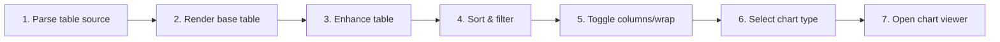

# Interact with Tables and Charts

## Purpose

Render GFM and delimited data, report malformed input, and provide sorting, filtering, wrapping, column visibility toggles, rich chart types, and fullscreen chart inspection without blocking base content.

| Property | Specification |
|---|---|
| Use-case ID | `UC-024` |
| Primary actor | User |
| Trigger | Document contains a pipe table, TSV/delimited block, or CSV preview. |
| Preconditions | Table data parses into rows/columns or can report a specific warning. |
| Success result | User can inspect and transform the table view, hide/show columns, switch across 9 chart visualizations, and open a fullscreen chart viewer; chart loading remains optional and isolated. |
| Scope exclusion | Dead code, unsupported runtime behavior, and speculative behavior |

## Real-world scenario

A report contains 500 rows of metrics; the user filters environments, sorts latency, hides unnecessary metadata columns, wraps text, and switches to a Scatter or Area chart, zooming into detailed trends inside the fullscreen chart viewer.

## Main success flow

| Step | User or event | System processing | Observable result |
|---:|---|---|---|
| 1 | Parse table source | Detect delimiter/header mode and normalize rows. | Table model or warning forms. |
| 2 | Render base table | Emit semantic table and enhancement metadata. | First rows are readable. |
| 3 | Enhance table | Attach toolbar, sort, filter, wrap, column visibility, and chart controls. | Controls become available. |
| 4 | Sort column | Apply stable direction/type-aware ordering. | Rows reorder. |
| 5 | Filter values | Apply global/column multi-select filters. | Visible rows/count update. |
| 6 | Toggle columns | Open Columns menu and toggle switch button for specific columns. | Selected columns hide/show with last-column protection. |
| 7 | Toggle rows/wrap | Expand initial collapse and adjust column width classes. | Dense data becomes manageable. |
| 8 | Select chart | Lazy-load Chart.js and map suitable columns across 9 chart types. | Bar, horizontal bar, line, area, scatter, radar, polar area, pie, or doughnut visualization appears. |
| 9 | Open chart viewer | Click chart canvas or viewer action. | Fullscreen modal opens with 50%–1000% zoom, pan navigation, type switcher, copy image, and PNG save. |

## Alternate and failure flows

| Condition | Required behavior | Recovery |
|---|---|---|
| Malformed row widths | Show parse warning and safe fallback. | Fix source. |
| No chartable numeric data | Disable chart modes. | Use table. |
| Chart library fails | Keep table functional and mark chart error. | Retry/reopen. |
| Attempt to hide last column | Keep switch checked and prevent hiding. | At least one column stays visible. |
| Very large table | Use initial collapse and bounded interactions. | Expand intentionally. |

## Validation and business rules

- Delimited modes support comma, tab, semicolon, and pipe with header/noheader/auto.
- Initial table collapse applies after 15 rows.
- Line chart hides points beyond 200 rows.
- Scatter chart requires at least two visible numeric columns (first is X, others are Y series).
- Table view dropdown dynamically sizes to its widest localized option.
- Chart modal viewer supports continuous 50%–1000% zoom and mouse/touch pan.

## Protocol effects

| Contract | Direction | Purpose |
|---|---|---|
| `saveChartPng` | UI → Host (Tauri) | Request native OS save dialog for chart PNG export. |

## State and persistence

| State | Rule |
|---|---|
| `table sort/filter state` | Scoped to rendered table. |
| `column visibility state` | Hidden column index array per table state. |
| `row expansion` | Collapsed/expanded presentation. |
| `chart instance` | Disposed before rerender/unmount. |
| `chart viewer state` | Ephemeral modal state (scale, pan offset, active view type). |

## Runtime-specific behavior

| Runtime | Rule |
|---|---|
| All | Shared table rendering, DOM handlers, and chart viewer modal. |
| Tauri Desktop | Dispatches `saveChartPng` to Rust dispatcher for native OS file dialog save. |
| Web / Extensions | Direct browser PNG download and clipboard raster copy. |
| Chromium Extension | Delegated click handling in content effects for CSP compliance. |
| Converted spreadsheets | Feed Markdown/delimited preview into same table and chart behavior. |

## Accessibility, security, and performance

- Keep keyboard focus on the active control or newly opened content.
- Table column toggles use accessible `SwitchButton` components with proper `role="switch"`.
- Announce asynchronous status through an `aria-live` region.
- Reject stale host responses whose operation or request ID no longer matches.

## Acceptance criteria

- [ ] Sorting/filtering changes visible rows deterministically.
- [ ] Columns can be toggled without hiding the final remaining column.
- [ ] Malformed data reports warning without crashing document.
- [ ] Chart failure leaves table usable.
- [ ] Fullscreen chart viewer supports 50%–1000% zoom, pan, fit, reset, copy, and PNG save.
- [ ] Handlers do not duplicate after enhancement retries.

## Source traceability

| Kind | Path | Purpose |
|---|---|---|
| Implementation | `ui/src/markdown/tableParser.ts` | Table parsing |
| Implementation | `ui/src/markdown/tableRenderer.ts` | Interactive table renderer |
| Implementation | `ui/src/markdown/delimitedText.ts` | Delimited text parser |
| Implementation | `ui/src/components/Content/enhancements/tableEnhancement.ts` | Table enhancement runner |
| Implementation | `ui/src/dom/tableHandlers.ts` | Core table handlers |
| Implementation | `ui/src/dom/tableChartHandlers.ts` | Table chart bridge |
| Implementation | `ui/src/dom/tableChartConfig.ts` | Chart.js config generator |
| Implementation | `ui/src/dom/tableChartViewer.ts` | Fullscreen chart modal viewer |
| Implementation | `ui/src/dom/tableColumnHandlers.ts` | Column visibility handlers |
| Implementation | `ui/src/components/shared/SwitchButton.tsx` | Accessible switch toggle |
| Verification | `tests/unit/ui/dom/registerTableHandlers-comprehensive.test.ts` | Comprehensive handler tests |
| Verification | `tests/unit/ui/dom/tableHandlers-sort.test.ts` | Sorting unit tests |
| Verification | `tests/unit/ui/dom/tableHandlers-filter.test.ts` | Filter unit tests |
| Verification | `tests/node/table-chart-types-contract.test.mjs` | Multi-type chart contract |
| Verification | `tests/node/table-columns-contract.test.mjs` | Column visibility contract |
| Verification | `tests/node/chart-modal-switch-native-save-contract.test.mjs` | Chart modal viewer contract |
| Verification | `tests/node/delimited-text.test.mjs` | Delimited text tests |

---

[← Convert Supported Documents to Markdown Preview](UC-023-document-conversion.md) · [Documentation index](../README.md) · [View Images, Diagrams, Video, and YouTube Media →](UC-025-media-gallery-video-youtube.md)

