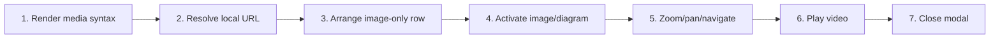

# View Images, Diagrams, Video, and YouTube Media

## Purpose

Resolve local/remote media safely, arrange image-only rows, open a navigable zoomable gallery, and embed supported local video or YouTube variants.

| Property | Specification |
|---|---|
| Use-case ID | `UC-025` |
| Primary actor | User |
| Trigger | Rendered document contains image, Mermaid output, video link, or YouTube URL. |
| Preconditions | Media URL/type is supported and can be resolved within runtime policy. |
| Success result | Media is visible with keyboard-accessible controls; failures remain local to the item. |
| Scope exclusion | Dead code, unsupported runtime behavior, and speculative behavior |

## Real-world scenario

A guide contains screenshots, a Mermaid architecture diagram, a local MP4 demo, and a YouTube tutorial.



## Main success flow

| Step | User or event | System processing | Observable result |
|---:|---|---|---|
| 1 | Render media syntax | Classify image/local video/YouTube/other URL. | Placeholder/media element appears. |
| 2 | Resolve local URL | Map workspace path through safe host/browser resolver. | Media source is available or rejected. |
| 3 | Arrange image-only row | Calculate equal presentation for sibling images. | Gallery-like row appears. |
| 4 | Activate image/diagram | Build gallery from document media items. | Media modal opens. |
| 5 | Zoom/pan/navigate | Clamp zoom and update transform/selected item. | User inspects details. |
| 6 | Play video | Use supported video element or YouTube embed policy and active-locale renderer labels. | Playback controls and localized fallback links appear. |
| 7 | Close modal | Dispose listeners/media state and restore focus. | Document returns. |

## Alternate and failure flows

| Condition | Required behavior | Recovery |
|---|---|---|
| Local path outside workspace | Reject source. | Move media into workspace. |
| Unsupported video extension | Render link/fallback. | Open externally if safe. |
| Media load fails | Show item-level failure/alt text. | Document remains usable. |
| No adjacent gallery item | Hide prev/next controls. | Zoom current item only. |

## Validation and business rules

- Gallery zoom range is 0.25–20; buttons adjust 0.25 and wheel about 0.15.
- Supported local video includes mp4, m4v, webm, ogv, ogg, mov, mkv, and m3u8.
- Tauri local reads enforce containment/range bounds.
- Modal is keyboard reachable and restores focus.
- Generated fallback labels (`Video`, open-video action, YouTube title/link) come from the active `rendererUi` locale rather than hard-coded English.


## Protocol effects

| Contract | Direction | Purpose |
|---|---|---|
| None | Local UI | No host protocol required |

## State and persistence

| State | Rule |
|---|---|
| `media gallery` | Ordered media items/current index. |
| `zoom/pan` | Clamped transform state. |
| `modal open` | Focus trap and restore target. |

## Runtime-specific behavior

| Runtime | Rule |
|---|---|
| Electron/VS Code/Chromium/Website | Runtime-specific local media URL resolvers. |
| Tauri | Custom local-file protocol; rejects unrestricted large full reads. |
| All | Shared gallery/modal and YouTube classification. |

## Accessibility, security, and performance

- Keep keyboard focus on the active control or newly opened content.
- Announce asynchronous status through an `aria-live` region.
- Reject stale host responses whose operation or request ID no longer matches.


## Acceptance criteria

- [ ] Images and Mermaid diagrams open in gallery.
- [ ] Zoom cannot exceed bounds.
- [ ] Keyboard can close and navigate media.
- [ ] A failed media item does not break surrounding document.
- [x] Video and YouTube fallback controls use the active application locale.
## UI reference implementation

The sample shows the interaction boundary, not a replacement for the React implementation.

```html
<section class="spec-view-images-diagrams-video-and-youtube-media" aria-labelledby="view-images-diagrams-video-and-youtube-media-title">
  <h2 id="view-images-diagrams-video-and-youtube-media-title">View Images, Diagrams, Video, and YouTube Media</h2>
  <p data-status role="status" aria-live="polite">Ready</p>
  <button type="button" data-action>Open document</button>
</section>
```

```css
.spec-view-images-diagrams-video-and-youtube-media {
  display: grid;
  gap: 0.75rem;
  padding: 1rem;
  border: 1px solid var(--border);
  border-radius: var(--radius, 8px);
  background: var(--surface);
  color: var(--text);
}
.spec-view-images-diagrams-video-and-youtube-media button:focus-visible {
  outline: 2px solid var(--accent);
  outline-offset: 2px;
}
```

```javascript
const root = document.querySelector('.spec-view-images-diagrams-video-and-youtube-media');
const status = root.querySelector('[data-status]');
root.querySelector('[data-action]').addEventListener('click', () => {
  window.PlatformBridge.postMessage({ command: 'navigate', path: '/project/docs/guide.md' });
  status.textContent = 'Request sent';
});
```
## Source traceability

| Kind | Path | Purpose |
|---|---|---|
| Implementation | `ui/src/constants/limits.ts` | Shared media limits |
| Implementation | `ui/src/constants/urls.ts` | Approved YouTube embed endpoints |
| Implementation | `ui/src/markdown/inline.ts` | YouTube URL classification and embed generation |
| Implementation | `ui/src/markdown/mediaUrls.ts` | Active behavior or contract |
| Implementation | `ui/src/markdown/rawHtmlImageRows.ts` | Active behavior or contract |
| Implementation | `ui/src/components/Modal/MediaModal.tsx` | Active behavior or contract |
| Implementation | `ui/src/components/Modal/mediaGallery.ts` | Active behavior or contract |
| Implementation | `ui/src/dom/localFileUrl.ts` | Active behavior or contract |
| Implementation | `tauri/src/local_file.rs` | Active behavior or contract |
| Implementation | `electron/youtube/youtube-headers.js` | Active behavior or contract |
| Verification | `tests/node/product-constants.test.mjs` | Shared constant contracts |
| Verification | `tests/unit/ui/markdown/mediaUrls.test.ts` | Automated expectation |
| Verification | `tests/unit/ui/components/modal-render.test.tsx` | Automated expectation |
| Verification | `tests/node/website-image-viewer.test.mjs` | Automated expectation |
| Verification | `tests/node/localization-settings-doc-sync-contract.test.mjs` | Generated-media localization guard |
| Verification | `tests/unit/electron/youtube-headers.test.ts` | Automated expectation |

---

[← Interact with Tables and Charts](UC-024-tables-charts.md) · [Documentation index](../README.md) · [Control Window, Tray, Fullscreen, Zoom, and Quit →](UC-026-window-tray-fullscreen-zoom-quit.md)
