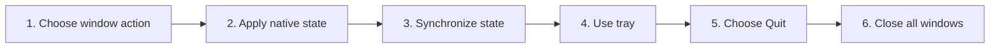

# Control Window, Tray, Fullscreen, Zoom, and Quit

## Purpose

Provide desktop window controls, tray lifecycle, fullscreen synchronization, zoom, and explicit quit behavior consistent with host platform.

| Property | Specification |
|---|---|
| Use-case ID | `UC-026` |
| Primary actor | User |
| Trigger | Header controls, shortcuts, tray actions, OS close, or application quit. |
| Preconditions | Desktop host exposes the relevant capability. |
| Success result | Window state changes exactly once, UI state synchronizes, and quit follows platform/runtime rules. |
| Scope exclusion | Dead code, unsupported runtime behavior, and speculative behavior |

## Real-world scenario

A Windows user minimizes to tray, restores the app, enters fullscreen, adjusts zoom, and chooses Quit.



## Main success flow

| Step | User or event | System processing | Observable result |
|---:|---|---|---|
| 1 | Choose window action | Dispatch typed minimize/maximize/close/fullscreen/zoom command. | Host validates capability. |
| 2 | Apply native state | Window service changes state. | OS window updates. |
| 3 | Synchronize state | Host emits maximized/fullscreen event. | Header icon/layout reflects truth. |
| 4 | Use tray | Click Open or tray icon. | Window restores and focuses. |
| 5 | Choose Quit | Host performs explicit app quit rather than only hiding. | Process exits after cleanup/update rule. |
| 6 | Close all windows | Apply platform lifecycle. | Non-mac quits; mac may remain and recreate on activate. |

## Alternate and failure flows

| Condition | Required behavior | Recovery |
|---|---|---|
| Action unavailable in non-desktop host | Hide control or no-op safely. | Use host-native controls. |
| Close while update scheduled | Apply scheduled-on-exit behavior. | Installer/update flow proceeds. |
| Fullscreen hides header | Header visibility follows contract and escape/shortcut remains available. | Exit fullscreen restores layout. |
| Portable build | Do not advertise install-only updater behavior. | Manual update path. |

## Validation and business rules

- UI does not infer maximized/fullscreen state; host events are authoritative.
- F11 toggles fullscreen; desktop `Ctrl+Alt+Z` resets Markdown Explorer zoom to 100%. VS Code/Chromium/Website leave zoom to the host.
- Tray Quit must terminate, not only hide.
- Window close behavior is platform-specific and documented.


## Protocol effects

| Contract | Direction | Purpose |
|---|---|---|
| `window-minimize` | UI → host | Minimize desktop window. |
| `window-maximize` | UI → host | Toggle maximize/restore. |
| `window-close` | UI → host | Request window close. |
| `toggle-fullscreen` | UI → host | Toggle native fullscreen. |
| `zoom-in` | UI → host | Increase zoom. |
| `zoom-out` | UI → host | Decrease desktop-app zoom. |
| `zoom-reset` | UI → host | Reset desktop-app zoom to 100%. |
| `window-state-changed` | Host → UI | Report maximized state. |
| `fullscreenChanged` | Host → UI | Report fullscreen state. |

## State and persistence

| State | Rule |
|---|---|
| `isMaximized/isFullscreen` | Host-authoritative window state. |
| `zoom level` | Host/webContents scale. |
| `tray lifecycle` | Desktop process/window ownership. |

## Runtime-specific behavior

| Runtime | Rule |
|---|---|
| Electron | Frameless window with 800px minimum width, tray Open/Quit, single instance; non-mac quits on all windows closed; mac activate recreates. |
| Tauri | Frameless 1280×800, minimum 800×480, restored window state, native commands. |
| VS Code/Chromium/Website | Native application window controls absent; browser/editor owns lifecycle and zoom. Markdown Explorer does not intercept zoom/reset shortcuts. |

## Accessibility, security, and performance

- Keep keyboard focus on the active control or newly opened content.
- Announce asynchronous status through an `aria-live` region.
- Reject stale host responses whose operation or request ID no longer matches.


## Acceptance criteria

- [ ] Header state follows host events.
- [ ] Tray Open restores/focuses hidden window.
- [ ] Tray Quit exits.
- [ ] Non-desktop hosts do not show nonfunctional native controls.
## UI reference implementation

The sample shows the interaction boundary, not a replacement for the React implementation.

```html
<section class="spec-control-window-tray-fullscreen-zoom-and-quit" aria-labelledby="control-window-tray-fullscreen-zoom-and-quit-title">
  <h2 id="control-window-tray-fullscreen-zoom-and-quit-title">Control Window, Tray, Fullscreen, Zoom, and Quit</h2>
  <p data-status role="status" aria-live="polite">Ready</p>
  <button type="button" data-action>Minimize window</button>
</section>
```

```css
.spec-control-window-tray-fullscreen-zoom-and-quit {
  display: grid;
  gap: 0.75rem;
  padding: 1rem;
  border: 1px solid var(--border);
  border-radius: var(--radius, 8px);
  background: var(--surface);
  color: var(--text);
}
.spec-control-window-tray-fullscreen-zoom-and-quit button:focus-visible {
  outline: 2px solid var(--accent);
  outline-offset: 2px;
}
```

```javascript
const root = document.querySelector('.spec-control-window-tray-fullscreen-zoom-and-quit');
const status = root.querySelector('[data-status]');
root.querySelector('[data-action]').addEventListener('click', () => {
  window.PlatformBridge.postMessage({ command: 'window-minimize' });
  status.textContent = 'Request sent';
});
```
## Source traceability

| Kind | Path | Purpose |
|---|---|---|
| Implementation | `ui/src/components/Workspace/WorkspaceWindowControls.tsx` | Active behavior or contract |
| Implementation | `electron/window/window.js` | Active behavior or contract |
| Implementation | `electron/window/tray.js` | Active behavior or contract |
| Implementation | `electron/core/main-bootstrap.js` | Active behavior or contract |
| Implementation | `tauri/src/dispatcher/commands_window_update.rs` | Active behavior or contract |
| Implementation | `tauri/tauri.conf.json` | Active behavior or contract |
| Verification | `tests/unit/electron/window.test.ts` | Automated expectation |
| Verification | `tests/unit/electron/tray.test.ts` | Automated expectation |
| Verification | `tests/contracts/fullscreen-header-visibility.test.ts` | Automated expectation |
| Verification | `tests/unit/electron/main.test.ts` | Automated expectation |

---

[← View Images, Diagrams, Video, and YouTube Media](UC-025-media-gallery-video-youtube.md) · [Documentation index](../README.md) · [Download, Schedule, and Apply Application Updates →](UC-027-application-update.md)
