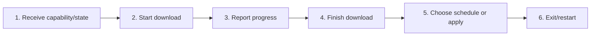

# Download, Schedule, and Apply Application Updates

## Purpose

Expose update availability only on capable packaged installations, report progress/errors, and let the user download, schedule-on-exit, or restart-and-apply safely.

| Property | Specification |
|---|---|
| Use-case ID | `UC-027` |
| Primary actor | User |
| Trigger | Host detects update or user selects update action. |
| Preconditions | Runtime reports `canInstallUpdates` and update metadata is valid. |
| Success result | Update reaches downloaded/scheduled/applied state or an actionable error without corrupting current session. |
| Scope exclusion | Dead code, unsupported runtime behavior, and speculative behavior |

## Real-world scenario

A supported Electron or signed Tauri desktop build downloads a verified release, then the user chooses Update on Close or Restart Now.



## Main success flow

| Step | User or event | System processing | Observable result |
|---:|---|---|---|
| 1 | Receive capability/state | Ready state reports updater support and current update state. | Update UI appears only when valid. |
| 2 | Start download | Send `downloadUpdate` with version and URL. | State becomes downloading. |
| 3 | Report progress | Host emits `updateStateChanged`. | Progress indicator updates. |
| 4 | Finish download | Host verifies and stages the signed artifact; Tauri persists verified bytes and metadata. | State becomes downloaded. |
| 5 | Choose schedule or apply | Send schedule or restart command. | State becomes scheduled-on-exit or applying. |
| 6 | Exit/restart | Host invokes trusted installer/update flow. | New version installs or error is reported. |

## Alternate and failure flows

| Condition | Required behavior | Recovery |
|---|---|---|
| Portable/dev/unsupported host | `canInstallUpdates` false; hide install controls. | Use manual release download. |
| Download fails | State `error` with message. | Retry later. |
| Version/artifact invalid | Reject staging. | Keep current version. |
| Apply fails | Report error; do not loop restarts. | Manual recovery. |

## Validation and business rules

- Update statuses are exact enum values.
- In-app installation is limited to supported packaged installations.
- UI never executes arbitrary downloaded file paths.
- Tauri uses `tauri-plugin-updater`; `Update::download` verifies the release signature before bytes are staged.
- Requested version must match the updater endpoint response.
- Progress and errors originate from host state.


## Protocol effects

| Contract | Direction | Purpose |
|---|---|---|
| `downloadUpdate` | UI → host | Download specified release. |
| `scheduleDownloadedUpdate` | UI → host | Apply downloaded update on exit. |
| `restartAndApplyUpdate` | UI → host | Restart and apply now. |
| `updateStateChanged` | Host → UI | Synchronize updater state/progress/error. |

## State and persistence

| State | Rule |
|---|---|
| `UpdateState` | idle/downloading/downloaded/scheduled-on-exit/applying/error. |
| `canInstallUpdates` | Host capability gate. |
| `staged artifact metadata` | Host-owned validated paths/names; Tauri persists `pending-update.json` beside staged verified bytes. |

## Runtime-specific behavior

| Runtime | Rule |
|---|---|
| Electron installed packaged Windows | In-app update eligible; portable excluded. |
| Tauri | Official updater/process plugins provide signed download, progress, persisted downloaded/scheduled state, apply-on-close, install-and-restart, and restoration after relaunch. |
| VS Code | Shared update checking may report availability, but VS Code owns extension download/install; Markdown Explorer download/install controls are hidden. |
| Chromium/Website | Distribution channel owns updates; app installer controls hidden. |

## Accessibility, security, and performance

- Keep keyboard focus on the active control or newly opened content.
- Announce asynchronous status through an `aria-live` region.
- Reject stale host responses whose operation or request ID no longer matches.


## Acceptance criteria

- [ ] Unsupported builds never show install action.
- [ ] Progress/state transitions match host events.
- [ ] A failed update leaves current app usable.
- [ ] Schedule and immediate apply are distinguishable.
- [ ] Tauri restores downloaded/scheduled state only when the staged artifact still exists.
- [ ] Release workflow uploads each updater artifact with its `.sig` companion.
## UI reference implementation

The sample shows the interaction boundary, not a replacement for the React implementation.

```html
<section class="spec-download-schedule-and-apply-application-updates" aria-labelledby="download-schedule-and-apply-application-updates-title">
  <h2 id="download-schedule-and-apply-application-updates-title">Download, Schedule, and Apply Application Updates</h2>
  <p data-status role="status" aria-live="polite">Ready</p>
  <button type="button" data-action>Download update</button>
</section>
```

```css
.spec-download-schedule-and-apply-application-updates {
  display: grid;
  gap: 0.75rem;
  padding: 1rem;
  border: 1px solid var(--border);
  border-radius: var(--radius, 8px);
  background: var(--surface);
  color: var(--text);
}
.spec-download-schedule-and-apply-application-updates button:focus-visible {
  outline: 2px solid var(--accent);
  outline-offset: 2px;
}
```

```javascript
const root = document.querySelector('.spec-download-schedule-and-apply-application-updates');
const status = root.querySelector('[data-status]');
root.querySelector('[data-action]').addEventListener('click', () => {
  window.PlatformBridge.postMessage({ command: 'downloadUpdate', version: '1.7.0', url: 'https://updates.example.com/markdown-explorer-1.7.0.zip' });
  status.textContent = 'Request sent';
});
```
## Source traceability

| Kind | Path | Purpose |
|---|---|---|
| Implementation | `ui/src/constants/urls.ts` | Shared product constants |
| Implementation | `ui/src/hooks/useUpdateCheck.ts` | Active behavior or contract |
| Implementation | `ui/src/useAppUpdateActions.ts` | Active behavior or contract |
| Implementation | `electron/update/update-manager.js` | Active behavior or contract |
| Implementation | `electron/update/update-state.js` | Active behavior or contract |
| Implementation | `electron/update/update-helper.js` | Active behavior or contract |
| Implementation | `tauri/src/update/manager.rs` | Active behavior or contract |
| Implementation | `tauri/src/dispatcher/commands_window_update.rs` | Active behavior or contract |
| Implementation | `tauri/src/core/bootstrap.rs` | Plugin setup and close-time apply interception |
| Implementation | `tauri/tauri.conf.json` | Updater endpoint, public-key sentinel, signed artifact flag |
| Implementation | `scripts/configure-tauri-updater.mjs` | Release-time updater key injection |
| Implementation | `.github/workflows/release.yml` | Signing and paired artifact publication |
| Verification | `tests/node/product-constants.test.mjs` | Shared constant contracts |
| Verification | `tests/unit/ui/hooks/useUpdateCheck.test.ts` | Automated expectation |
| Verification | `tests/unit/electron/update-manager.test.ts` | Automated expectation |
| Verification | `tests/unit/electron/update-helper.test.ts` | Automated expectation |
| Verification | `tests/node/packaged-runtime-contract.test.mjs` | Automated expectation |
| Verification | `tests/node/tauri-updater-contract.test.mjs` | Tauri state, plugin, close/restart, and signing workflow contract |

---

[← Control Window, Tray, Fullscreen, Zoom, and Quit](UC-026-window-tray-fullscreen-zoom-quit.md) · [Documentation index](../README.md) · [Recover from Errors and Unavailable Workspaces →](UC-028-errors-recovery-unavailable.md)
