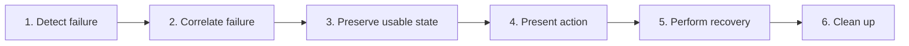

# Recover from Errors and Unavailable Workspaces

## Purpose

Translate filesystem, conversion, navigation, resource, update, and runtime failures into bounded states with clear recovery actions.

| Property | Specification |
|---|---|
| Use-case ID | `UC-028` |
| Primary actor | User |
| Trigger | Any host/UI operation fails or a workspace becomes missing/locked. |
| Preconditions | An operation or enhancement is active. |
| Success result | The user retains a usable shell/document and can retry, choose another target, or remove stale state. |
| Scope exclusion | Dead code, unsupported runtime behavior, and speculative behavior |

## Real-world scenario

A recent workspace moved, a local CSS file is missing, and a chart enhancement fails while the main document remains readable.



## Main success flow

| Step | User or event | System processing | Observable result |
|---:|---|---|---|
| 1 | Detect failure | Classify typed reason/error at the narrowest boundary. | Failure state is created. |
| 2 | Correlate failure | Check operation/request/tab identity. | Stale failure is ignored. |
| 3 | Preserve usable state | Keep previous workspace/base document where safe. | App does not blank globally. |
| 4 | Present action | Show retry/select/remove/open-source/detail action. | User understands next step. |
| 5 | Perform recovery | Start fresh correlated operation or dismiss local failure. | State returns to loading/ready. |
| 6 | Clean up | Dispose timers/listeners/workers/preview servers. | No repeated background failure. |

## Alternate and failure flows

| Condition | Required behavior | Recovery |
|---|---|---|
| Workspace missing | Show `missing`; offer remove recent/select another. | Open valid target. |
| Workspace locked | Show `locked`; preserve recent. | Fix permission and retry. |
| Navigation target absent | Show `navNotFound`. | Stay current. |
| Resource failure | Omit asset and show warning. | Fix reference. |
| Enhancement failure | Mark only element. | Base content stays usable. |
| Updater error | Show state error. | Retry/manual update. |

## Validation and business rules

- Never delete recents automatically for a temporary lock.
- Errors include actionable context but not secrets.
- Recovery creates new IDs and invalidates failed work.
- Application-level failure presentation is last resort; feature errors remain local.


## Protocol effects

| Contract | Direction | Purpose |
|---|---|---|
| `refresh` | UI → host | Retry workspace/content. |
| `deleteRecentWorkspace` | UI → host | Remove confirmed stale recent. |
| `openFolder` | UI → host | Choose replacement workspace. |
| `workspaceUnavailable` | Host → UI | Missing/locked workspace. |
| `navNotFound` | Host → UI | Unresolved navigation. |
| `workspaceTextResourceResult` | Host → UI | Resource failure reason. |
| `updateStateChanged` | Host → UI | Updater error. |
| `workspaceOpenCancelled` | Host → UI | Cancelled operation. |

## State and persistence

| State | Rule |
|---|---|
| `error/reason` | Typed local or host state. |
| `last usable workspace/content` | Preserved where safe. |
| `operation/request IDs` | Recovery generation. |

## Runtime-specific behavior

| Runtime | Rule |
|---|---|
| All | Shared error presentation and stale-result guards. |
| Native hosts | Expose filesystem/shell/update-specific reasons. |
| Browser | Permission loss and handle access are common recoverable cases. |

## Accessibility, security, and performance

- Keep keyboard focus on the active control or newly opened content.
- Announce asynchronous status through an `aria-live` region.
- Reject stale host responses whose operation or request ID no longer matches.


## Acceptance criteria

- [ ] Every typed reason maps to an understandable state/action.
- [ ] One failed enhancement cannot hide base document.
- [ ] Retry uses a new correlation ID.
- [ ] Locked and missing workspaces remain distinct.
## UI reference implementation

The sample shows the interaction boundary, not a replacement for the React implementation.

```html
<section class="spec-recover-from-errors-and-unavailable-workspaces" aria-labelledby="recover-from-errors-and-unavailable-workspaces-title">
  <h2 id="recover-from-errors-and-unavailable-workspaces-title">Recover from Errors and Unavailable Workspaces</h2>
  <p data-status role="status" aria-live="polite">Ready</p>
  <button type="button" data-action>Refresh content</button>
</section>
```

```css
.spec-recover-from-errors-and-unavailable-workspaces {
  display: grid;
  gap: 0.75rem;
  padding: 1rem;
  border: 1px solid var(--border);
  border-radius: var(--radius, 8px);
  background: var(--surface);
  color: var(--text);
}
.spec-recover-from-errors-and-unavailable-workspaces button:focus-visible {
  outline: 2px solid var(--accent);
  outline-offset: 2px;
}
```

```javascript
const root = document.querySelector('.spec-recover-from-errors-and-unavailable-workspaces');
const status = root.querySelector('[data-status]');
root.querySelector('[data-action]').addEventListener('click', () => {
  window.PlatformBridge.postMessage({ command: 'refresh' });
  status.textContent = 'Request sent';
});
```
## Source traceability

| Kind | Path | Purpose |
|---|---|---|
| Implementation | `ui/src/contexts/appStateReducer.ts` | Active behavior or contract |
| Implementation | `ui/src/App.tsx` | Active behavior or contract |
| Implementation | `ui/src/components/Content/scheduleContentEnhancements.ts` | Active behavior or contract |
| Implementation | `electron/core/runtime-utils.js` | Active behavior or contract |
| Implementation | `tauri/src/core/error.rs` | Active behavior or contract |
| Implementation | `vscode/src/core/panel.ts` | Active behavior or contract |
| Implementation | `chromium-xtension/src/chrome-host.ts` | Active behavior or contract |
| Verification | `tests/unit/ui/contexts/appStateReducer-missing.test.ts` | Automated expectation |
| Verification | `tests/node/content-enhancement-scheduler.test.mjs` | Automated expectation |
| Verification | `tests/unit/electron/main-runtime.test.ts` | Automated expectation |
| Verification | `tests/unit/chromium/chrome-host-extended.test.ts` | Automated expectation |

---

[← Download, Schedule, and Apply Application Updates](UC-027-application-update.md) · [Documentation index](../README.md) · [Use Welcome, Help, and Localization →](UC-029-welcome-help-localization.md)
