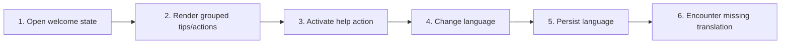

# Use Welcome, Help, and Localization

## Purpose

Provide discoverable startup/help content and render supported interface languages without changing identifiers, file content, or host contracts.

| Property | Specification |
|---|---|
| Use-case ID | `UC-029` |
| Primary actor | User |
| Trigger | No active document, Welcome action, language change, or first-run context. |
| Preconditions | Shared UI is initialized. |
| Success result | Welcome/help content and controls use the selected supported language, with English fallback for missing strings. |
| Scope exclusion | Dead code, unsupported runtime behavior, and speculative behavior |

## Real-world scenario

A Vietnamese user opens Welcome, reviews keyboard tips, then switches to Japanese UI labels.



## Main success flow

| Step | User or event | System processing | Observable result |
|---:|---|---|---|
| 1 | Open welcome state | Select translated welcome model for current language. | Welcome page appears. |
| 2 | Render grouped tips/actions | Show workspace, search, navigation, appearance, and help guidance. | User sees actionable shortcuts. |
| 3 | Activate help action | Open relevant UI or safe external resource. | Target behavior starts. |
| 4 | Change language | Validate code and update settings. | Visible application labels rerender. |
| 5 | Persist language | Write through bridge state. | Choice survives restart. |
| 6 | Encounter missing translation | Use fallback string. | No blank label appears. |

## Alternate and failure flows

| Condition | Required behavior | Recovery |
|---|---|---|
| Unknown language code | Normalize/fallback to English. | Settings remains usable. |
| Translation key missing | Use canonical fallback. | UI remains understandable. |
| External help unavailable | Keep local welcome tips. | Retry external link later. |

## Validation and business rules

- Supported languages are en, vi, fr, es, zh, no, ja, ko, and ru.
- Do not translate paths, commands, code, identifiers, or user documents.
- Welcome shortcuts reflect effective binding where implemented.
- Language changes do not reset other settings.
- When all document files/tabs are closed, a featured **Random Tip Card** from the Tips & Practices collection is randomly selected and rendered in the center of `content__scroll` with full 3D keycap formatting and shuffle controls.


## Protocol effects

| Contract | Direction | Purpose |
|---|---|---|
| `openExternal` | UI → host | Open validated external help link when used. |

## State and persistence

| State | Rule |
|---|---|
| `language` | Persisted locale code. |
| `welcome view` | Local content mode. |
| `translation fallback` | English/canonical value. |

## Runtime-specific behavior

| Runtime | Rule |
|---|---|
| All | Shared translation data and welcome UI. |
| Host-native dialogs | May remain OS-localized independently. |

## Accessibility, security, and performance

- Keep keyboard focus on the active control or newly opened content.
- Announce asynchronous status through an `aria-live` region.
- Reject stale host responses whose operation or request ID no longer matches.


## Acceptance criteria

- [ ] Each supported locale renders non-empty core labels.
- [ ] Unknown locale falls back safely.
- [ ] Changing language preserves workspace/content.
- [ ] Code/path identifiers remain unchanged.
## UI reference implementation

The sample shows the interaction boundary, not a replacement for the React implementation.

```html
<section class="spec-use-welcome-help-and-localization" aria-labelledby="use-welcome-help-and-localization-title">
  <h2 id="use-welcome-help-and-localization-title">Use Welcome, Help, and Localization</h2>
  <p data-status role="status" aria-live="polite">Ready</p>
  <button type="button" data-action>Open external link</button>
</section>
```

```css
.spec-use-welcome-help-and-localization {
  display: grid;
  gap: 0.75rem;
  padding: 1rem;
  border: 1px solid var(--border);
  border-radius: var(--radius, 8px);
  background: var(--surface);
  color: var(--text);
}
.spec-use-welcome-help-and-localization button:focus-visible {
  outline: 2px solid var(--accent);
  outline-offset: 2px;
}
```

```javascript
const root = document.querySelector('.spec-use-welcome-help-and-localization');
const status = root.querySelector('[data-status]');
root.querySelector('[data-action]').addEventListener('click', () => {
  window.PlatformBridge.postMessage({ command: 'openExternal', url: 'https://example.com/documentation' });
  status.textContent = 'Request sent';
});
```
## Source traceability

| Kind | Path | Purpose |
|---|---|---|
| Implementation | `ui/src/contexts/translations.ts` | Active behavior or contract |
| Implementation | `ui/src/contexts/translationsData.ts` | Active behavior or contract |
| Implementation | `ui/src/contexts/welcomeTranslations.ts` | Active behavior or contract |
| Implementation | `ui/src/components/Content/renderWelcomeDescription.tsx` | Active behavior or contract |
| Implementation | `ui/src/components/Content/welcomeTipsContent.ts` | Active behavior or contract |
| Verification | `tests/unit/ui/contexts/translations.test.ts` | Automated expectation |
| Verification | `tests/unit/ui/contexts/welcome-translations.test.ts` | Automated expectation |
| Verification | `tests/unit/ui/components/welcome-render.test.tsx` | Automated expectation |

---

[← Recover from Errors and Unavailable Workspaces](UC-028-errors-recovery-unavailable.md) · [Documentation index](../README.md) · [Copy, Edit, Open in Browser, and Export Content →](UC-030-copy-edit-browser-snapshot.md)
