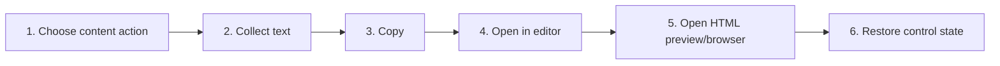

# Copy, Edit, Open in Browser, and Export Content

## Purpose

Let users copy code/sections/documents, open source in an editor or browser preview, and create user-controlled content snapshots without bypassing host security.

| Property | Specification |
|---|---|
| Use-case ID | `UC-030` |
| Primary actor | User |
| Trigger | Copy button, heading/document action, Open in Editor, HTML preview action, or browser download/export control. |
| Preconditions | Current content exposes the selected action and runtime supports it. |
| Success result | Requested text or destination is produced once, with feedback and no hidden mutation of source files. |
| Scope exclusion | Dead code, unsupported runtime behavior, and speculative behavior |

## Real-world scenario

A user copies a code block, copies a whole section, opens the source in VS Code, and opens an HTML preview.



## Main success flow

| Step | User or event | System processing | Observable result |
|---:|---|---|---|
| 1 | Choose content action | Identify code/section/document/source target. | Action is enabled only when data exists. |
| 2 | Collect text | Use source text or DOM extraction that omits controls. | Canonical copy payload forms. |
| 3 | Copy | Use bridge clipboard or `copyCode`. | Success/failure feedback appears. |
| 4 | Open in editor | Send canonical file path to host. | Editor focuses source where supported. |
| 5 | Open HTML preview/browser | Build safe preview and send `openHtmlPreview` or browser action. | Preview destination opens. |
| 6 | Restore control state | Reset temporary copied label/timer. | Action can repeat. |

## Alternate and failure flows

| Condition | Required behavior | Recovery |
|---|---|---|
| Clipboard rejected | Show failure; do not claim copied. | Retry or manual selection. |
| No source document text | Use available Markdown/DOM fallback according to action. | Copy remains meaningful. |
| Editor action unsupported | Hide action. | Use shell/copy path. |
| Preview exceeds host limit | Keep in-app source/preview. | Reduce document. |

## Validation and business rules

- Copy extraction excludes buttons/toolbars and hidden implementation text.
- Opening in editor never edits content automatically.
- External/browser actions pass validated data only.
- Timers/listeners are cleaned after feedback.


## Protocol effects

| Contract | Direction | Purpose |
|---|---|---|
| `copyCode` | UI → host | Delegate clipboard where needed. |
| `openInEditor` | UI → host | Open canonical source path. |
| `openHtmlPreview` | UI → host | Open bounded standalone preview. |
| `openExternal` | UI → host | Open safe browser target. |

## State and persistence

| State | Rule |
|---|---|
| `copy feedback` | Temporary success/failure state. |
| `sourceDocumentText/markdownSource` | Canonical copy/preview inputs. |
| `filePath` | Host target identity. |

## Runtime-specific behavior

| Runtime | Rule |
|---|---|
| VS Code | Open in editor is a primary action. |
| Electron/Tauri | May open editor/shell or standalone HTML preview. |
| Chromium/Website | Browser clipboard/download/preview restrictions apply. |

## Accessibility, security, and performance

- Keep keyboard focus on the active control or newly opened content.
- Announce asynchronous status through an `aria-live` region.
- Reject stale host responses whose operation or request ID no longer matches.


## Acceptance criteria

- [ ] Copy success is reported only after clipboard completion.
- [ ] Copied section excludes unrelated UI controls.
- [ ] Unsupported editor action is not shown.
- [ ] Preview action uses the same sandbox/security rules as normal HTML preview.
## UI reference implementation

The sample shows the interaction boundary, not a replacement for the React implementation.

```html
<section class="spec-copy-edit-open-in-browser-and-export-content" aria-labelledby="copy-edit-open-in-browser-and-export-content-title">
  <h2 id="copy-edit-open-in-browser-and-export-content-title">Copy, Edit, Open in Browser, and Export Content</h2>
  <p data-status role="status" aria-live="polite">Ready</p>
  <button type="button" data-action>Copy code</button>
</section>
```

```css
.spec-copy-edit-open-in-browser-and-export-content {
  display: grid;
  gap: 0.75rem;
  padding: 1rem;
  border: 1px solid var(--border);
  border-radius: var(--radius, 8px);
  background: var(--surface);
  color: var(--text);
}
.spec-copy-edit-open-in-browser-and-export-content button:focus-visible {
  outline: 2px solid var(--accent);
  outline-offset: 2px;
}
```

```javascript
const root = document.querySelector('.spec-copy-edit-open-in-browser-and-export-content');
const status = root.querySelector('[data-status]');
root.querySelector('[data-action]').addEventListener('click', () => {
  window.PlatformBridge.postMessage({ command: 'copyCode', text: 'const ready = true;' });
  status.textContent = 'Request sent';
});
```
## Source traceability

| Kind | Path | Purpose |
|---|---|---|
| Implementation | `ui/src/dom/copyHandlers.ts` | Active behavior or contract |
| Implementation | `ui/src/dom/codeLineHandlers.ts` | Active behavior or contract |
| Implementation | `ui/src/components/shared/HeaderActionGroups.tsx` | Active behavior or contract |
| Implementation | `ui/src/dom/htmlPreviewActions.ts` | Active behavior or contract |
| Implementation | `vscode/src/core/panelNavigationHandler.ts` | Active behavior or contract |
| Implementation | `electron/core/runtime-command-handlers.js` | Active behavior or contract |
| Verification | `tests/unit/ui/dom/copyHandlers.test.ts` | Automated expectation |
| Verification | `tests/unit/ui/dom/codeLineHandlers.test.ts` | Automated expectation |
| Verification | `tests/unit/ui/dom/htmlPreviewActions.test.ts` | Automated expectation |
| Verification | `tests/unit/vscode/panel-extended.test.ts` | Automated expectation |

---

[← Use Welcome, Help, and Localization](UC-029-welcome-help-localization.md) · [Documentation index](../README.md) · [Workspace Selection and Application Shell →](../03-features/01-workspace-selection-shell.md)
