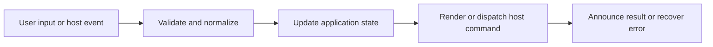

# Workspace Selection and Application Shell

## Feature intent

Define the selection screen, loading shell, workspace shell, global dialogs, and responsive transitions that surround every use case.

## Capability contract

| Capability | Required behavior | User result |
|---|---|---|
| Workspace selection | Offer folder, file, recent, and more/search actions according to runtime capability. | User can enter the product without hidden prerequisites. |
| Loading shell | Show operation label, detail, progress, and cancellation without replacing newer state. | Long operations remain understandable. |
| Workspace shell | Compose topbar, sidebar, content, TOC, overlays, and desktop controls. | Main reading workflow remains stable. |
| Responsive layout | Collapse/reflow panels and preserve accessible controls at constrained widths. | Application remains usable at minimum window size. |

## Interaction and processing flow



### Layout rules

- Selection, loading, unavailable, welcome, and ready workspace states are mutually understandable; stale host messages cannot jump between them.
- Sidebar and TOC widths use CSS variables and persisted values with minimum/maximum constraints.
- Dialogs and overlays layer above context menus/content without accidental clipping.
- Fullscreen state may alter header visibility but must retain an exit path.

### Shell composition

| Region | Responsibility |
|---|---|
| Topbar | history, title, global actions, search/settings/theme |
| Sidebar | tree, filter, scope, item menu |
| Content | tabs, document, enhancements, feedback |
| TOC | headings and active section |
| Overlay layer | search, settings, media, terms, onboarding, confirmation |


## States and failure behavior

| State | Required presentation | Exit condition |
|---|---|---|
| Selecting | Open actions and recents | Open/cancel operation |
| Loading | Progress/detail/cancel | Ready/cancel/unavailable |
| Unavailable | Reason and recovery actions | New valid open |
| Ready | Full workspace shell | Close/switch/error |

## Runtime behavior

| Runtime | Specification |
|---|---|
| Desktop | Includes frameless window controls and workspace tabs. |
| VS Code | Fits editor webview and extension command lifecycle. |
| Chromium/Website | Uses browser-safe selection and no native controls. |

## Non-functional requirements

- All actions remain keyboard reachable.
- A failed enhancement must not prevent the base document from rendering.
- Host-facing inputs are validated before filesystem, shell, or network access.


## Acceptance criteria

- [ ] Every top-level state has a keyboard-reachable recovery or primary action.
- [ ] Minimum desktop size does not hide essential controls.
- [ ] Loading from an old operation cannot cover a ready newer workspace.
- [ ] Layered dialogs restore focus on close.
## UI reference implementation

The sample shows the interaction boundary, not a replacement for the React implementation.

```html
<section class="spec-workspace-selection-and-application-shell" aria-labelledby="workspace-selection-and-application-shell-title">
  <h2 id="workspace-selection-and-application-shell-title">Workspace Selection and Application Shell</h2>
  <p data-status role="status" aria-live="polite">Ready</p>
  <button type="button" data-action>Choose folder</button>
</section>
```

```css
.spec-workspace-selection-and-application-shell {
  display: grid;
  gap: 0.75rem;
  padding: 1rem;
  border: 1px solid var(--border);
  border-radius: var(--radius, 8px);
  background: var(--surface);
  color: var(--text);
}
.spec-workspace-selection-and-application-shell button:focus-visible {
  outline: 2px solid var(--accent);
  outline-offset: 2px;
}
```

```javascript
const root = document.querySelector('.spec-workspace-selection-and-application-shell');
const status = root.querySelector('[data-status]');
root.querySelector('[data-action]').addEventListener('click', () => {
  window.PlatformBridge.postMessage({ command: 'openFolder', workspaceOperationId: crypto.randomUUID(), openFirstFile: true });
  status.textContent = 'Request sent';
});
```
## Source traceability

| Kind | Path | Purpose |
|---|---|---|
| Implementation | `ui/src/App.tsx` | Active behavior or contract |
| Implementation | `ui/src/components/Workspace/WorkspaceSelection.tsx` | Active behavior or contract |
| Implementation | `ui/src/components/Workspace/WorkspaceWindowControls.tsx` | Active behavior or contract |
| Implementation | `ui/src/styles/global/global-app-shell.css` | Active behavior or contract |
| Implementation | `ui/src/styles/global/global-dynamic-layout.css` | Active behavior or contract |
| Verification | `tests/unit/ui/components/app-render.test.tsx` | Automated expectation |
| Verification | `tests/unit/ui/components/workspace-render.test.tsx` | Automated expectation |
| Verification | `tests/node/header-layout-contracts.test.mjs` | Automated expectation |

---

[← Copy, Edit, Open in Browser, and Export Content](../02-use-cases/UC-030-copy-edit-browser-snapshot.md) · [Documentation index](../README.md) · [Desktop Workspace Tabs →](02-desktop-workspace-tabs.md)
