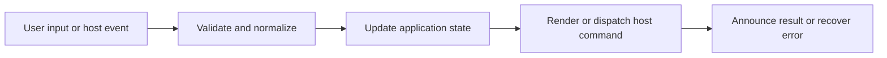

# Desktop Workspace Tabs

## Feature intent

Specify the home/new/workspace tab model, tab lifecycle, aliases, context menu, loading state, and snapshot persistence.

## Capability contract

| Capability | Required behavior | User result |
|---|---|---|
| Home tab | Provide a fixed non-removable landing tab. | User always has a stable return point. |
| Workspace tab | Own independent workspace, content, history, search, and operation state. | Multiple projects coexist safely. |
| Activation | Snapshot outgoing state and restore incoming state. | Switching is fast and isolated. |
| Close actions | Close current, others, or tabs to right with deterministic selection. | Tab management behaves predictably. |
| Alias | Persist a display name without changing filesystem identity. | Long/duplicate paths become recognizable. |

## Interaction and processing flow



### Tab model

```typescript
interface DesktopWorkspaceTab {
  id: string;
  kind: 'home' | 'new' | 'workspace';
  workspacePath?: string;
  workspaceOperationId?: string;
  label: string;
}
```

### Invariants

- `home` is always present.
- Workspace messages update only the tab carrying matching `workspaceTabId` and operation ID.
- Closing a tab cancels its scan/search work before state removal.
- Persisted snapshots are normalized; unknown or duplicate IDs are discarded.
- Tab bar scrolling keeps the active tab visible.


## States and failure behavior

| State | Required presentation | Exit condition |
|---|---|---|
| Home | Landing content; cannot close | Open/activate workspace |
| New | Workspace chooser inside a tab | Open/cancel |
| Loading workspace | Spinner/progress in tab | Ready/cancel/unavailable |
| Ready workspace | Alias/path/title | Switch/close |
| Unavailable | Reason marker and recovery | Reopen/close |

## Runtime behavior

| Runtime | Specification |
|---|---|
| Electron/Tauri | Primary multi-workspace shell. |
| Other runtimes | Do not assume desktop workspace tabs; content tabs remain separate. |

## Non-functional requirements

- All actions remain keyboard reachable.
- A failed enhancement must not prevent the base document from rendering.
- Host-facing inputs are validated before filesystem, shell, or network access.


## Acceptance criteria

- [ ] Home cannot be removed.
- [ ] A result for a closed tab is ignored.
- [ ] Active-tab selection after close is deterministic.
- [ ] Alias changes no command path or search identity.
## UI reference implementation

The sample shows the interaction boundary, not a replacement for the React implementation.

```html
<section class="spec-desktop-workspace-tabs" aria-labelledby="desktop-workspace-tabs-title">
  <h2 id="desktop-workspace-tabs-title">Desktop Workspace Tabs</h2>
  <p data-status role="status" aria-live="polite">Ready</p>
  <button type="button" data-action>Activate workspace</button>
</section>
```

```css
.spec-desktop-workspace-tabs {
  display: grid;
  gap: 0.75rem;
  padding: 1rem;
  border: 1px solid var(--border);
  border-radius: var(--radius, 8px);
  background: var(--surface);
  color: var(--text);
}
.spec-desktop-workspace-tabs button:focus-visible {
  outline: 2px solid var(--accent);
  outline-offset: 2px;
}
```

```javascript
const root = document.querySelector('.spec-desktop-workspace-tabs');
const status = root.querySelector('[data-status]');
root.querySelector('[data-action]').addEventListener('click', () => {
  window.PlatformBridge.postMessage({ command: 'activateWorkspace', workspacePath: '/project/docs', filePath: '/project/docs/readme.md', openFirstFile: true, workspaceOperationId: crypto.randomUUID() });
  status.textContent = 'Request sent';
});
```
## Source traceability

| Kind | Path | Purpose |
|---|---|---|
| Implementation | `ui/src/components/Desktop/DesktopTabBar.tsx` | Active behavior or contract |
| Implementation | `ui/src/components/Desktop/DesktopTabItem.tsx` | Active behavior or contract |
| Implementation | `ui/src/components/Desktop/DesktopTabContextMenu.tsx` | Active behavior or contract |
| Implementation | `ui/src/desktop/desktopTabs.ts` | Active behavior or contract |
| Implementation | `ui/src/hooks/useDesktopTabManagement.ts` | Active behavior or contract |
| Verification | `tests/unit/ui/components/desktop-tabbar-deep.test.tsx` | Automated expectation |
| Verification | `tests/unit/ui/components/desktop-tabbar-interactions.test.tsx` | Automated expectation |
| Verification | `tests/unit/ui/desktop-tabs.test.ts` | Automated expectation |

---

[← Workspace Selection and Application Shell](01-workspace-selection-shell.md) · [Documentation index](../README.md) · [Sidebar Tree, Filtering, and Scope →](03-sidebar-tree-and-scope.md)
