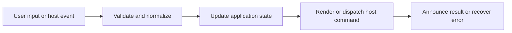

# Sidebar Tree, Filtering, and Scope

## Feature intent

Specify hierarchical file navigation, search/filter rendering, cursor navigation, context menus, resizing, per-workspace scope focus, and the capability-aware History sidebar.

## Capability contract

| Capability | Required behavior | User result |
|---|---|---|
| Tree | Render folder/file hierarchy and active item. | Workspace structure is understandable. |
| Filter | Retain matching descendants and required ancestors. | Large trees are narrowed without losing context. |
| Cursor mode | Move, expand, collapse, and open by keyboard. | Tree is usable without pointer. |
| Scope focus | Limit navigation and workspace search to selected files/folders per workspace. | Users concentrate on relevant documentation. |
| History | Show repository commits and read-only revision files only when local Git is supported. | Repository history is browsable without checkout or working-tree mutation. |
| Resize | Persist bounded sidebar width. | Layout matches reader preference. |

## Interaction and processing flow



### Tree-node behavior

- Folder expansion is independent from text filtering.
- The active document remains visually identifiable when its node is visible.
- File and folder context menus are built from target type and host capability.
- Filter matching is case/Unicode aware through shared utilities where applicable.
- Scope maps are reconciled when files/folders disappear.

### Tree ordering, sorting, and pin controls

- **Folders-first Ordering**: By default (`name-asc`), unpinned folders are always listed before files at each directory level, with items within each group sorted alphabetically ascending (A-Z).
- **Sort Modes**: `SidebarSortMenu` offers three sort modes: `name-asc` (A-Z, default), `name-desc` (Z-A), and `modified-desc` (recently modified first).
- **Root Level Pin Hoisting**: When a file or folder located inside a parent folder is pinned, it is hoisted and displayed at the root level of the sidebar tree instead of remaining inside its parent folder.
- **Revocable Sorting**: Clicking the currently active sort mode in `SidebarSortMenu` revokes active sorting and resets the workspace sort mode back to `DEFAULT_SIDEBAR_SORT_MODE` (`name-asc`).
- **Toolbar Actions Sequence**: Sidebar toolbar buttons are arranged in exact sequence: `Sort` (left), `Clear Pins`, `Locate`, `Collapse All`, `Expand All` (right).
- **Pin & Unpin Icons**: The per-row pinned-item indicator uses the stroke-only `PinIcon` (Lucide thumbtack, size 12 for tap-target parity). Both unpin affordances — the per-item context-menu entry and the toolbar Clear Pins button — render the same `UnpinIcon` SVG (Lucide thumbtack + diagonal slash overlay, path `M3 3L18 18`) so users see one consistent "remove pin" affordance regardless of scope. `ClearPinsIcon` is kept as a named export (so the toolbar call-site reads as "clear all pins") but delegates to `UnpinIcon`; both inherit `currentColor` from the parent button.
- **Scope Focus Badge**: The scope focus count badge (`.sidebar__scope-count`) and TOC count badge (`.toc-panel__count`) utilize theme-aware border radius `border-radius: var(--r-s, var(--r));`.

### Scope separation

| Setting | Effect |
|---|---|
| `scopeFocus` | Visible/browsable workspace focus |
| `searchScopeFocus` | Workspace-search candidate focus |

The two maps may differ and must not overwrite each other.

### History sidebar and repository snapshots

- `historySidebarEnabled` is enabled by default, but the History tab is rendered only after `getGitCapability` reports local Git support for the active workspace.
- Files, Search, Bookmarks, and History share the same tab header and animated indicator. When more than three sidebar tabs are visible, labels collapse to icon-only presentation while accessible names/tooltips remain available.
- Opening History does not checkout, restore, reset, switch branches, or modify the working tree. Repository history is loaded lazily only when the History panel becomes visible.
- Commit rows show graph lanes, subject, short SHA, author, refs, and the exact `HEAD` marker. Merge commits preserve all parent OIDs for deterministic graph layout.
- Selecting a commit requests the workspace-scoped revision file list. Selecting a file opens an isolated read-only snapshot; live content tabs, editor sessions, split panes, and unsaved working copies remain mounted and unchanged.
- **Back to current HEAD** clears only repository snapshot state and reveals the exact live view that was present before snapshot browsing.
- Chromium and Website runtimes keep the History tab unavailable because they explicitly report `unsupported-runtime` and never execute a local process.

## States and failure behavior

| State | Required presentation | Exit condition |
|---|---|---|
| Expanded | Children visible | Collapse |
| Collapsed | Children hidden | Expand |
| Filtered | Matching subtree only | Clear query |
| Cursor mode | One visible node focused | Exit/move/open |
| Scoped | Selected roots applied | Edit/clear scope |
| History loading | Repository commits or revision files are loading | Result/error |
| Snapshot | Historical file is rendered read-only above live content | Back to current HEAD |

## Runtime behavior

| Runtime | Specification |
|---|---|
| All | Shared tree, filtering, scope, and capability-gated tab behavior. |
| Electron / Tauri / VS Code | History tab can browse repository commits and read-only snapshots through installed Git. |
| Chromium / Website | Git History remains hidden/unsupported; no local process execution. |
| Native/editor hosts | Reveal/open-in-editor actions enabled where the runtime supports them. |
| Browser hosts | Filesystem shell actions unavailable. |

## Non-functional requirements

- All actions remain keyboard reachable.
- A failed enhancement must not prevent the base document from rendering.
- Host-facing inputs are validated before filesystem, shell, or network access.
- Repository snapshot browsing must not mutate live document/editor/split state or the Git working tree.

## Acceptance criteria

- [ ] Ancestors remain visible for matching descendants.
- [ ] Cursor navigation never focuses hidden nodes.
- [ ] Scope state is reconciled after workspace change.
- [ ] Sidebar width remains within layout bounds.
- [ ] History is visible only when the setting is enabled and local Git capability is supported.
- [ ] Selecting repository revisions does not checkout or dirty the working tree.
- [ ] Back to current HEAD restores the previous live view without reconstructing its editor session.

## UI reference implementation

The sample shows the interaction boundary, not a replacement for the React implementation.

```html
<section class="spec-sidebar-tree-filtering-and-scope" aria-labelledby="sidebar-tree-filtering-and-scope-title">
  <h2 id="sidebar-tree-filtering-and-scope-title">Sidebar Tree, Filtering, and Scope</h2>
  <p data-status role="status" aria-live="polite">Ready</p>
  <button type="button" data-action>Open document</button>
</section>
```

```css
.spec-sidebar-tree-filtering-and-scope {
  display: grid;
  gap: 0.75rem;
  padding: 1rem;
  border: 1px solid var(--border);
  border-radius: var(--radius, 8px);
  background: var(--surface);
  color: var(--text);
}
.spec-sidebar-tree-filtering-and-scope button:focus-visible {
  outline: 2px solid var(--accent);
  outline-offset: 2px;
}
```

```javascript
const root = document.querySelector('.spec-sidebar-tree-filtering-and-scope');
const status = root.querySelector('[data-status]');
root.querySelector('[data-action]').addEventListener('click', () => {
  window.PlatformBridge.postMessage({ command: 'navigate', path: '/project/docs/guide.md' });
  status.textContent = 'Request sent';
});
```

## Sidebar header and focus-aware search contract

- Files, Search, Bookmarks, and capability-aware History tabs size to their icon and translated label while three or fewer are visible; no fixed minimum tab width is imposed.
- With four visible tabs, the header switches to icon-only tab presentation so the row remains compact without truncating controls.
- One measured indicator animates to the active tab, and all tab bodies use the same reduced-motion-aware transition.
- Each tab uses the same search-field height where applicable. Files keeps the search field on row one and scope-focus controls on row two.
- Workspace search filters host results against the current focus set. Unfocused files never appear.
- Changing focus while a non-empty search query exists changes the scope revision and reruns focus-aware search, so newly focused files appear and newly unfocused files disappear without editing the query.

## Source traceability

| Kind | Path | Purpose |
|---|---|---|
| Implementation | `ui/src/components/Sidebar/Sidebar.tsx` | Sidebar tabs and active panel behavior |
| Implementation | `ui/src/components/Sidebar/TreeNode.tsx` | File/folder tree behavior |
| Implementation | `ui/src/components/Sidebar/SidebarScopeControls.tsx` | Scope focus controls |
| Implementation | `ui/src/components/Sidebar/sidebarItemMenuItems.tsx` | Right-click context menu items |
| Implementation | `ui/src/components/Sidebar/sidebarTreeFiltering.ts` | Tree filtering |
| Implementation | `ui/src/components/Sidebar/sidebarActiveFolders.ts` | Active folder tracking |
| Implementation | `ui/src/components/Sidebar/useSidebarCursorNavigation.ts` | Cursor navigation |
| Implementation | `ui/src/components/Sidebar/useSidebarPinnedSorting.ts` | Pinned item sort ordering |
| Implementation | `ui/src/components/Sidebar/useSidebarScopeFocus.ts` | Per-workspace scope focus |
| Implementation | `ui/src/components/History/RepositoryHistoryPanel.tsx` | Repository commit and revision-file browser |
| Implementation | `ui/src/components/History/GitCommitGraph.tsx` | Commit graph rendering |
| Implementation | `ui/src/hooks/useResize.ts` | Sidebar resize behavior |
| Verification | `tests/unit/ui/components/sidebar-render.test.tsx` | Automated tree expectation |
| Verification | `tests/unit/ui/components/sidebar-search-pure.test.ts` | Automated search expectation |
| Verification | `tests/unit/ui/history/repository-history-panel.test.tsx` | Repository history UI expectation |
| Verification | `tests/unit/ui/history/git-graph-layout.test.ts` | Commit graph layout expectation |
| Verification | `tests/unit/ui/hooks/useResize.test.ts` | Resize expectation |

---

[← Desktop Workspace Tabs](02-desktop-workspace-tabs.md) · [Documentation index](../README.md) · [Content Tabs and Document Shell →](04-content-tabs-and-document-shell.md)
