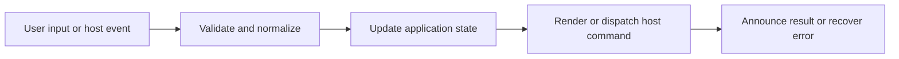

# Sidebar Tree, Filtering, and Scope

## Feature intent

Specify hierarchical file navigation, search/filter rendering, cursor navigation, context menus, resizing, and per-workspace scope focus.

## Capability contract

| Capability | Required behavior | User result |
|---|---|---|
| Tree | Render folder/file hierarchy and active item. | Workspace structure is understandable. |
| Filter | Retain matching descendants and required ancestors. | Large trees are narrowed without losing context. |
| Cursor mode | Move, expand, collapse, and open by keyboard. | Tree is usable without pointer. |
| Scope focus | Limit navigation/search to selected folders per workspace. | Users concentrate on relevant documentation. |
| Resize | Persist bounded sidebar width. | Layout matches reader preference. |

## Interaction and processing flow



### Tree-node behavior

- Folder expansion is independent from text filtering.
- The active document remains visually identifiable when its node is visible.
- File and folder context menus are built from target type and host capability.
- Filter matching is case/Unicode aware through shared utilities where applicable.
- Scope maps are reconciled when files/folders disappear.

### Tree ordering, sorting, and pin controls

- **Folders-first Ordering**: By default (`name-asc`), unpinned folders are always listed before files at each directory level, with items within each group sorted alphabetically ascending (A-Z).
- **Revocable Sorting**: Clicking the currently active sort mode in `SidebarSortMenu` revokes active sorting and resets the workspace sort mode back to `DEFAULT_SIDEBAR_SORT_MODE` (`name-asc`).
- **Toolbar Actions Sequence**: Sidebar toolbar buttons are arranged in exact sequence: `Sort` (left), `Clear Pins`, `Locate`, `Collapse All`, `Expand All` (right).
- **Pin & Unpin Icons**: Unpin actions (in item context menus and toolbar Clear Pins) display the `ClearPinsIcon` SVG featuring a scaled 2/3 size X-mark with `strokeWidth="14"`.
- **Scope Focus Badge**: The scope focus count badge (`.sidebar__scope-count`) and TOC count badge (`.toc-panel__count`) utilize theme-aware border radius `border-radius: var(--r-s, var(--r));`.

### Scope separation

| Setting | Effect |
|---|---|
| `scopeFocus` | Visible/browsable workspace focus |
| `searchScopeFocus` | Workspace-search candidate focus |

The two maps may differ and must not overwrite each other.


## States and failure behavior

| State | Required presentation | Exit condition |
|---|---|---|
| Expanded | Children visible | Collapse |
| Collapsed | Children hidden | Expand |
| Filtered | Matching subtree only | Clear query |
| Cursor mode | One visible node focused | Exit/move/open |
| Scoped | Selected roots applied | Edit/clear scope |

## Runtime behavior

| Runtime | Specification |
|---|---|
| All | Shared tree and filtering behavior. |
| Native/editor hosts | Reveal/open-in-editor actions enabled. |
| Browser hosts | Filesystem shell actions unavailable. |

## Non-functional requirements

- All actions remain keyboard reachable.
- A failed enhancement must not prevent the base document from rendering.
- Host-facing inputs are validated before filesystem, shell, or network access.


## Acceptance criteria

- [ ] Ancestors remain visible for matching descendants.
- [ ] Cursor navigation never focuses hidden nodes.
- [ ] Scope state is reconciled after workspace change.
- [ ] Sidebar width remains within layout bounds.
## UI reference implementation

The sample shows the interaction boundary, not a replacement for the React implementation.

```html
<section class="spec-sidebar-tree-filtering-and-scope" aria-labelledby="sidebar-tree-filtering-and-scope-title">
  <h2 id="sidebar-tree-filtering-and-scope-title">Sidebar Tree, Filtering, and Scope</h2>
  <p data-status role="status" aria-live="polite">Ready</p>
  <button type="button" data-action>Open document</button>
</section>
```

```css
.spec-sidebar-tree-filtering-and-scope {
  display: grid;
  gap: 0.75rem;
  padding: 1rem;
  border: 1px solid var(--border);
  border-radius: var(--radius, 8px);
  background: var(--surface);
  color: var(--text);
}
.spec-sidebar-tree-filtering-and-scope button:focus-visible {
  outline: 2px solid var(--accent);
  outline-offset: 2px;
}
```

```javascript
const root = document.querySelector('.spec-sidebar-tree-filtering-and-scope');
const status = root.querySelector('[data-status]');
root.querySelector('[data-action]').addEventListener('click', () => {
  window.PlatformBridge.postMessage({ command: 'navigate', path: '/project/docs/guide.md' });
  status.textContent = 'Request sent';
});
```
## Source traceability

| Kind | Path | Purpose |
|---|---|---|
| Implementation | `ui/src/components/Sidebar/Sidebar.tsx` | Active behavior or contract |
| Implementation | `ui/src/components/Sidebar/TreeNode.tsx` | Active behavior or contract |
| Implementation | `ui/src/components/Sidebar/sidebarTreeFiltering.ts` | Active behavior or contract |
| Implementation | `ui/src/components/Sidebar/useSidebarCursorNavigation.ts` | Active behavior or contract |
| Implementation | `ui/src/hooks/useResize.ts` | Active behavior or contract |
| Verification | `tests/unit/ui/components/sidebar-render.test.tsx` | Automated expectation |
| Verification | `tests/unit/ui/components/sidebar-search-pure.test.ts` | Automated expectation |
| Verification | `tests/unit/ui/hooks/useResize.test.ts` | Automated expectation |

---

[← Desktop Workspace Tabs](02-desktop-workspace-tabs.md) · [Documentation index](../README.md) · [Content Tabs and Document Shell →](04-content-tabs-and-document-shell.md)
