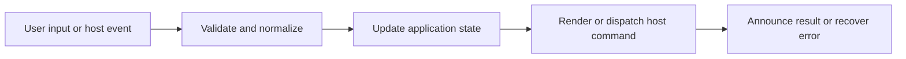
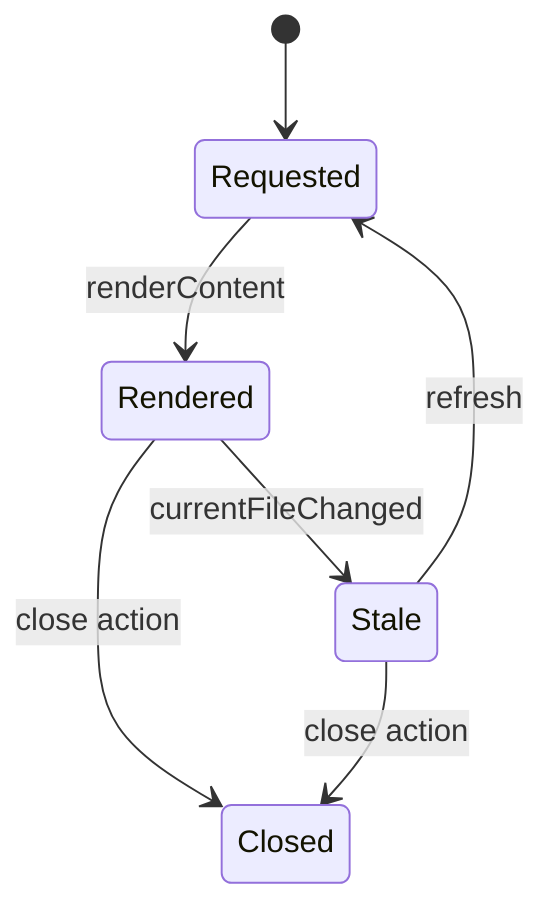

# Content Tabs and Document Shell

## Feature intent

Specify document-tab identity, loading/rendered/stale states, title/source metadata, toolbar actions, scroll memory, and cleanup.

## Capability contract

| Capability | Required behavior | User result |
|---|---|---|
| Content tab identity | Use canonical file path within owning workspace. | No duplicate tabs for one document. |
| Stored render state | Retain HTML, source, frontmatter, TOC, and preview metadata. | Switching avoids unnecessary reread. |
| Scroll memory | Save and restore per-tab position after layout. | Reading context is preserved. |
| Stale indicator | Mark externally changed source. | User knows preview may be old. |
| Toolbar actions | Expose valid copy/open/preview/collapse operations. | Document tasks are discoverable. |

## Interaction and processing flow



### Content lifecycle



### Cleanup

On close or workspace disposal, remove scroll records, chart instances, media listeners, pending enhancement timers, find highlights, and stale markers belonging to the document.


## States and failure behavior

| State | Required presentation | Exit condition |
|---|---|---|
| Requested | Loading indicator | Render/failure |
| Rendered | Document and toolbar | Stale/close |
| Stale | Visible stale state and refresh | Refresh/close |
| Preview override | Source or HTML preview selected | Toggle/reset |

## Runtime behavior

| Runtime | Specification |
|---|---|
| All | Shared content shell. |
| Electron | Additional close-tab shortcuts. |
| VS Code | Open in editor is prominent. |

## Non-functional requirements

- All actions remain keyboard reachable.
- A failed enhancement must not prevent the base document from rendering.
- Host-facing inputs are validated before filesystem, shell, or network access.


## Acceptance criteria

- [ ] Canonical-path duplicate opens activate existing tab.
- [ ] Scroll restore waits until content layout is measurable.
- [ ] Close removes document-owned asynchronous work.
- [ ] Stale indicator clears only after valid new render.
## UI reference implementation

The sample shows the interaction boundary, not a replacement for the React implementation.

```html
<section class="spec-content-tabs-and-document-shell" aria-labelledby="content-tabs-and-document-shell-title">
  <h2 id="content-tabs-and-document-shell-title">Content Tabs and Document Shell</h2>
  <p data-status role="status" aria-live="polite">Ready</p>
  <button type="button" data-action>Open document</button>
</section>
```

```css
.spec-content-tabs-and-document-shell {
  display: grid;
  gap: 0.75rem;
  padding: 1rem;
  border: 1px solid var(--border);
  border-radius: var(--radius, 8px);
  background: var(--surface);
  color: var(--text);
}
.spec-content-tabs-and-document-shell button:focus-visible {
  outline: 2px solid var(--accent);
  outline-offset: 2px;
}
```

```javascript
const root = document.querySelector('.spec-content-tabs-and-document-shell');
const status = root.querySelector('[data-status]');
root.querySelector('[data-action]').addEventListener('click', () => {
  window.PlatformBridge.postMessage({ command: 'navigate', path: '/project/docs/guide.md' });
  status.textContent = 'Request sent';
});
```
## Source traceability

| Kind | Path | Purpose |
|---|---|---|
| Implementation | `ui/src/components/Content/Content.tsx` | Active behavior or contract |
| Implementation | `ui/src/components/Content/ContentTabs.tsx` | Active behavior or contract |
| Implementation | `ui/src/components/shared/HeaderActionGroups.tsx` | Active behavior or contract |
| Implementation | `ui/src/components/Content/useContentScrollMemory.ts` | Active behavior or contract |
| Implementation | `ui/src/contexts/contentTabState.ts` | Active behavior or contract |
| Verification | `tests/unit/ui/components/content-tabs-deep.test.tsx` | Automated expectation |
| Verification | `tests/unit/ui/components/content-render.test.tsx` | Automated expectation |
| Verification | `tests/node/content-tab-close-events.test.mjs` | Automated expectation |

---

[← Sidebar Tree, Filtering, and Scope](03-sidebar-tree-and-scope.md) · [Documentation index](../README.md) · [Markdown and MDX Parser/Renderer →](05-markdown-mdx-parser-renderer.md)
