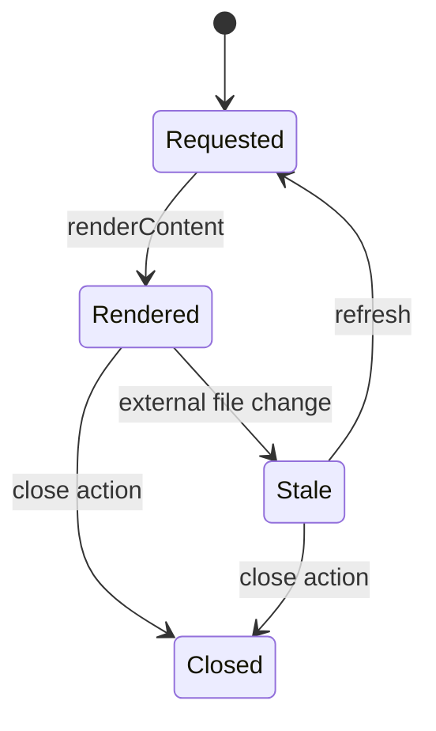

# Content Tabs and Document Shell

## Feature intent

Specify document-tab identity, loading/rendered/stale states, title/source metadata, document modes, split-pane ownership, file drop behavior, scroll memory, render isolation, and cleanup.

## Capability contract

| Capability | Required behavior | User result |
|---|---|---|
| Content tab identity | Use canonical file path within owning workspace. | No duplicate tabs for one document. |
| Stored render state | Retain HTML, source, frontmatter, TOC, and preview metadata. | Switching avoids unnecessary reread. |
| Pane-owned tabs | Each split pane owns its own tab collection and active tab. | Both panes can independently navigate multiple files. |
| Scroll memory | Keep ordinary scroll local while scrolling and persist at lifecycle boundaries. | Reading context survives without invalidating the other pane every frame. |
| Render isolation | Invalidate the document body only for dependencies that affect that pane/document. | Unrelated pane interactions do not remount expensive content. |
| File drop | Open a dragged workspace file in the intended unsplit/split target. | Split navigation works directly from the Files tree. |
| Stale indicator | Mark externally changed source. | User knows preview may be old. |
| Toolbar actions | Expose valid copy/open/preview/collapse/edit/history operations. | Document tasks are discoverable. |

## Content lifecycle



On close or workspace disposal, remove scroll records, chart instances, media listeners, pending enhancement timers, find highlights, stale markers, and document-owned editor/history work.

## Split-pane state contract

The active split model is:

```ts
interface DocumentPaneState {
  id: 'primary' | 'secondary';
  filePath: string | null;
  tabs: readonly string[];
  activeTabPath: string | null;
  mode: 'rendered' | 'inline-edit' | 'plain' | 'git-revision' | 'diff';
  scrollTop: number;
  revision?: string;
  diffKey?: string;
}
```

Required behavior:

- Navigation targets the active/focused pane.
- If content tabs are enabled, opening a document upserts/activates that pane's tab without modifying the opposite pane's tabs.
- If content tabs are disabled, opening replaces only the active pane's file.
- Activating/closing a pane tab updates only that pane.
- Opening split activates the secondary pane.
- Swapping panes swaps their state and active-pane identity.
- Closing split **promotes the focused pane** to primary and preserves its tab strip/active document; it does not always keep the former left pane.
- Split ratio remains bounded by the split-state contract.
- Revision and Diff modes are read-only.
- Viewing/editing the same live document in two panes uses one shared application document session; there are not two competing working copies.

## Render isolation

- Split document bodies use document-scoped render revisions/selectors instead of blindly depending on a global application render counter.
- Activating one pane must not remount the unrelated opposite-pane document body.
- Scrolling one pane must not force a render of the opposite pane.
- Editing one file must not rerender an opposite pane showing a different file.
- If both panes show the same document, the rendered mirror may update on the existing short debounce; save/file transitions can flush the relevant document revision immediately.

## Scroll persistence

Normal wheel/trackpad scroll is DOM-local while the interaction is in progress. The shell records the latest position and persists it when state ownership actually changes, including relevant tab/file/mode transitions, pane deactivation, split close, and unmount. It must not dispatch shared application state for every `scroll` event.

## File context and drag/drop

Files can be sent to split view by context menu or drag/drop.

### Context action

- File targets expose **Open in Split View** when the split action is valid.
- Folder targets do not expose this file-only action.

### Drag payload

The canonical custom MIME type is:

```text
application/x-markdown-explorer-file
```

`text/plain` is retained as a fallback. The payload identifies the workspace file path; it must not be treated as arbitrary external HTML/text content.

### Drop behavior

- Unsplit document area: open the dropped file through normal navigation.
- Split pane: show pane-specific drop feedback, activate the pane under the pointer, then open the file in that pane only.
- A drop must not replace the wrong pane or bypass unsaved-change safety.

## Editing/document modes

- Rendered is the default live mode.
- Internal full-source Plain editing uses local CodeMirror 6 packaged dependencies and remains backed by the shared document session.
- Inline Edit and Plain are available only when the document is writable and Markdown editing is enabled.
- Git revision, repository snapshot, and Diff views are read-only and cannot save.
- When Markdown editing is disabled on a live capable native/editor host, the existing Edit action routes to the external/native editor rather than disappearing.

## States and failure behavior

| State | Required presentation | Exit condition |
|---|---|---|
| Requested | Loading indicator | Render/failure |
| Rendered | Document and toolbar | Stale/mode change/close |
| Inline edit | Source-backed rendered editing | Preview/mode change |
| Plain edit | CodeMirror full-source editor | Preview/mode change |
| Revision | Read-only historical document | Return/change revision |
| Diff | Read-only source/rendered comparison | Return/change comparison |
| Stale | Visible stale state and refresh | Refresh/close |
| Split target | Pane-specific drag highlight | Drop/drag leave |
| All closed | Centered `RandomTipCard` with shuffled tips and keyboard hint | Open document |

## Toolbar actions & tooltips

- Section toggle controls expose localized Collapse/Expand tooltips matching active collapse state.
- More Actions and action-bar tooltips use measured target-centered alignment with viewport overflow fallback.
- **More Actions → History** routes to the repository History sidebar; document-specific revision/diff controls remain available in the document History UI where applicable.

## Scope View modal

- `ScopeViewModal` provides isolated workspace-document inspection without replacing the active document shell.
- It owns its own bounded navigation stack, supports Previous/Next/Open file/Close, keyboard and hardware mouse history navigation, and maximum-depth guard.
- Opening a scope file in the main shell goes through normal document navigation, so the active split pane rules apply.

## Export Center

- Export Center supports current/selected/folder/workspace source scopes; html/pdf/site formats; document/explorer layouts; separate/merged batch modes.
- Selected-document lists use the fill-height `ExportMultiSelect` layout with responsive fallbacks.
- Referenced assets are packaged through `readWorkspaceExportResource`; there is no legacy separate additional-workspace-files enumeration.

## Runtime behavior

| Runtime | Specification |
|---|---|
| All | Shared document shell, pane-owned tabs, split isolation, context/drop behavior, and modes. |
| Electron/Tauri | Desktop shell also integrates native window/focus behavior. |
| VS Code | Open-in-editor route uses VS Code. |
| Chromium/Website | Split/edit behavior is capability-based; Git modes remain unavailable. |

## Acceptance criteria

- [ ] Canonical-path duplicate opens activate the existing tab for the target pane.
- [ ] Pane tab changes do not modify the other pane's tab strip.
- [ ] Closing split preserves the focused pane and its tabs.
- [ ] Opposite pane body does not rerender for unrelated scroll/activation/source changes.
- [ ] Scroll state is persisted without shared-state dispatch on every scroll event.
- [ ] File context action opens the intended split pane.
- [ ] Custom file drag payload targets the pane under the pointer.
- [ ] Revision/Diff modes expose no write path.
- [ ] Close removes document-owned asynchronous work.
- [ ] Stale indicator clears only after valid new render.

## Source traceability

| Kind | Path | Purpose |
|---|---|---|
| Implementation | `ui/src/components/Content/Content.tsx` | Active document-shell routing |
| Implementation | `ui/src/components/Content/SplitContent.tsx` | Split orchestration |
| Implementation | `ui/src/components/Content/SplitDocumentView.tsx` | Pane shell and drop target |
| Implementation | `ui/src/components/Content/documentFileDrop.ts` | Drag payload encode/decode contract |
| Implementation | `ui/src/split-view/paneState.ts` | Pane-owned tabs/mode/scroll state |
| Implementation | `ui/src/split-view/documentRenderRevision.ts` | Document-scoped invalidation |
| Implementation | `ui/src/components/Content/useContentScrollMemory.ts` | Live content scroll memory |
| Verification | `tests/unit/ui/split-view/split-shell.test.tsx` | Pane interaction expectation |
| Verification | `tests/unit/ui/split-view/split-render-isolation.test.tsx` | Render/scroll isolation |
| Verification | `tests/node/split-file-drag-drop-contract.test.mjs` | Drag/drop contract |

---

[← Sidebar Tree, Filtering, and Scope](03-sidebar-tree-and-scope.md) · [Documentation index](../README.md) · [Markdown and MDX Parser/Renderer →](05-markdown-mdx-parser-renderer.md)
