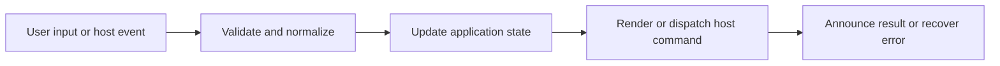

# Markdown and MDX Parser/Renderer

## Feature intent

Define supported source syntax, safe MDX handling, title/TOC/frontmatter extraction, HTML escaping, and renderer parity.

## Capability contract

| Capability | Required behavior | User result |
|---|---|---|
| Frontmatter | Read scalar metadata into a record. | Title and metadata can be displayed. |
| Block syntax | Headings, paragraphs, comments, fences, math, quotes, callouts, tables, lists, rules. | Common documentation renders semantically. |
| Inline syntax | Links, emphasis, code, images, escapes, and supported inline constructs. | Rich text remains safe. |
| MDX safety | Strip imports/exports and handle selected JSX without arbitrary execution. | MDX-like docs render without component execution. |
| TOC/title | Create stable heading IDs and title priority. | Navigation and labels are deterministic. |

## Interaction and processing flow



### Supported block families

| Family | Notes |
|---|---|
| Headings | ATX and Setext; stable IDs; TOC entries |
| Code fences | Backticks or tildes; language and metadata |
| Math | Display blocks enhanced later |
| Quotes/callouts | GFM-style callout markers |
| Tables | Pipe and delimited text routes |
| Lists | Nested ordered/unordered and task items |
| Comments | Preserved/omitted according to safe rendering rules |

### Title priority

Frontmatter title → exported MDX title/meta title/JSX title where supported → first heading → filename. Hosts may obtain a bounded prefix for scan titles; full render remains authoritative.


## States and failure behavior

| State | Required presentation | Exit condition |
|---|---|---|
| Parsed | Valid block model | Render |
| Recoverable malformed | Fallback text/warning | Continue |
| Unsupported executable MDX | Stripped/escaped | Render safe remainder |
| Empty | Empty-state content | Open another file |

## Runtime behavior

| Runtime | Specification |
|---|---|
| Shared UI | Canonical rendered presentation. |
| VS Code | Parser/renderer modules are checked for parity. |
| Hosts | Provide source/read pipeline and paths. |

## Non-functional requirements

- All actions remain keyboard reachable.
- A failed enhancement must not prevent the base document from rendering.
- Host-facing inputs are validated before filesystem, shell, or network access.


## Acceptance criteria

- [ ] The Markdown corpus renders consistently across parity implementations.
- [ ] Raw untrusted text is escaped.
- [ ] MDX imports/exports never execute.
- [ ] Heading IDs and TOC correspond to rendered headings.
## UI reference implementation

The sample shows the interaction boundary, not a replacement for the React implementation.

```html
<section class="spec-markdown-and-mdx-parser-renderer" aria-labelledby="markdown-and-mdx-parser-renderer-title">
  <h2 id="markdown-and-mdx-parser-renderer-title">Markdown and MDX Parser/Renderer</h2>
  <p data-status role="status" aria-live="polite">Ready</p>
  <button type="button" data-action>Open document</button>
</section>
```

```css
.spec-markdown-and-mdx-parser-renderer {
  display: grid;
  gap: 0.75rem;
  padding: 1rem;
  border: 1px solid var(--border);
  border-radius: var(--radius, 8px);
  background: var(--surface);
  color: var(--text);
}
.spec-markdown-and-mdx-parser-renderer button:focus-visible {
  outline: 2px solid var(--accent);
  outline-offset: 2px;
}
```

```javascript
const root = document.querySelector('.spec-markdown-and-mdx-parser-renderer');
const status = root.querySelector('[data-status]');
root.querySelector('[data-action]').addEventListener('click', () => {
  window.PlatformBridge.postMessage({ command: 'navigate', path: '/project/docs/guide.md' });
  status.textContent = 'Request sent';
});
```
## Source traceability

| Kind | Path | Purpose |
|---|---|---|
| Implementation | `ui/src/markdown/parser.ts` | Active behavior or contract |
| Implementation | `ui/src/markdown/renderer.ts` | Active behavior or contract |
| Implementation | `ui/src/markdown/inline.ts` | Active behavior or contract |
| Implementation | `ui/src/markdown/utils.ts` | Active behavior or contract |
| Implementation | `vscode/src/markdown/parser.ts` | Active behavior or contract |
| Implementation | `vscode/src/markdown/renderer.ts` | Active behavior or contract |
| Verification | `tests/fixtures/markdown-corpus.ts` | Automated expectation |
| Verification | `tests/unit/ui/markdown/parser.test.ts` | Automated expectation |
| Verification | `tests/unit/ui/markdown/renderer.test.ts` | Automated expectation |
| Verification | `tests/contracts/markdown-parity.test.ts` | Automated expectation |

---

[← Content Tabs and Document Shell](04-content-tabs-and-document-shell.md) · [Documentation index](../README.md) · [TOC, Heading Sections, and Navigation History →](06-toc-heading-sections-history.md)
