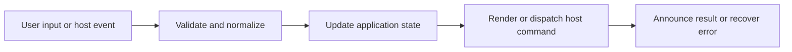

# TOC, Heading Sections, and Navigation History

## Feature intent

Define generated TOC behavior, active-heading tracking, section collapse/expand, document/history navigation, and target reveal.

## Capability contract

| Capability | Required behavior | User result |
|---|---|---|
| TOC generation | Use render payload heading entries. | Document outline is available. |
| Active heading | Track scroll position and highlight current section. | Reader knows location. |
| Section collapse | Hide/reveal a heading section without losing targetability. | Long documents become manageable. |
| History | Record logical document/fragment transitions. | Back/Forward works. |
| Global collapse/expand | Apply action across document sections. | Reader controls density quickly. |

## Interaction and processing flow



### Target reveal algorithm

1. Resolve target ID inside active document.
2. Expand any collapsed containing section.
3. Scroll target into view with header offset.
4. Update active TOC entry.
5. Move focus only when initiated as keyboard navigation and appropriate.

### Persistence

TOC panel collapsed state uses local storage. Per-document heading section state is owned by content state/DOM enhancement and must not leak into another document.


## States and failure behavior

| State | Required presentation | Exit condition |
|---|---|---|
| TOC open | Outline visible | Collapse panel |
| TOC collapsed | Toggle remains available | Expand panel |
| Section collapsed | Body hidden | Expand/target reveal |
| History boundary | Back or forward disabled | New navigation |

## Runtime behavior

| Runtime | Specification |
|---|---|
| All | Shared behavior and storage. |
| Fullscreen/responsive | TOC may collapse but remains reachable. |

## Non-functional requirements

- All actions remain keyboard reachable.
- A failed enhancement must not prevent the base document from rendering.
- Host-facing inputs are validated before filesystem, shell, or network access.


## Acceptance criteria

- [ ] Active TOC follows document scroll.
- [ ] Target navigation expands hidden section.
- [ ] Back/Forward never crosses unrelated workspace state incorrectly.
- [ ] Global collapse/expand remains idempotent.
## UI reference implementation

The sample shows the interaction boundary, not a replacement for the React implementation.

```html
<section class="spec-toc-heading-sections-and-navigation-history" aria-labelledby="toc-heading-sections-and-navigation-history-title">
  <h2 id="toc-heading-sections-and-navigation-history-title">TOC, Heading Sections, and Navigation History</h2>
  <p data-status role="status" aria-live="polite">Ready</p>
  <button type="button" data-action>Open document</button>
</section>
```

```css
.spec-toc-heading-sections-and-navigation-history {
  display: grid;
  gap: 0.75rem;
  padding: 1rem;
  border: 1px solid var(--border);
  border-radius: var(--radius, 8px);
  background: var(--surface);
  color: var(--text);
}
.spec-toc-heading-sections-and-navigation-history button:focus-visible {
  outline: 2px solid var(--accent);
  outline-offset: 2px;
}
```

```javascript
const root = document.querySelector('.spec-toc-heading-sections-and-navigation-history');
const status = root.querySelector('[data-status]');
root.querySelector('[data-action]').addEventListener('click', () => {
  window.PlatformBridge.postMessage({ command: 'navigate', path: '/project/docs/guide.md' });
  status.textContent = 'Request sent';
});
```
## Source traceability

| Kind | Path | Purpose |
|---|---|---|
| Implementation | `ui/src/components/TOC/TableOfContents.tsx` | Active behavior or contract |
| Implementation | `ui/src/components/Content/headingSectionInteractions.ts` | Active behavior or contract |
| Implementation | `ui/src/components/Content/enhancements/headingSectionState.ts` | Active behavior or contract |
| Implementation | `ui/src/contexts/NavigationContext.tsx` | Active behavior or contract |
| Verification | `tests/unit/ui/components/toc-render.test.tsx` | Automated expectation |
| Verification | `tests/unit/ui/contexts/navigation.test.tsx` | Automated expectation |
| Verification | `tests/unit/ui/dom/globalHandlers.test.ts` | Automated expectation |

---

[← Markdown and MDX Parser/Renderer](05-markdown-mdx-parser-renderer.md) · [Documentation index](../README.md) · [Code Blocks, Syntax, Line Interaction, and Copy →](07-code-blocks-and-copy.md)
